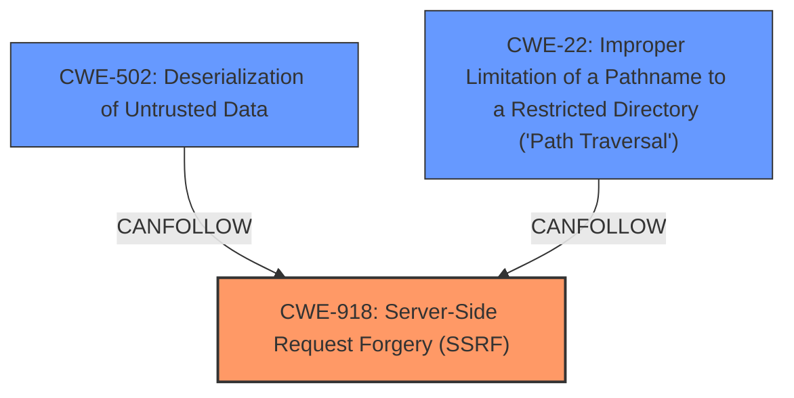

# Analysis for CVE-2025-27776

# Summary
| CWE ID  | CWE Name | Confidence | CWE Abstraction Level | CWE Vulnerability Mapping Label | CWE-Vulnerability Mapping Notes |
|----------------|--------------------------------------------------------------------------------------|------------|-------------------------|-----------------------------------|------------------------------------|
| CWE-918 | Server-Side Request Forgery (SSRF) | 0.95 | Base | Primary | Allowed |
| CWE-502 | Deserialization of Untrusted Data | 0.85 | Base | Secondary | Allowed |
| CWE-22 | Improper Limitation of a Pathname to a Restricted Directory ('Path Traversal') | 0.75 | Base | Secondary | Allowed |

## Evidence and Confidence

*   **Confidence Score:** 0.85
*   **Evidence Strength:** HIGH

## Relationship Analysis
The primary CWE is CWE-918, representing the **server-side request forgery**. The secondary issues are CWE-502, representing **unsafe deserialization**, and CWE-22, representing **file write** which can lead to path traversal. These weaknesses are related because the **SSRF** could be used to trigger the **deserialization** vulnerability, and the **file write** vulnerability allows for writing to arbitrary locations.

## Vulnerability Chain
The vulnerability chain starts with the **SSRF (CWE-918)**, which allows an attacker to send requests on behalf of the server. This can be coupled with **arbitrary file read (CWE-22)** to read files from internal hosts, or with **unsafe deserialization (CWE-502)** to achieve remote code execution.

## Summary of Analysis
The primary weakness is **server-side request forgery (SSRF)**, as indicated by the vulnerability description: "Applio is a voice conversion tool. Versions 3.2.7 and prior are vulnerable to **server-side request forgery** (SSRF) and **file write** in `model_download.py` (line 240 in 3.2.7)." This allows an attacker to send requests on behalf of the server. The presence of **unsafe deserialization** and **file write** issues enable further exploitation, such as remote code execution. The graph relationships show that **SSRF** is the entry point, while **deserialization** and **file write/path traversal** are subsequent steps in the attack chain.

The primary CWE, CWE-918, is chosen because it directly addresses the **SSRF** vulnerability. The secondary CWE, CWE-502, represents the **unsafe deserialization** aspect, which can be triggered by the **SSRF**. The other secondary CWE, CWE-22, represents the **file write** vulnerability. All are at the base level of abstraction, which is the preferred level.

The description also mentions that the **SSRF** can be coupled with the arbitrary file read CVE-2025-27784 to read files from hosts on the internal network, that the Applio server can reach, which would make it a full SSRF. The **file write** allows for writing files on the server, which can be coupled with other vulnerabilities, for example an **unsafe deserialization**, to achieve remote code execution on the Applio server.

I considered CWE-611, CWE-923, and CWE-306, but they are not as directly relevant as CWE-918, CWE-502, and CWE-22. CWE-611 is specific to XML external entities, which is not mentioned in the description. CWE-923 is about restricting communication channels, which is related to SSRF but not as specific. CWE-306 is about missing authentication, which is not the primary issue here.

Relevant CWE Information:

# Enhanced Context (25 CWEs)
The following CWEs were identified as potentially relevant to this vulnerability:

## CWE-303: Incorrect Implementation of Authentication Algorithm
**Abstraction Level**: Base
**Similarity Score**: 0.73
**Source**: dense

**Description**:
The requirements for the product dictate the use of an established authentication algorithm, but the implementation of the algorithm is incorrect.

**Mapping Guidance**:
- Usage: Allowed
- Rationale: This CWE entry is at the Base level of abstraction, which is a preferred level of abstraction for mapping to the root causes of vulnerabilities.

## CWE-345: Insufficient Verification of Data Authenticity
**Abstraction Level**: Class
**Similarity Score**: 0.73
**Source**: dense

**Description**:
The product does not sufficiently verify the origin or authenticity of data, in a way that causes it to accept invalid data.

**Mapping Guidance**:
- Usage: Discouraged
- Rationale: This CWE entry is a level-1 Class (i.e., a child of a Pillar). It might have lower-level children that would be more appropriate

## CWE-668: Exposure of Resource to Wrong Sphere
**Abstraction Level**: Class
**Similarity Score**: 0.72
**Source**: dense

**Description**:
The product exposes a resource to the wrong control sphere, providing unintended actors with inappropriate access to the resource.

**Mapping Guidance**:
- Usage: Discouraged
- Rationale: CWE-668 is high-level and is often misused as a catch-all when lower-level CWE IDs might be applicable. It is sometimes used for low-information vulnerability reports [REF-1287]. It is a level-1 Class (i.e., a child of a Pillar). It is not useful for trend analysis.

## CWE-74: Improper Neutralization of Special Elements in Output Used by a Downstream Component ('Injection')
**Abstraction Level**: Class
**Similarity Score**: 0.72
**Source**: dense

**Description**:
The product constructs all or part of a command, data structure, or record using externally-influenced input from an upstream component, but it does not neutralize or incorrectly neutralizes special elements that could modify how it is parsed or interpreted when it is sent to a downstream component.

**Mapping Guidance**:
- Usage: Discouraged
- Rationale: CWE-74 is high-level and often misused when lower-level weaknesses are more appropriate.

## CWE-203: Observable Discrepancy
**Abstraction Level**: Base
**Similarity Score**: 0.72
**Source**: dense

**Description**:
The product behaves differently or sends different responses under different circumstances in a way that is observable to an unauthorized actor, which exposes security-relevant information about the state of the product, such as whether a particular operation was successful or not.

**Mapping Guidance**:
- Usage: Allowed
- Rationale: This CWE entry is at the Base level of abstraction, which is a preferred level of abstraction for mapping to the root causes of vulnerabilities.

## CWE-41: Improper Resolution of Path Equivalence
**Abstraction Level**: Base
**Similarity Score**: 0.71
**Source**: dense

**Description**:
The product is vulnerable to file system contents disclosure through path equivalence. Path equivalence involves the use of special characters in file and directory names. The associated manipulations are intended to generate multiple names for the same object.

**Mapping Guidance**:
- Usage: Allowed
- Rationale: This CWE entry is at the Base level of abstraction, which is a preferred level of abstraction for mapping to the root causes of vulnerabilities.

## CWE-451: User Interface (UI) Misrepresentation of Critical Information
**Abstraction Level**: Class
**Similarity Score**: 0.71
**Source**: dense

**Description**:
The user interface (UI) does not properly represent critical information to the user, allowing the information - or its source - to be obscured or spoofed. This is often a component in phishing attacks.

**Mapping Guidance**:
- Usage: Allowed-with-Review
- Rationale: This CWE entry is a Class and might have Base-level children that would be more appropriate

## CWE-807: Reliance on Untrusted Inputs in a Security Decision
**Abstraction Level**: Base
**Similarity Score**: 0.71
**Source**: dense

**Description**:
The product uses a protection mechanism that relies on the existence or values of an input, but the input can be modified by an untrusted actor in a way that bypasses the protection mechanism.

**Mapping Guidance**:
- Usage: Allowed
- Rationale: This CWE entry is at the Base level of abstraction, which is a preferred level of abstraction for mapping to the root causes of vulnerabilities.

## CWE-23: Relative Path Traversal
**Abstraction Level**: Base
**Similarity Score**: 0.71
**Source**: dense

**Description**: