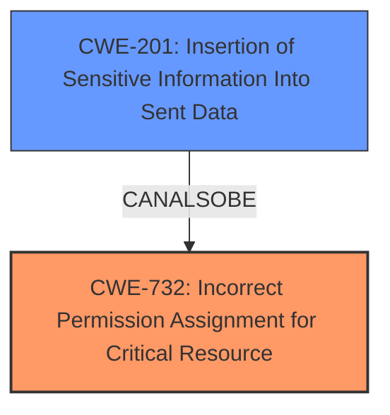

# Analysis Report for CVE-2025-2786

# Vulnerability Analysis Report: CVE-2025-2786

## Description

A flaw was found in Tempo Operator, where it **creates a ServiceAccount**, **ClusterRole**, **and **ClusterRole**Binding** when a user deploys a TempoStack or TempoMonolithic instance. This flaw allows a user with full access to their namespace to extract the ServiceAccount token and use it to submit TokenReview and SubjectAccessReview requests, potentially revealing information about other users permissions. While this does not allow privilege escalation or impersonation, it exposes information that could aid in gathering information for further attacks.

## Vulnerability Description Key Phrases

- **Weakness:** ['creates a ServiceAccount', 'and ClusterRoleBinding', 'ClusterRole']
- **Impact:** ['extract ServiceAccount token', 'privilege escalation', 'impersonation']
- **Attacker:** user with full access to their namespace
- **Product:** Tempo Operator

## Analysis (with Relationship Data)

# Summary
| CWE ID | CWE Name | Confidence | CWE Abstraction Level | CWE Vulnerability Mapping Label | CWE-Vulnerability Mapping Notes |
|---|---|---|---|---|---|
| CWE-732 | Incorrect Permission Assignment for Critical Resource | 0.9 | Class | Primary | Allowed-with-Review |
| CWE-201 | Insertion of Sensitive Information Into Sent Data | 0.6 | Base | Secondary | Allowed |

## Evidence and Confidence

*   **Confidence Score:** 0.75
*   **Evidence Strength:** MEDIUM

## Relationship Analysis
The primary relationship is that CWE-732, while named for permission assignment, is often misused for missing permission checks, which relates to authorization weaknesses. CWE-201 is included because sensitive information (the ServiceAccount token) is exposed as a result of the **incorrect permission assignment**. CWE-732 is a Class, while CWE-201 is Base.



## Vulnerability Chain
The vulnerability chain starts with the **incorrect permission assignment** (CWE-732) leading to the exposure of the ServiceAccount token, effectively resulting in **insertion of sensitive information into sent data** (CWE-201). The chain highlights the flow from the initial misconfiguration to the final impact of information exposure.

## Summary of Analysis
The initial analysis identified several potential CWEs based on the keyphrases provided, with CWE-732 consistently appearing as a top candidate for the **weakness** related to creating a ServiceAccount, ClusterRole, and ClusterRoleBinding. The vulnerability description explicitly states that a user with full access to their namespace can extract the ServiceAccount token, which aligns with CWE-732's description of a product specifying permissions that allow unintended actors to read or modify a resource.

The choice of CWE-732 is primarily driven by the fact that the vulnerability resides in the **incorrect assignment of permissions**, leading to the **exposure of sensitive information**. While the vulnerability doesn't lead to privilege escalation or impersonation, the ability to extract the ServiceAccount token and use it for TokenReview and SubjectAccessReview requests reveals information about other users' permissions. The permissions assigned to the created ServiceAccount, ClusterRole, and ClusterRoleBinding are too broad, allowing users within the same namespace to potentially gather sensitive information.

CWE-201 is added as a secondary CWE because extracting the ServiceAccount token and using it to submit requests effectively results in the **insertion of sensitive information into data sent** to other actors.

Relevant CWE Information:

# Enhanced Context (25 CWEs)
The following CWEs were identified as potentially relevant to this vulnerability:

## CWE-732: Incorrect Permission Assignment for Critical Resource
**Abstraction Level**: Class
**Similarity Score**: 3051.66
**Source**: sparse

**Description**:
The product specifies permissions for a security-critical resource in a way that allows that resource to be read or modified by unintended actors.

**Mapping Guidance**:
- Usage: Allowed-with-Review
- Rationale: While the name itself indicates an assignment of permissions for resources, this is often misused for vulnerabilities in which "permissions" are not checked, which is an "authorization" weakness (CWE-285 or descendants) within CWE's model [REF-1287].

## CWE-201: Insertion of Sensitive Information Into Sent Data
**Abstraction Level**: base
**Similarity Score**: 4.33
**Source**: graph

**Description**:
CWE-201: Insertion of Sensitive Information Into Sent Data

**Mapping Guidance**:
- Usage: Allowed
- Rationale: This CWE entry is at the Base level of abstraction, which is a preferred level of abstraction for mapping to the root causes of vulnerabilities.


## CWE Relationship Analysis

Current CWEs represent these abstraction levels: .


### Vulnerability Chain Analysis

**Chain starting from CWE-201:**
- 201 (Insertion of Sensitive Information Into Sent Data) - ROOT


**Chain starting from CWE-285:**
- 285 (Improper Authorization) - ROOT


### CWE Relationship Diagram

```mermaid
graph TD
    classDef primary fill:#f96,stroke:#333,stroke-width:2px
    classDef secondary fill:#69f,stroke:#333
    classDef tertiary fill:#9e9,stroke:#333
```


*Report generated on 2025-07-14 15:43:52*
