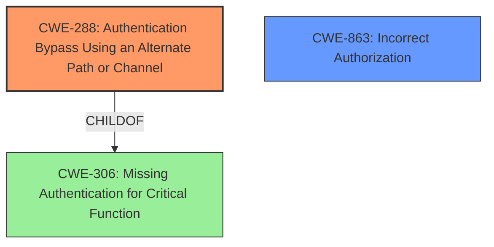

# Analysis Report for CVE-2025-2798

# Vulnerability Analysis Report: CVE-2025-2798

## Description

The Woffice CRM theme for WordPress is vulnerable to Authentication Bypass in all versions up to, and including, 5.4.21. This is due to a **misconfiguration of excluded roles during registration**. This makes it possible for unauthenticated attackers to register with an Administrator role if a custom login form is being used. This can be combined with CVE-2025-2797 to bypass the user approval process if an Administrator can be tricked into taking an action such as clicking a link.

## Vulnerability Description Key Phrases

- **Rootcause:** misconfiguration of excluded roles during registration
- **Weakness:** Authentication Bypass, bypass the user approval process
- **Product:** Woffice CRM theme for WordPress
- **Impact:** ['register with an Administrator role', 'bypass the user approval process']
- **Attacker:** unauthenticated attackers
- **Version:** up to and including 5.4.21

## Analysis (with Relationship Data)

# Summary
| CWE ID   | CWE Name                                                                 | Confidence | CWE Abstraction Level | CWE Vulnerability Mapping Label | CWE-Vulnerability Mapping Notes |
| :------- | :----------------------------------------------------------------------- | :--------- | :-------------------- | :------------------------------ | :------------------------------ |
| CWE-288  | Authentication Bypass Using an Alternate Path or Channel                 | 0.9        | Base                  | Primary                         | Allowed                       |
| CWE-863  | Incorrect Authorization                                                  | 0.7        | Class                 | Secondary                       | Allowed-with-Review           |

## Evidence and Confidence

*   **Confidence Score:** 0.8
*   **Evidence Strength:** MEDIUM

## Relationship Analysis

The primary CWE is CWE-288 (Authentication Bypass Using an Alternate Path or Channel), which is a Base level CWE. It is related to CWE-306 (Missing Authentication for Critical Function) as a parent. CWE-863 (Incorrect Authorization) is a Class level CWE and is related to authorization bypass. The relationship analysis helps in selecting the most specific CWE based on the provided evidence.



## Vulnerability Chain

The vulnerability chain starts with a **misconfiguration of excluded roles during registration**, leading to an **authentication bypass**, and finally allowing unauthenticated attackers to **register with an Administrator role**.

## Summary of Analysis

The initial assessment considered CWE-306, CWE-862 and CWE-863 but the **root cause** of the vulnerability is the **misconfiguration of excluded roles during registration** which allows for **Authentication Bypass Using an Alternate Path or Channel** (CWE-288). The additional factor of being able to register as an admin due to the bypass can be seen as an authorization issue (CWE-863). The analysis is based on the vulnerability description key phrases and the provided guidance which highlights the authentication vs authorization. The selected CWEs are at the optimal level of specificity as CWE-288 and CWE-863 capture the core issues.

Relevant CWE Information:

# Enhanced Context (25 CWEs)
The following CWEs were identified as potentially relevant to this vulnerability:

## CWE Classification Guidance

The following guidance has been automatically included because relevant keywords were detected in the vulnerability description:

### Authentication vs Authorization vs Access Control Guidance

## ===Guidance===

### Level Set – Authentication vs Authorization vs Access Control

**Authentication**:
Determines *who* the actor is (identity validation). This is typically the *first step* in access control.

* Example phrases: "user must log in", "lack of login check", "bypasses login"
* CWE relevance: authentication is usually mapped to CWE-306 or its children.

  * **CWE-306**: *Missing Authentication for Critical Function* – used when no identity validation is enforced for sensitive functionality (e.g., password reset, user deletion).

**Authorization**:
Determines *what* an authenticated actor is allowed to do. It decides access *after* identity is verified.

* Example phrases: "unauthorized access", "regular user can access admin panel", "role checks are missing"
* CWE relevance: use CWEs like 862, 863, 285 for authorization errors:

  * **CWE-862**: *Missing Authorization* – the application doesn't check whether the user is authorized at all.
  * **CWE-863**: *Incorrect Authorization* – the application checks authorization, but does it incorrectly (e.g., flawed logic).
  * **CWE-285**: *Improper Authorization* – general category for any flawed authorization logic or design.

**Access Control**:
A broader term that includes both authentication and authorization. Governs how resources are protected and who can access them under what conditions.

* CWE relevance:

  * **CWE-284**: *Improper Access Control* – top-level category used when access control failure exists but root cause is unclear.
  * This should be avoided **if** a more specific child CWE like 285, 862, 863, or 306 is appropriate.

---

## Mapping Discussion – Common Misclassification Patterns

### 1. **CWE-306 vs CWE-862**:

* **306** is about lack of **authentication** (e.g., *no login required at all*).
* **862** is about lack of **authorization** *after* authentication (e.g., *admin check missing*).
* ✅ Example CWE-306: *“An unauthenticated attacker can invoke the password reset API.”*
* ✅ Example CWE-862: *“An authenticated user without admin privileges can delete any user account.”*

### 2. **CWE-285 vs CWE-284**:

* **285** is specific to authorization flaws – it's a better choice than 284 **if** the issue involves *improper or missing role checks*.
* **284** should be reserved for general access control issues when it’s unclear whether the issue lies in authn or authz.

---

## Technical Impact vs Root Cause Clarification

**Phrase like "unauthorized access" is not enough.**

* If you **cannot determine whether identity was checked**, assume it’s **authorization** and consider 862 or 863.
* If you **know no login happened**, lean toward **authentication** → CWE-306.
* If the **access control policy is unclear or inconsistently enforced**, but it's not due to missing checks, consider **CWE-284**.

---

## Good Mapping Examples

* ✅ **CWE-306**: “The endpoint `/admin/deleteUser` does not require any authentication.”
* ✅ **CWE-862**: “Any logged-in user can change any other user's email without being an admin.”
* ✅ **CWE-863**: “An admin check exists but incorrectly grants access to non-admin users.”
* ✅ **CWE-285**: “Application uses a static role check that fails when roles change dynamically.”
* ✅ **CWE-284**: “Inconsistent enforcement of access rules across services with unclear policy source.”

---

## Summary – Quick LLM Rules of Thumb

| **Indicator**                                              | **Likely CWE** |
| ---------------------------------------------------------- | -------------- |
| No identity check (no login)                               | CWE-306        |
| No role/privilege check after login                        | CWE-862        |
| Role check is present but flawed                           | CWE-863        |
| General or ambiguous authorization failure                 | CWE-285        |
| High-level access control problem with no clear root cause | CWE-284        |

### CWE-288: Authentication Bypass Using an Alternate Path or Channel

The product requires authentication, but the product has an alternate path or channel that does not require authentication. In this case, the alternate path is the registration process due to the **misconfiguration of excluded roles during registration**, which bypasses the normal authentication process. This allows unauthenticated attackers to register with an Administrator role.

The security implication is that an attacker can gain administrative access to the system without proper authentication.

### CWE-863: Incorrect Authorization

The product performs an authorization check when an actor attempts to access a resource or perform an action, but it does not correctly perform the check. Due to the authentication bypass, the attacker is able to register with an administrative role, which gives them access to resources and actions that they should not have.

The security implication is that an attacker can perform actions that they are not authorized to perform.

### Rejected CWEs

*   CWE-306: Missing Authentication for Critical Function - While authentication is bypassed, the vulnerability lies in a **misconfiguration** rather than a complete lack of authentication.
*   CWE-862: Missing Authorization - The vulnerability is primarily about bypassing authentication, not missing authorization checks after authentication.
*   CWE-285: Improper Authorization - While related to authorization, the primary issue is the authentication bypass which then leads to the attacker being able to register as an Admin.
*   CWE-287: Improper Authentication - Similar to CWE-306, the issue isn't an improper authentication mechanism itself, but a bypass due to **misconfiguration**.
*   CWE-472: External Control of Assumed-Immutable Web Parameter - This is less relevant as the core issue is with role configuration, not directly with externally controlled


## CWE Relationship Analysis

Current CWEs represent these abstraction levels: .


### Vulnerability Chain Analysis

**Chain starting from CWE-288:**
- 288 (Authentication Bypass Using an Alternate Path or Channel) - ROOT


**Chain starting from CWE-863:**
- 863 (Incorrect Authorization) - ROOT


### CWE Relationship Diagram

```mermaid
graph TD
    classDef primary fill:#f96,stroke:#333,stroke-width:2px
    classDef secondary fill:#69f,stroke:#333
    classDef tertiary fill:#9e9,stroke:#333
```


*Report generated on 2025-07-14 15:45:00*
