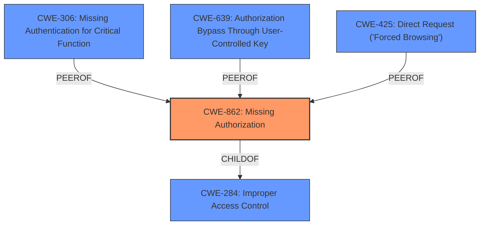

# Enhanced Analysis for CVE-2025-28104

# Summary

| CWE ID   | CWE Name                                                                 | Confidence | CWE Abstraction Level | CWE Vulnerability Mapping Label | CWE-Vulnerability Mapping Notes |
| -------- | ------------------------------------------------------------------------ | ---------- | --------------------- | ------------------------------- | ------------------------------- |
| CWE-862  | Missing Authorization                                                    | 0.9        | Base                  | Primary CWE                     | Allowed                         |
| CWE-284  | Improper Access Control                                                  | 0.7        | Pillar                 | Secondary Candidate             | Discouraged                     |
| CWE-306  | Missing Authentication for Critical Function                             | 0.6        | Base                  | Secondary Candidate             | Allowed                         |
| CWE-639  | Authorization Bypass Through User-Controlled Key                         | 0.5        | Base                  | Secondary Candidate             | Allowed                         |
| CWE-425  | Direct Request ('Forced Browsing')                                       | 0.5        | Base                  | Secondary Candidate             | Allowed                         |

## Evidence and Confidence

*   **Confidence Score:** 0.8
*   **Evidence Strength:** HIGH

## Relationship Analysis

The primary relationship that impacted the decision was the parent-child relationship between CWE-284 (Improper Access Control) and CWE-862 (Missing Authorization). While the vulnerability description indicates a general **"incorrect access control"**, the CVE summary reveals that the backend **"does not validate the input query,"** which is a form of missing authorization. Therefore, CWE-862, being a more specific child of CWE-284, is a better fit.

CWE-306 (Missing Authentication for Critical Function) was considered but is less likely because the description doesn't explicitly state that authentication is missing, only that access control is **incorrect**. It is more likely to be an authorization issue, assuming there is some level of authentication.

CWE-639 (Authorization Bypass Through User-Controlled Key) and CWE-425 (Direct Request ('Forced Browsing')) are also possibilities. CWE-639 involves modifying a key to gain access to another user's data, which could be related to the crafted input mentioned in the description. CWE-425 describes inadequate enforcement of authorization on restricted URLs. Both are less likely than CWE-862 because the core issue seems to be the missing authorization check on the input query, rather than modifying keys or directly accessing restricted URLs.



## Vulnerability Chain

The vulnerability chain starts with the **missing authorization** check on the input query (CWE-862). Because the backend **does not validate the input query**, this leads to the impact of an attacker gaining access to all usernames.

## Summary of Analysis

The initial assessment pointed towards a general access control issue. However, after analyzing the CVE summary, the root cause was identified as the backend's failure to validate the input query. This missing validation step allows attackers to access all usernames through a crafted input. Given this specific root cause, CWE-862 (Missing Authorization) is the most appropriate mapping. The vulnerability description key phrases also helped narrow down the rootcause to **incorrect access control**.

The graph relationships influenced the final selection by highlighting the hierarchical relationship between CWE-284 and CWE-862, reinforcing the decision to choose the more specific CWE-862.

The selected CWE is at the optimal level of specificity (Base) as it directly addresses the **missing authorization** check on the input query, which is the root cause of the vulnerability.

Other CWEs considered but not used:

*   CWE-284: A more general term, but CWE-862 is more specific.
*   CWE-306: Authentication wasn't explicitly missing, so this is less likely than authorization.
*   CWE-639 and CWE-425: These were considered as possibilities because of the crafted input vector, but the core issue is the **missing authorization**.


## CWE Relationship Analysis

Current CWEs represent these abstraction levels: .


### Vulnerability Chain Analysis

**Chain starting from CWE-862:**
- 862 (Missing Authorization) - ROOT


**Chain starting from CWE-639:**
- 639 (Authorization Bypass Through User-Controlled Key) - ROOT


### CWE Relationship Diagram

```mermaid
graph TD
    classDef primary fill:#f96,stroke:#333,stroke-width:2px
    classDef secondary fill:#69f,stroke:#333
    classDef tertiary fill:#9e9,stroke:#333
```