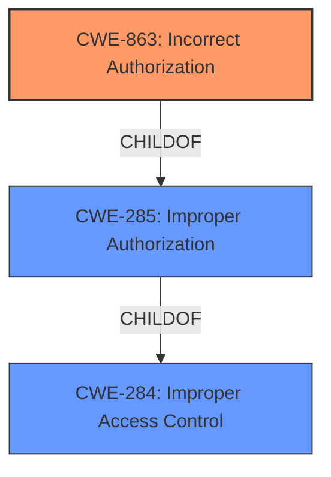

# Raw Analyzer Response for CVE-2025-28131

# Summary
| CWE ID | CWE Name | Confidence | CWE Abstraction Level | CWE Vulnerability Mapping Label | CWE-Vulnerability Mapping Notes |
|---|---|---|---|---|---|
| CWE-863 | Incorrect Authorization | 0.9 | Class | Primary CWE | Allowed-with-Review |
| CWE-284 | Improper Access Control | 0.6 | Pillar | Secondary Candidate | Discouraged |

## Evidence and Confidence

*   **Confidence Score:** 0.75
*   **Evidence Strength:** HIGH

## Relationship Analysis
The primary CWE is CWE-863, which is a child of CWE-285 (Improper Authorization), which in turn is a child of CWE-284 (Improper Access Control). CWE-863 is chosen because the vulnerability arises from the **improper authorization enforcement**, indicating that an authorization check is in place but is implemented incorrectly. If there were no authorization check at all, CWE-862 (Missing Authorization) would be more appropriate. CWE-284 is a higher-level class and would be less specific.

## Vulnerability Chain
The vulnerability chain starts with **improper authorization enforcement** (CWE-863), which leads to low-privilege users being able to perform administrative actions such as stopping system services and deleting critical resources.

## Summary of Analysis
The analysis is based on the provided evidence, specifically the "Vulnerability Description Key Phrases" which states "**rootcause:** **improper authorization enforcement**" and the "CVE Reference Links Content Summary" which indicates that "The application lacks proper authorization enforcement, allowing users with Read-Only permissions to execute high-impact administrative operations."

The relationship graph influenced the decision to choose CWE-863 over the more general CWE-284. The evidence strongly suggests that authorization checks exist, but they are implemented incorrectly, making CWE-863 the most specific and appropriate choice.

Relevant CWE Information:
- CWE-863: Incorrect Authorization: The product performs an authorization check when an actor attempts to access a resource or perform an action, but it does not correctly perform the check.
- CWE-284: Improper Access Control: The product does not adequately control access to resources or data, which could be leveraged by an attacker.

Other CWEs considered:
- CWE-285: Improper Authorization: While similar to CWE-863, it is more general. CWE-863 indicates the presence of authorization logic, albeit flawed, whereas CWE-285 encompasses broader authorization failures. Given the explicit mention of **improper authorization enforcement**, CWE-863 is a more precise fit.
- CWE-862: Missing Authorization: This CWE was considered, but the description indicates that the application has authorization checks, but they are not working correctly.