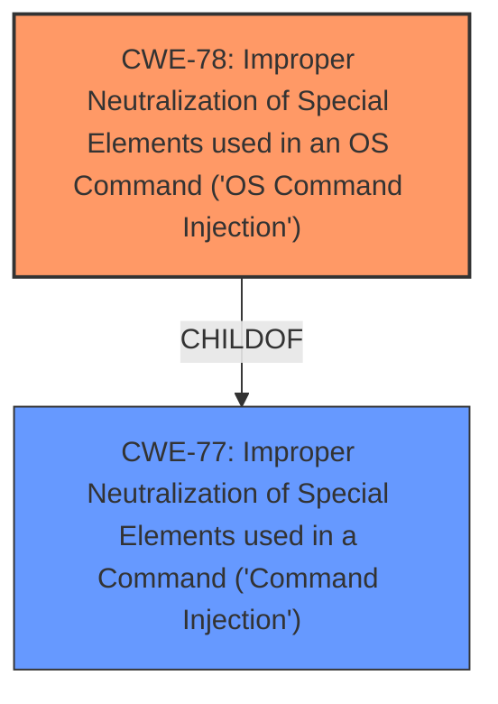

# Analysis for CVE-2025-28146

# Summary
| CWE ID | CWE Name | Confidence | CWE Abstraction Level | CWE Vulnerability Mapping Label | CWE-Vulnerability Mapping Notes |
|---|---|---|---|---|---|
| CWE-78 | Improper Neutralization of Special Elements used in an OS Command ('OS Command Injection') | 1.0 | Base | Allowed | Primary CWE. The vulnerability involves **command injection** via the `fota_url` parameter, indicating **improper neutralization** of special elements within an OS command. |

## Evidence and Confidence

*   **Confidence Score:** 1.0
*   **Evidence Strength:** HIGH

## Relationship Analysis
The primary CWE is CWE-78, which is a base-level CWE. CWE-78 is a child of CWE-77 (Class). The vulnerability involves **command injection** via the `fota_url` parameter, indicating **improper neutralization** of special elements within an OS command. Selecting the base CWE provides a more specific classification than the class-level CWE.

## Vulnerability Chain
The vulnerability chain starts with the **improper neutralization** of the `fota_url` parameter, leading to OS **command injection**, and ultimately resulting in the ability to execute arbitrary commands as root.

## Summary of Analysis
The primary CWE is CWE-78. The vulnerability is a **command injection** vulnerability in the `fota_url` parameter. The `fota_url` parameter is not sanitized, leading to **command injection**. This allows a remote authenticated attacker to execute arbitrary commands as root. This aligns with the description of CWE-78. The evidence is strong, and I am confident in this assessment.

Relevant CWE Information:

# Enhanced Context (25 CWEs)
The following CWEs were identified as potentially relevant to this vulnerability:

## CWE-78: Improper Neutralization of Special Elements used in an OS Command ('OS Command Injection')
**Abstraction Level**: Base
**Similarity Score**: 0.77
**Source**: dense

**Description**:
The product constructs all or part of an OS command using externally-influenced input from an upstream component, but it does not neutralize or incorrectly neutralizes special elements that could modify the intended OS command when it is sent to a downstream component.

**Mapping Guidance**:
- Usage: Allowed
- Rationale: This CWE entry is at the Base level of abstraction, which is a preferred level of abstraction for mapping to the root causes of vulnerabilities.