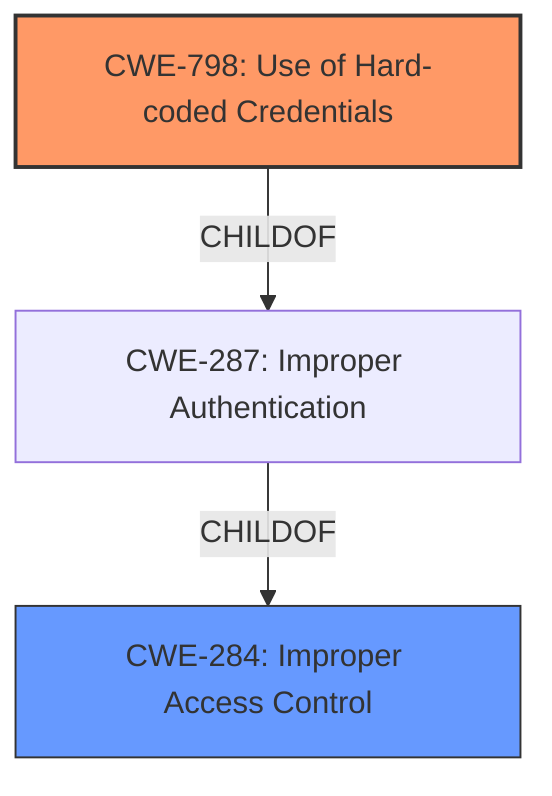

# Analysis Report for CVE-2025-28230

# Vulnerability Analysis Report: CVE-2025-28230

## Description

**Incorrect access control** in JMBroadcast JMB0150 Firmware v1.0 allows attackers to access hardcoded administrator credentials.

## Vulnerability Description Key Phrases

- **Rootcause:** Incorrect access control
- **Impact:** access hardcoded administrator credentials
- **Attacker:** attackers
- **Product:** JMBroadcast JMB0150 Firmware
- **Version:** v1.0

## Analysis (with Relationship Data)

# Summary
| CWE ID  | CWE Name  | Confidence | CWE Abstraction Level | CWE Vulnerability Mapping Label | CWE-Vulnerability Mapping Notes |
| :------- | :--------------------------------------- | :--------- | :---------------------- | :-------------------------------- | :---------------------------------- |
| CWE-798 | Use of Hard-coded Credentials | 0.9 | Base  | Allowed | Primary CWE |
| CWE-284 | Improper Access Control | 0.6 | Pillar | Discouraged | Secondary Candidate |

## Evidence and Confidence

*   **Confidence Score:** 0.75
*   **Evidence Strength:** MEDIUM

## Relationship Analysis
The primary relationship considered was the child-of relationship between CWE-798 and CWE-287 (Improper Authentication), and CWE-284 (Improper Access Control). The analysis favored CWE-798 because the vulnerability description explicitly mentions "hardcoded administrator credentials," making it more specific than the general "Improper Access Control." While CWE-284 is a broader category, the availability of a more precise CWE makes it less suitable.



## Vulnerability Chain
The vulnerability chain starts with **incorrect access control**, leading to the exposure of hardcoded administrator credentials.
  - **Root Cause:** **Incorrect access control** leads to...
  - **Weakness:** ...exposure of hardcoded administrator credentials (CWE-798)
  - **Impact:** Attackers can access the system with administrator privileges.

## Summary of Analysis
Initially, the analysis considered CWE-284 (Improper Access Control) because the vulnerability description mentions **"Incorrect access control"**. However, further analysis revealed that the **incorrect access control** leads to the exposure of "hardcoded administrator credentials." This suggests that the root cause is more specifically related to the use of hardcoded credentials. Given this information, CWE-798 (Use of Hard-coded Credentials) is the more appropriate primary CWE.

The decision is heavily based on the vulnerability description and the provided "Vulnerability Description Key Phrases". The presence of both "**Incorrect access control**" and "access hardcoded administrator credentials" phrases strongly supports the selection of CWE-798 as the primary weakness. While **incorrect access control** is present as the rootcause, the exposure of hardcoded credentials is the mechanism of the weakness.

Relevant CWE Information:

# Enhanced Context (25 CWEs)
The following CWEs were identified as potentially relevant to this vulnerability:

## CWE-798: Use of Hard-coded Credentials
**Abstraction Level**: Base
**Similarity Score**: 0.75
**Source**: dense

**Description**:
The product contains hard-coded credentials, such as a password or cryptographic key.

**Mapping Guidance**:
- Usage: Allowed
- Rationale: This CWE entry is at the Base level of abstraction, which is a preferred level of abstraction for mapping to the root causes of vulnerabilities.

## CWE-284: Improper Access Control
**Abstraction Level**: Pillar
**Similarity Score**: 0.113
**Source**: sparse

**Description**:
The software does not restrict access to resources (files, data, services, etc.) to only the intended privileged actors (users, processes, etc.).

**Mapping Guidance**:
- Usage: Discouraged
- Rationale: This is a very general category. It is better to select a more specific child.

## CWE-798: Use of Hard-coded Credentials
Technical Explanation:

CWE-798 (Use of Hard-coded Credentials): This CWE is applicable because the vulnerability involves the exposure of hardcoded administrator credentials. The **incorrect access control** allows attackers to access these credentials directly, which violates the principle of secure credential management. The security implication is that attackers can gain complete control over the system by using these hardcoded credentials.

CWE-284: Improper Access Control
Technical Explanation:

CWE-284 (Improper Access Control): This CWE is a general category for access control issues. While **incorrect access control** is mentioned, the more specific issue is the exposure of hardcoded credentials. Therefore, CWE-284 is a secondary consideration.


## CWE Relationship Analysis

Current CWEs represent these abstraction levels: .


### Vulnerability Chain Analysis

**Chain starting from CWE-284:**
- 284 (Improper Access Control) - ROOT


**Chain starting from CWE-287:**
- 287 (Improper Authentication) - ROOT


### CWE Relationship Diagram

```mermaid
graph TD
    classDef primary fill:#f96,stroke:#333,stroke-width:2px
    classDef secondary fill:#69f,stroke:#333
    classDef tertiary fill:#9e9,stroke:#333
```


*Report generated on 2025-07-14 15:51:20*
