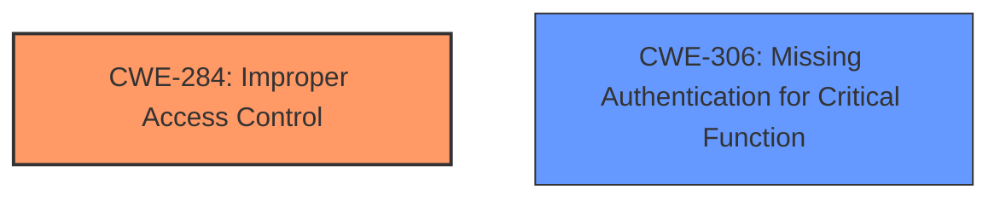

# Analysis Report for CVE-2025-28233

# Vulnerability Analysis Report: CVE-2025-28233

## Description

**Incorrect access control** in BW Broadcast TX600 (14980), TX300 (32990) (31448), TX150, TX1000, TX30, and TX50 Hardware Version 2, Software Version 1.6.0, Control Version 1.0, AIO Firmware Version 1.7 allows attackers to access log files and extract session identifiers to execute a session hijacking attack.

## Vulnerability Description Key Phrases

- **Rootcause:** Incorrect access control
- **Product:** ['BW Broadcast TX600', 'TX300', 'TX150', 'TX1000', 'TX30', 'TX50']
- **Impact:** ['access log files', 'session hijacking attack']
- **Attacker:** attackers
- **Version:** ['Hardware Version 2', 'Software Version 1.6.0', 'Control Version 1.0', 'AIO Firmware Version 1.7']

## Analysis (with Relationship Data)

# Summary
| CWE ID | CWE Name | Confidence | CWE Abstraction Level | CWE Vulnerability Mapping Label | CWE-Vulnerability Mapping Notes |
|---|---|---|---|---|---|
| CWE-284 | Improper Access Control | 0.9 | Pillar | Primary | Allowed-with-Review |
| CWE-306 | Missing Authentication for Critical Function | 0.6 | Base | Secondary | Allowed |

## Evidence and Confidence

*   **Confidence Score:** 0.9
*   **Evidence Strength:** MEDIUM

## Relationship Analysis
The primary CWE is CWE-284, which is a high-level category. The vulnerability involves **incorrect access control**, suggesting a flaw in how the system manages access to resources. CWE-284 is a Pillar level CWE, and thus is high level. The description mentions that attackers can "access log files and extract session identifiers," which could imply a **missing authentication** step. This leads to the consideration of CWE-306. However, the description focuses on the **incorrect** nature of the access control, rather than a complete absence, making CWE-284 the more suitable primary classification. CWE-306 is considered as a secondary.



## Vulnerability Chain
The chain of events in this vulnerability is as follows:
1.  **Incorrect Access Control (CWE-284)**: The root cause is the **incorrect access control** mechanism, allowing unauthorized access to resources.
2.  Access Log Files: Due to the **incorrect access control**, attackers can access log files.
3.  Extract Session Identifiers: Attackers extract session identifiers from the log files.
4.  Session Hijacking Attack: Finally, the extracted session identifiers are used to execute a session hijacking attack.

## Summary of Analysis
The initial assessment identified **incorrect access control** as the primary issue. The provided evidence, specifically the vulnerability description, explicitly mentions "**Incorrect access control**" as the root cause. The description indicates that this **incorrect access control** leads to the ability to access log files and perform session hijacking.

The retriever results pointed to CWE-284 as a potential candidate, and the CWE Classification Guidance further solidified this choice. The guidance differentiates between authentication, authorization, and access control, highlighting that CWE-284 is appropriate for general access control issues when the root cause is unclear. In this case, while the specific mechanism of the **incorrect access control** isn't detailed, the overall issue falls under this category.

Other CWEs considered but not used:

*   CWE-306: Missing Authentication for Critical Function - While session hijacking is the result, the root cause is stated as **incorrect access control**, not missing authentication.
*   CWE-862: Missing Authorization - Similar to CWE-306, the vulnerability description focuses on **incorrect access control** in general.

The final decision to use CWE-284 is based on the explicit mention of "**Incorrect access control**" in the vulnerability description, combined with the guidance that CWE-284 is appropriate when the root cause isn't specifically authentication or authorization related.

Relevant CWE Information:

# Enhanced Context (25 CWEs)
The following CWEs were identified as potentially relevant to this vulnerability:

## CWE-280: Improper Handling of Insufficient Permissions or Privileges 
**Abstraction Level**: Base
**Similarity Score**: 0.75
**Source**: dense

**Description**:
The product does not handle or incorrectly handles when it has insufficient privileges to access resources or functionality as specified by their permissions. This may cause it to follow unexpected code paths that may leave the product in an invalid state.

**Mapping Guidance**:
- Usage: Allowed
- Rationale: This CWE entry is at the Base level of abstraction, which is a preferred level of abstraction for mapping to the root causes of vulnerabilities.


## CWE-807: Reliance on Untrusted Inputs in a Security Decision
**Abstraction Level**: Base
**Similarity Score**: 0.75
**Source**: dense

**Description**:
The product uses a protection mechanism that relies on the existence or values of an input, but the input can be modified by an untrusted actor in a way that bypasses the protection mechanism.

**Mapping Guidance**:
- Usage: Allowed
- Rationale: This CWE entry is at the Base level of abstraction, which is a preferred level of abstraction for mapping to the root causes of vulnerabilities.


## CWE-668: Exposure of Resource to Wrong Sphere
**Abstraction Level**: Class
**Similarity Score**: 0.75
**Source**: dense

**Description**:
The product exposes a resource to the wrong control sphere, providing unintended actors with inappropriate access to the resource.

**Mapping Guidance**:
- Usage: Discouraged
- Rationale: CWE-668 is high-level and is often misused as a catch-all when lower-level CWE IDs might be applicable. It is sometimes used for low-information vulnerability reports [REF-1287]. It is a level-1 Class (i.e., a child of a Pillar). It is not useful for trend analysis.


## CWE-303: Incorrect Implementation of Authentication Algorithm
**Abstraction Level**: Base
**Similarity Score**: 0.74
**Source**: dense

**Description**:
The requirements for the product dictate the use of an established authentication algorithm, but the implementation of the algorithm is incorrect.

**Mapping Guidance**:
- Usage: Allowed
- Rationale: This CWE entry is at the Base level of abstraction, which is a preferred level of abstraction for mapping to the root causes of vulnerabilities.


## CWE-274: Improper Handling of Insufficient Privileges
**Abstraction Level**: Base
**Similarity Score**: 0.74
**Source**: dense

**Description**:
The product does not handle or incorrectly handles when it has insufficient privileges to perform an operation, leading to resultant weaknesses.

**Mapping Guidance**:
- Usage: Discouraged
- Rationale: This CWE entry could be deprecated in a future version of CWE.


## CWE-497: Exposure of Sensitive System Information to an Unauthorized Control Sphere
**Abstraction Level**: Base
**Similarity Score**: 0.74
**Source**: dense

**Description**:
The product does not properly prevent sensitive system-level information from being accessed by unauthorized actors who do not have the same level of access to the underlying system as the product does.

**Mapping Guidance**:
- Usage: Allowed
- Rationale: This CWE entry is at the Base level of abstraction, which is a preferred level of abstraction for mapping to the root causes of vulnerabilities.


## CWE-425: Direct Request ('Forced Browsing')
**Abstraction Level**: Base
**Similarity Score**: 0.74
**Source**: dense

**Description**:
The web application does not adequately enforce appropriate authorization on all restricted URLs, scripts, or files.

**Mapping Guidance**:
- Usage: Allowed
- Rationale: This CWE entry is at the Base level of abstraction, which is a preferred level of abstraction for mapping to the root causes of vulnerabilities.


## CWE-41: Improper Resolution of Path Equivalence
**Abstraction Level**: Base
**Similarity Score**: 0.74
**Source**: dense

**Description**:
The product is vulnerable to file system contents disclosure through path equivalence. Path equivalence involves the use of special characters in file and directory names. The associated manipulations are intended to generate multiple names for the same object.

**Mapping Guidance**:
- Usage: Allowed
- Rationale: This CWE entry is at the Base level of abstraction, which is a preferred level of abstraction for mapping to the root causes of vulnerabilities.


## CWE-345: Insufficient Verification of Data Authenticity
**Abstraction Level**: Class
**Similarity Score**: 0.74
**Source**: dense

**Description**:
The product does not sufficiently verify the origin or authenticity of data, in a way that causes it to accept invalid data.

**Mapping Guidance**:
- Usage: Discouraged
- Rationale: This CWE entry is a level-1 Class (i.e., a child of a Pillar). It might have lower-level children that would be more appropriate


## CWE-472: External Control of Assumed-Immutable Web Parameter
**Abstraction Level**: Base
**Similarity Score**: 0.74
**Source**: dense

**Description**:
The web application does not sufficiently verify inputs that are assumed to be immutable but are actually externally controllable, such as hidden form fields.

**Mapping Guidance**:
- Usage: Allowed
- Rationale: This CWE entry is at the Base level of abstraction, which is a preferred level of abstraction for mapping to the root causes of vulnerabilities.


## CWE-639: Authorization Bypass Through User-Controlled Key
**Abstraction Level**: Base
**Similarity Score**: 1193.84
**Source**: sparse

**Description**:
The system's authorization functionality does not prevent one user from gaining access to another user's data or record by modifying the key value identifying the data.

**Mapping Guidance


## CWE Relationship Analysis

Current CWEs represent these abstraction levels: .


### Vulnerability Chain Analysis

**Chain starting from CWE-274:**
- 274 (Improper Handling of Insufficient Privileges) - ROOT


**Chain starting from CWE-280:**
- 280 (Improper Handling of Insufficient Permissions or Privileges ) - ROOT


### CWE Relationship Diagram

```mermaid
graph TD
    classDef primary fill:#f96,stroke:#333,stroke-width:2px
    classDef secondary fill:#69f,stroke:#333
    classDef tertiary fill:#9e9,stroke:#333
```


*Report generated on 2025-07-14 15:52:22*
