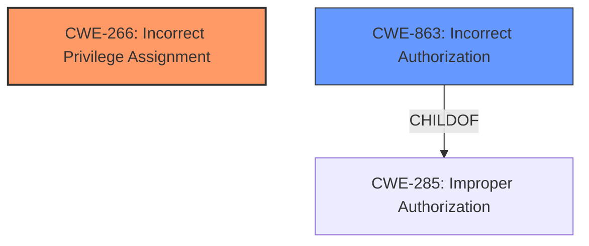

# Analysis for CVE-2025-28401

# Summary
| CWE ID  | CWE Name                                                                  | Confidence | CWE Abstraction Level | CWE Vulnerability Mapping Label | CWE-Vulnerability Mapping Notes |
| ------- | ------------------------------------------------------------------------- | ---------- | --------------------- | ------------------------------- | ------------------------------- |
| CWE-266 | Incorrect Privilege Assignment                                            | 0.8        | Base                  | Primary                         | Allowed                         |
| CWE-863 | Incorrect Authorization                                                   | 0.6        | Class                  | Secondary                       | Allowed-with-Review             |

## Evidence and Confidence

*   **Confidence Score:** 0.7
*   **Evidence Strength:** LOW

## Relationship Analysis

The primary relationship impacting my decision is the parent-child relationship between CWE-285 (Improper Authorization) and CWE-863 (Incorrect Authorization) as well as the explicit mention of privilege escalation in the vulnerability description, guiding me toward privilege-related CWEs. While CWE-285 is a higher-level class, CWE-863 offers more specificity. However, based on the CWE Guidance, privilege escalation points to privilege assignment as root cause, guiding the choice of CWE-266.

## Vulnerability Chain

The vulnerability chain starts with **Incorrect Privilege Assignment** (CWE-266), leading to **Incorrect Authorization** (CWE-863), and ultimately results in the impact of privilege escalation. The missing link is that the **menuId parameter** is the vector to **escalate privileges**.

## Summary of Analysis

The initial analysis focused on identifying the root cause of the vulnerability, which is privilege escalation. Based on the provided evidence, particularly the phrase "escalate privileges via the menuId parameter", the primary focus shifted towards privilege-related CWEs. The selection of CWE-266 is justified by the fact that the vulnerability allows a remote attacker to escalate privileges, which aligns with the description of **incorrect privilege assignment**. 

The decision is based on the **Vulnerability Description Key Phrases**, which highlights privilege escalation as the impact. The lack of detailed information about the code or the exact mechanism of exploitation limits the confidence in the mapping. However, based on the given information, CWE-266 represents the most accurate classification of the root cause.

The guidance provided suggests that privilege escalation is related to privilege assignment as root cause, which aligns with the choice of CWE-266.

Relevant CWE Information:

# Enhanced Context (25 CWEs)
The following CWEs were identified as potentially relevant to this vulnerability:

## CWE-266: Incorrect Privilege Assignment
**Abstraction Level**: Base
**Similarity Score**: 0.78
**Source**: dense

**Description**:
A product **incorrectly assigns a privilege** to a particular actor, creating an unintended sphere of control for that actor.

**Mapping Guidance**:
- Usage: Allowed
- Rationale: This CWE entry is at the Base level of abstraction, which is a preferred level of abstraction for mapping to the root causes of vulnerabilities.

## CWE-863: Incorrect Authorization
**Abstraction Level**: Class
**Similarity Score**: 1283.29
**Source**: sparse

**Description**:
The product performs an authorization check when an actor attempts to access a resource or perform an action, but it does not correctly perform the check.

**Mapping Guidance**:
- Usage: Allowed-with-Review
- Rationale: This CWE entry is a Class and might have Base-level children that would be more appropriate

# Vulnerability Description
An issue in RUoYi v.4.8.0 allows a remote attacker to **escalate privileges** via the menuId parameter

### Vulnerability Description Key Phrases
- **product:** RUoYi
- **impact:** **escalate privileges**, **escalate privileges**
- **attacker:** remote attacker
- **version:** v.4.8.0