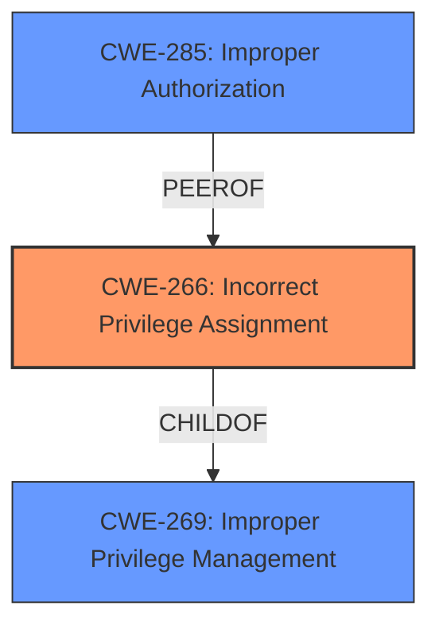

# Enhanced Analysis for CVE-2025-28402

# Summary
| CWE ID | CWE Name | Confidence | CWE Abstraction Level | CWE Vulnerability Mapping Label | CWE-Vulnerability Mapping Notes |
|---|---|---|---|---|---|
| CWE-266 | Incorrect Privilege Assignment | 0.7 | Base | Allowed | Primary CWE |

## Evidence and Confidence

*   **Confidence Score:** 0.7
*   **Evidence Strength:** LOW

## Relationship Analysis
The primary CWE identified is CWE-266, which falls under the broader category of privilege management issues. While there may be other related weaknesses, such as incorrect authorization or improper privilege management, the available evidence points most directly to an incorrect assignment of privileges as the root cause. The analysis considered alternative CWEs, but ultimately favored CWE-266 for its specific focus on privilege assignment errors.



## Vulnerability Chain
The vulnerability chain starts with the **incorrect privilege assignment** (CWE-266) due to the `jobId` parameter, which allows a remote attacker to **escalate privileges**. The final impact is unauthorized access or control within the RUoYi application.

## Summary of Analysis
The initial assessment focused on identifying the root cause of the privilege escalation vulnerability in RUoYi v.4.8.0. The description indicates that a remote attacker can **escalate privileges** via the `jobId` parameter. The provided evidence is low because CVE Reference Links Content Summary is unrelated.
Given the limited information, CWE-266 (Incorrect Privilege Assignment) appears to be the most appropriate mapping. This selection is based on the understanding that the vulnerability involves an error in assigning privileges, which enables the attacker to escalate their access level.
The selection of CWE-266 is at the optimal level of specificity, as it directly addresses the **incorrect assignment of privileges** that leads to the **privilege escalation**.
Relevant CWE Information:

# Enhanced Context (25 CWEs)
The following CWEs were identified as potentially relevant to this vulnerability:

## CWE-266: Incorrect Privilege Assignment
**Abstraction Level**: Base
**Similarity Score**: 0.78
**Source**: dense

**Description**:
A product **incorrectly assigns a privilege** to a particular actor, creating an unintended sphere of control for that actor.

**Mapping Guidance**:
- Usage: Allowed
- Rationale: This CWE entry is at the Base level of abstraction, which is a preferred level of abstraction for mapping to the root causes of vulnerabilities.


## CWE Relationship Analysis

Current CWEs represent these abstraction levels: .


### Vulnerability Chain Analysis

**Chain starting from CWE-266:**
- 266 (Incorrect Privilege Assignment) - ROOT


**Chain starting from CWE-269:**
- 269 (Improper Privilege Management) - ROOT


### CWE Relationship Diagram

```mermaid
graph TD
    classDef primary fill:#f96,stroke:#333,stroke-width:2px
    classDef secondary fill:#69f,stroke:#333
    classDef tertiary fill:#9e9,stroke:#333
```