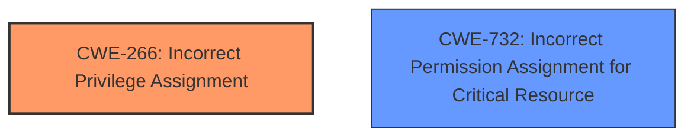

# Analysis Report for CVE-2025-28413

# Vulnerability Analysis Report: CVE-2025-28413

## Description

An issue in RUoYi v.4.8.0 allows a remote attacker to escalate privileges via the SysDictTypeController component

## Vulnerability Description Key Phrases

- **Component:** SysDictTypeController component
- **Product:** RUoYi
- **Impact:** escalate privileges, privilege escalation
- **Attacker:** remote attacker
- **Version:** v.4.8.0

## Analysis (with Relationship Data)

# Summary

| CWE ID  | CWE Name                                                              | Confidence | CWE Abstraction Level | CWE Vulnerability Mapping Label | CWE-Vulnerability Mapping Notes |
| ------- | --------------------------------------------------------------------- | ---------- | --------------------- | ------------------------------- | ----------------------------- |
| CWE-266 | Incorrect Privilege Assignment                                        | 0.8        | Base                  | Primary                         | Allowed                       |
| CWE-732 | Incorrect Permission Assignment for Critical Resource                 | 0.6        | Class                 | Secondary                       | Allowed-with-Review           |

## Evidence and Confidence

*   **Confidence Score:** 0.7
*   **Evidence Strength:** MEDIUM

## Relationship Analysis

The primary CWE is CWE-266, representing the **incorrect privilege assignment**. CWE-732, a class-level CWE, is a related concept focusing on incorrect permission assignment for critical resources. There isn't a direct parent-child relationship between these CWEs. However, both relate to access control issues. The choice of CWE-266 is preferred because it is at the Base level of abstraction, according to MITRE mapping guidance.



## Vulnerability Chain

The vulnerability chain starts with the **incorrect privilege assignment** (CWE-266) in the `SysDictTypeController` component, leading to the attacker's ability to **escalate privileges**. The impact is privilege escalation.

## Summary of Analysis

Based on the provided vulnerability description, the most relevant CWE is CWE-266 (Incorrect Privilege Assignment). The description explicitly mentions that a remote attacker can **escalate privileges** via the `SysDictTypeController` component in RUoYi v.4.8.0.

The phrase "**escalate privileges**" maps strongly to issues related to privilege management. Since there isn't a specific technical root cause like **improper** input validation mentioned, but rather an issue within the `SysDictTypeController` component that allows this **privilege escalation**, CWE-266 is appropriate. This is because CWE-266 covers scenarios where a product incorrectly assigns a privilege to an actor.

The Retriever results also suggest CWE-732 (Incorrect Permission Assignment for Critical Resource) and CWE-269 (Improper Privilege Management). CWE-269 is discouraged by MITRE because it's often misused. CWE-732 is a class-level CWE and might have Base-level children that would be more appropriate, but since we don't know what resource is critical or that this is really a resource issue, CWE-266 is better.

The confidence is slightly reduced (0.7) because the provided information is minimal. The "CVE Reference Links Content Summary" section is empty (NOINFO), so there is no further information from external sources.

Relevant CWE Information:

# Enhanced Context (25 CWEs)
The following CWEs were identified as potentially relevant to this vulnerability:

## CWE-266: Incorrect Privilege Assignment
**Abstraction Level**: Base
**Similarity Score**: 0.80
**Source**: dense

**Description**:
A product **incorrectly assigns a privilege** to a particular actor, creating an unintended sphere of control for that actor.

**Mapping Guidance**:
- Usage: Allowed
- Rationale: This CWE entry is at the Base level of abstraction, which is a preferred level of abstraction for mapping to the root causes of vulnerabilities.

## CWE-732: Incorrect Permission Assignment for Critical Resource
**Abstraction Level**: Class
**Similarity Score**: 0.037
**Source**: sparse

**Description**:
The product grants permissions to a critical resource in a way that allows unintended access or modification.

**Mapping Guidance**:
- Usage: Allowed-with-Review
- Rationale: This CWE entry is a Class and might have Base-level children that would be more appropriate.

The above CWE specifications were considered to make the final decision.


## CWE Relationship Analysis

Current CWEs represent these abstraction levels: .


### Vulnerability Chain Analysis

**Chain starting from CWE-266:**
- 266 (Incorrect Privilege Assignment) - ROOT


**Chain starting from CWE-269:**
- 269 (Improper Privilege Management) - ROOT


### CWE Relationship Diagram

```mermaid
graph TD
    classDef primary fill:#f96,stroke:#333,stroke-width:2px
    classDef secondary fill:#69f,stroke:#333
    classDef tertiary fill:#9e9,stroke:#333
```


*Report generated on 2025-07-14 16:00:21*
