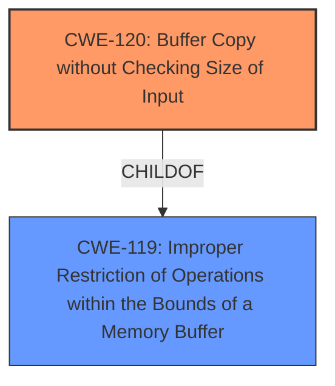

# Analysis for CVE-2025-2851

# Summary
| CWE ID | CWE Name | Confidence | CWE Abstraction Level | CWE Vulnerability Mapping Label | CWE-Vulnerability Mapping Notes |
|---|---|---|---|---|---|
| CWE-120 | Buffer Copy without Checking Size of Input ('Classic Buffer Overflow') | 0.9 | Base | Allowed-with-Review | Primary CWE. The vulnerability description explicitly states "**buffer overflow**" due to manipulation of the `plugins.so` component via the RPC Handler. |
| CWE-119 | Improper Restriction of Operations within the Bounds of a Memory Buffer | 0.7 | Class | Discouraged | Secondary candidate. This is a broader category that encompasses buffer overflows, but CWE-120 is more specific. |

## Evidence and Confidence

*   **Confidence Score:** 0.9
*   **Evidence Strength:** HIGH

## Relationship Analysis
The primary relationship that influenced the decision was the parent-child relationship between CWE-119 and CWE-120. CWE-120 is a specific type of CWE-119. The vulnerability description mentions "**buffer overflow**", making CWE-120 the more precise and preferred choice. While CWE-119 is a broader class, the specific nature of the vulnerability, as evidenced by the "**buffer overflow**" keyword, warrants the selection of CWE-120.

## Vulnerability Chain
The vulnerability chain starts with the **buffer overflow** in the `plugins.so` library due to **missing size checking** when copying data into a buffer. This leads to an exploitable condition that can result in code execution or denial of service.
  - Root Cause: CWE-120 Buffer Copy without Checking Size of Input ('Classic Buffer Overflow').
  - Impact: Code execution or denial of service.

## Summary of Analysis
The analysis is based on the provided vulnerability description and the CVE Reference Links Content Summary, which clearly indicate a "**buffer overflow**" vulnerability in the `plugins.so` component. The Retriever Results also list CWE-120 as a strong candidate. CWE-120 is preferred over the more general CWE-119 because it provides a more specific description of the **buffer overflow** occurring due to missing size checks during a buffer copy operation. The vulnerability is classified as CWE-120 with high confidence (0.9) due to the explicit mention of "**buffer overflow**" and the role of `plugins.so` component. The description clearly states that a manipulation leads to a **buffer overflow**, which is the root cause.

CWEs Considered but Not Used:

*   CWE-119: While related, it's a broader category than CWE-120.
*   CWE-190: Integer Overflow or Wraparound: Not directly related to the provided vulnerability description.
*   CWE-125: Out-of-bounds Read: The vulnerability is a **buffer overflow**, which is a write issue, not a read issue.
*   CWE-20: Improper Input Validation: While this might be a contributing factor, the core issue is the unchecked buffer copy, making CWE-120 more relevant.