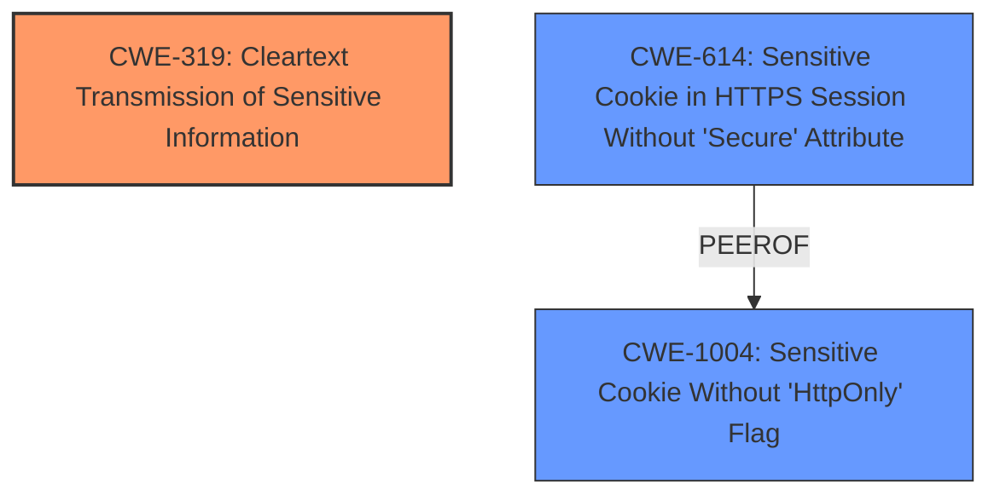

# Analysis for CVE-2025-2859

# Summary
| CWE ID | CWE Name | Confidence | CWE Abstraction Level | CWE Vulnerability Mapping Label | CWE-Vulnerability Mapping Notes |
|---|---|---|---|---|---|
| CWE-319 | Cleartext Transmission of Sensitive Information | 0.9 | Base | Allowed | Primary CWE |
| CWE-614 | Sensitive Cookie in HTTPS Session Without 'Secure' Attribute | 0.7 | Variant | Allowed | Secondary Candidate |
| CWE-1004 | Sensitive Cookie Without 'HttpOnly' Flag | 0.6 | Variant | Allowed | Secondary Candidate |

## Evidence and Confidence

*   **Confidence Score:** 0.9
*   **Evidence Strength:** HIGH

## Relationship Analysis
The primary relationship that influenced the decision was the hierarchical relationship where `CWE-614` and `CWE-1004` are related to the use of cookies. The retriever results showed these cookies issues and `CWE-319` as good matches. `CWE-319` is the root cause of sending the cookies over cleartext, and the other CWEs are related issues from the cookies.

## Vulnerability Chain
The vulnerability chain starts with the transmission of sensitive information (cookies) in cleartext (`CWE-319`). This leads to potential exposure of session cookies, which can then be used to hijack user sessions. The missing secure attribute (`CWE-614`) and HTTPOnly flag (`CWE-1004`) exacerbate the problem, making it easier for attackers to steal and use the cookies.
  - The **Primary CWE** is `CWE-319` which identifies the issue that led to the vulnerability i.e. the first in the "Vulnerability Chain"

## Summary of Analysis
The initial analysis of the vulnerability description and the CVE reference links indicates that the root cause of the vulnerability is the **use of the HTTP protocol for web browsing**, which results in the exchange of sensitive data (user cookies) in unencrypted text. This aligns perfectly with `CWE-319 (Cleartext Transmission of Sensitive Information)`. The vulnerability description key phrases also highlight the **weakness** that leads to the session hijacking impact.

The retriever results further support this assessment, with `CWE-319` being among the top matches. The CVE reference links content summary explicitly mentions the use of unencrypted HTTP protocol which is direct evidence supporting the selection of `CWE-319`.

The relationship graph helped visualize the connections between `CWE-319` and other relevant CWEs like `CWE-614` and `CWE-1004`, which are related to cookie security. While these are important considerations, they stem from the primary issue of transmitting sensitive data in cleartext. Therefore, `CWE-319` is the most appropriate primary CWE.

The selection of `CWE-319` is at the optimal level of specificity, as it directly addresses the root cause of the vulnerability. The other CWEs considered were either too high-level (e.g., `CWE-287`, `CWE-285`) or focused on specific aspects of the impact rather than the underlying cause. The provided evidence strongly supports this classification.

Relevant CWE Information:

# Enhanced Context (25 CWEs)
The following CWEs were identified as potentially relevant to this vulnerability:

## CWE-319: Cleartext Transmission of Sensitive Information
**Abstraction Level**: Base
**Similarity Score**: 0.238

**Description**:
The product transmits sensitive information in cleartext, which can be intercepted by unauthorized actors.

**Mapping Guidance**:
- Usage: Allowed
- Rationale: This CWE entry is at the Base level of abstraction, which is a preferred level of abstraction for mapping to the root causes of vulnerabilities.

## CWE-614: Sensitive Cookie in HTTPS Session Without 'Secure' Attribute
**Abstraction Level**: Variant
**Similarity Score**: 0.266

**Description**:
The product transmits a sensitive cookie over an HTTPS session but does not set the "Secure" attribute for the cookie. This allows the cookie to be transmitted over unencrypted HTTP connections, potentially exposing it to interception.

**Mapping Guidance**:
- Usage: Allowed
- Rationale: This CWE entry is at the Variant level of abstraction, which is a preferred level of abstraction for mapping to the root causes of vulnerabilities.

## CWE-1004: Sensitive Cookie Without 'HttpOnly' Flag
**Abstraction Level**: Variant
**Similarity Score**: 0.240

**Description**:
The product transmits a sensitive cookie without setting the "HttpOnly" flag. This can allow client-side scripts to access the cookie, potentially leading to information disclosure or session hijacking.

**Mapping Guidance**:
- Usage: Allowed
- Rationale: This CWE entry is at the Variant level of abstraction, which is a preferred level of abstraction for mapping to the root causes of vulnerabilities.

### CWE Details and Justification:

*   **CWE-319 Cleartext Transmission of Sensitive Information:** The vulnerability description states that user cookies are transmitted in cleartext due to the use of the HTTP protocol. This directly matches the description of `CWE-319`. The security implication is that an attacker can intercept the traffic and steal the cookies, leading to session hijacking. This is the root cause.
*   **CWE-614 Sensitive Cookie in HTTPS Session Without 'Secure' Attribute:** While the description mentions the use of HTTP, it doesn't explicitly state whether HTTPS is used or not. However, even if HTTPS is used, **not setting the "Secure" attribute can lead to the cookie being transmitted over HTTP**, exposing it to interception. This is a variant of the cookie handling issue and can be considered as a secondary weakness.
*   **CWE-1004 Sensitive Cookie Without 'HttpOnly' Flag:** This CWE is relevant because the vulnerability description mentions the possibility of stealing the active user session. **If the HttpOnly flag is not set, client-side scripts can access the cookie, potentially leading to session hijacking.** This is another variant of the cookie handling issue and can be considered as a secondary weakness.

### CWEs Considered but Not Used:

*   **CWE-287 Improper Authentication:** This CWE is too high-level and doesn't directly address the root cause of the vulnerability, which is the cleartext transmission of sensitive information.
*   **CWE-306 Missing Authentication for Critical Function:** While the vulnerability can lead to unauthorized access, the primary issue is not the lack of authentication, but the exposure of session cookies.
*   **CWE-863 Incorrect Authorization:** Similar to `CWE-306`, this CWE is not the primary issue. The vulnerability allows attackers to bypass authorization by stealing user sessions, but the root cause is the cleartext transmission of cookies.
*   **CWE-565 Reliance on Cookies without Validation and Integrity Checking:** While cookie validation is important, the primary issue is the cleartext transmission, not the lack of validation.

I am overriding the retriever suggestions of `CWE-287, CWE-306, CWE-863, and CWE-565` because they are not the root cause.