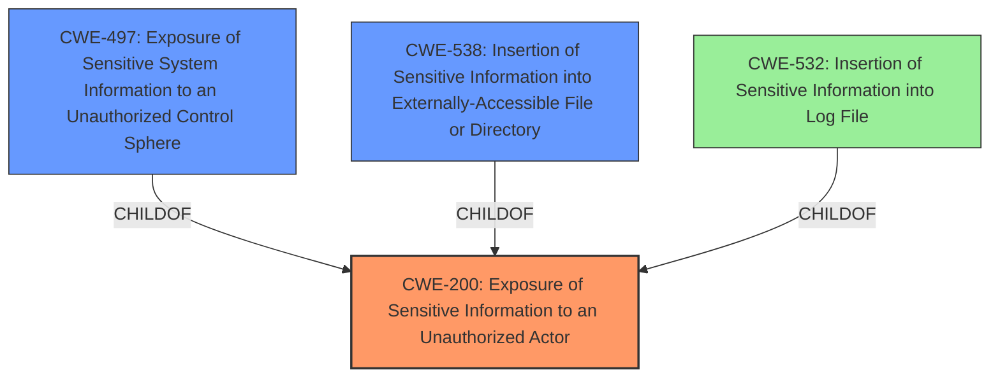

# Analysis Report for CVE-2025-2880

# Vulnerability Analysis Report: CVE-2025-2880

## Description

The Yame | Link In Bio plugin for WordPress is vulnerable to **Sensitive Information Exposure** in all versions up to, and including, 0.9.0 through the publicly accessible phpinfo.php script. This makes it possible for unauthenticated attackers to view potentially sensitive information contained in the exposed file.

## Vulnerability Description Key Phrases

- **Weakness:** Sensitive Information Exposure
- **Impact:** Information Disclosure
- **Vector:** publicly accessible phpinfo.php script
- **Attacker:** unauthenticated attackers
- **Product:** Yame | Link In Bio plugin for WordPress
- **Version:** up to and including 0.9.0
- **Component:** phpinfo.php script

## Analysis (with Relationship Data)

# Summary
| CWE ID | CWE Name | Confidence | CWE Abstraction Level | CWE Vulnerability Mapping Label | CWE-Vulnerability Mapping Notes |
|---|---|---|---|---|---|
| CWE-200 | Exposure of Sensitive Information to an Unauthorized Actor | 0.9 | Class | Primary | Allowed-with-Review |
| CWE-497 | Exposure of Sensitive System Information to an Unauthorized Control Sphere | 0.6 | Base | Secondary | Allowed |
| CWE-538 | Insertion of Sensitive Information into Externally-Accessible File or Directory | 0.5 | Base | Secondary | Allowed |

## Evidence and Confidence

*   **Confidence Score:** 0.9
*   **Evidence Strength:** MEDIUM

## Relationship Analysis
The primary CWE selected is CWE-200 [Exposure of Sensitive Information to an Unauthorized Actor], which is a Class-level CWE. While it's generally better to choose Base or Variant level CWEs, in this case, the description directly states **"Sensitive Information Exposure"** which aligns well with CWE-200. Further specificity could be achieved by considering child CWEs of CWE-200, but the provided information does not allow for a confident selection of a more specific CWE. The related CWEs, like CWE-497 [Exposure of Sensitive System Information to an Unauthorized Control Sphere] and CWE-538 [Insertion of Sensitive Information into Externally-Accessible File or Directory], were considered as they represent more specific cases of information exposure but weren't selected as primary due to lacking specific evidence.



## Vulnerability Chain
The vulnerability chain is relatively simple:
1.  **Root Cause:** Publicly accessible `phpinfo.php` script.
2.  **Weakness:** **Sensitive Information Exposure** due to the misconfiguration.
3.  **Impact:** Information Disclosure.

The chain highlights the direct exposure of sensitive information without proper authorization.

## Summary of Analysis
The primary assessment is based on the explicit mention of **"Sensitive Information Exposure"** in the vulnerability description, which strongly aligns with CWE-200 [Exposure of Sensitive Information to an Unauthorized Actor]. The publicly accessible `phpinfo.php` script enables unauthenticated attackers to view sensitive information.

While CWE-200 is a Class-level CWE, the provided information doesn't give enough specificity to confidently select a more detailed Base or Variant CWE. For instance, CWE-532 [Insertion of Sensitive Information into Log File] could be applicable if the `phpinfo.php` was inadvertently writing information to a log file, but this isn't stated. Similarly, CWE-497 [Exposure of Sensitive System Information to an Unauthorized Control Sphere] could be considered if the exposed information was system-specific. CWE-538 [Insertion of Sensitive Information into Externally-Accessible File or Directory] is also a good fit because the file is externally accessible.

The selection of CWE-200 is further supported by its high ranking in the Retriever Results. Although the mapping guidance discourages the use of CWE-200 as a catch-all, in this case, the description directly indicates the nature of the vulnerability.

Other CWEs were considered but ultimately deemed less appropriate:

*   CWE-306 [Missing Authentication for Critical Function]: While authentication is missing, the primary issue is the exposure of sensitive data, not the missing authentication itself.
*   CWE-668 [Exposure of Resource to Wrong Sphere]: This is too broad and doesn't accurately reflect the specific weakness.
*   CWE-201 [Insertion of Sensitive Information Into Sent Data]: This is not about *sending* data, but rather exposing it via a publicly accessible file.
*   CWE-73 [External Control of File Name or Path]: Not applicable as there's no external control over file names or paths mentioned.


## CWE Relationship Analysis

Current CWEs represent these abstraction levels: .


### Vulnerability Chain Analysis

**Chain starting from CWE-306:**
- 306 (Missing Authentication for Critical Function) - ROOT


**Chain starting from CWE-201:**
- 201 (Insertion of Sensitive Information Into Sent Data) - ROOT


### CWE Relationship Diagram

```mermaid
graph TD
    classDef primary fill:#f96,stroke:#333,stroke-width:2px
    classDef secondary fill:#69f,stroke:#333
    classDef tertiary fill:#9e9,stroke:#333
```


*Report generated on 2025-07-14 16:05:50*
