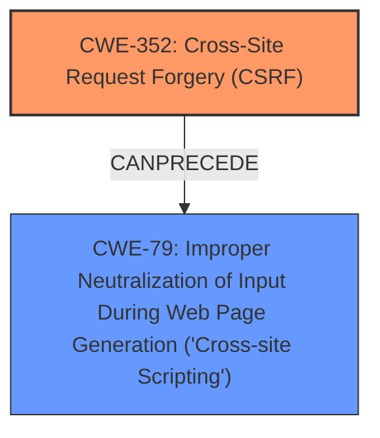

# Enhanced Analysis for CVE-2025-28883

# Summary
| CWE ID | CWE Name | Confidence | CWE Abstraction Level | CWE Vulnerability Mapping Label | CWE-Vulnerability Mapping Notes |
|---|---|---|---|---|---|
| CWE-352 | Cross-Site Request Forgery (CSRF) | 0.9 | Compound | Allowed | Primary CWE. The vulnerability is a CSRF issue. |
| CWE-79 | Improper Neutralization of Input During Web Page Generation ('Cross-site Scripting') | 0.8 | Base | Allowed | Secondary CWE. The CSRF leads to Stored XSS. |

## Evidence and Confidence

*   **Confidence Score:** 0.85
*   **Evidence Strength:** MEDIUM

## Relationship Analysis
The primary weakness is CWE-352 [Cross-Site Request Forgery (CSRF)], which allows an attacker to induce a user to perform actions they did not intend. In this case, the CSRF leads to Stored XSS (CWE-79 [Improper Neutralization of Input During Web Page Generation ('Cross-site Scripting')]).



## Vulnerability Chain
The vulnerability chain starts with CWE-352 [Cross-Site Request Forgery (CSRF)], which allows an attacker to trick a user into making a request, and this leads to CWE-79 [Improper Neutralization of Input During Web Page Generation ('Cross-site Scripting')] because the request contains malicious code that is not properly neutralized, resulting in Stored XSS.

## Summary of Analysis
The vulnerability is a Cross-Site Request Forgery (CSRF) that leads to Stored XSS. The primary CWE is CWE-352 [Cross-Site Request Forgery (CSRF)], which is the root cause of the vulnerability. The secondary CWE is CWE-79 [Improper Neutralization of Input During Web Page Generation ('Cross-site Scripting')], which is the result of the CSRF.

The evidence for this assessment is:

*   **Vulnerability Description Key Phrases:** "**weakness:** **XSS, cross-site scripting**"
*   **CVE Reference Links Content Summary:** "The vulnerability is a Cross-Site Request Forgery (CSRF)."

CWE-352 [Cross-Site Request Forgery (CSRF)] is chosen as the primary CWE because the vulnerability description clearly states that it is a CSRF issue. CWE-79 [Improper Neutralization of Input During Web Page Generation ('Cross-site Scripting')] is chosen as the secondary CWE because the CSRF leads to Stored XSS.

Other CWEs were considered but not chosen because they did not directly relate to the vulnerability. For example, CWE-434 [Unrestricted Upload of File with Dangerous Type] was not chosen because the vulnerability did not involve uploading files.


## CWE Relationship Analysis

Current CWEs represent these abstraction levels: .


### Vulnerability Chain Analysis

**Chain starting from CWE-352:**
- 352 (Cross-Site Request Forgery (CSRF)) - ROOT


**Chain starting from CWE-79:**
- 79 (Improper Neutralization of Input During Web Page Generation ('Cross-site Scripting')) - ROOT


### CWE Relationship Diagram

```mermaid
graph TD
    classDef primary fill:#f96,stroke:#333,stroke-width:2px
    classDef secondary fill:#69f,stroke:#333
    classDef tertiary fill:#9e9,stroke:#333
```