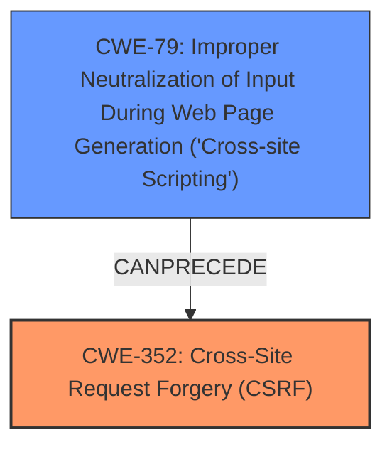

# Analysis Report for CVE-2025-28900

# Vulnerability Analysis Report: CVE-2025-28900

## Description

Cross-Site Request Forgery (CSRF) vulnerability in webgarb TabGarb Pro allows Stored XSS. This issue affects TabGarb Pro from n/a through 2.6.

## Vulnerability Description Key Phrases

- **Rootcause:** cross-site request forgery, weakness
- **Weakness:** Stored XSS, XSS
- **Product:** TabGarb Pro
- **Version:** n/a through 2.6

## Analysis (with Relationship Data)

# Summary
| CWE ID | CWE Name | Confidence | CWE Abstraction Level | CWE Vulnerability Mapping Label | CWE-Vulnerability Mapping Notes |
|---|---|---|---|---|---|
| CWE-352 | Cross-Site Request Forgery (CSRF) | 1.0 | Compound | Allowed | Primary CWE. The **root cause** is the **lack of CSRF protection**. |
| CWE-79 | Improper Neutralization of Input During Web Page Generation ('Cross-site Scripting') | 1.0 | Base | Allowed | Secondary CWE. Due to **Stored XSS**. |

## Evidence and Confidence

*   **Confidence Score:** 1.0
*   **Evidence Strength:** HIGH

## Relationship Analysis
The vulnerability is a combination of CWE-352 [Cross-Site Request Forgery (CSRF)] and CWE-79 [Improper Neutralization of Input During Web Page Generation ('Cross-site Scripting')]. The primary weakness is the **lack of CSRF protection**, which allows for the possibility of **stored XSS**.



## Vulnerability Chain
The vulnerability chain starts with the **lack of CSRF protection** (CWE-352), which allows an attacker to craft malicious requests. This can lead to **stored XSS** (CWE-79) if input is not properly neutralized, allowing the attacker to inject malicious scripts into the web page.

## Summary of Analysis
The primary **weakness** is Cross-Site Request Forgery (CSRF) due to the **lack of CSRF protection**, which allows for the possibility of stored XSS.

*   CWE-352 [Cross-Site Request Forgery (CSRF)] is the most appropriate primary CWE because the **root cause** is the **lack of CSRF protection**. The "CVE Reference Links Content Summary" section states that "The root cause is the lack of proper CSRF protection in the TabGarb Pro plugin." This aligns perfectly with the description of CWE-352. The "Vulnerability Description Key Phrases" also calls out "cross-site request forgery, weakness".
*   CWE-79 [Improper Neutralization of Input During Web Page Generation ('Cross-site Scripting')] is a secondary CWE because the vulnerability also leads to Stored XSS. The "Vulnerability Description Key Phrases" section lists "**Stored XSS, XSS**", so this vulnerability has that impact.

Other CWEs considered but not used:

*   CWE-89 [Improper Neutralization of Special Elements used in an SQL Command ('SQL Injection')]: This CWE was not selected because there is no evidence of SQL injection in the provided vulnerability description.
*   CWE-601 [URL Redirection to Untrusted Site ('Open Redirect')]: This CWE was not selected because there is no evidence of URL redirection to untrusted sites in the provided vulnerability description.
*   CWE-918 [Server-Side Request Forgery (SSRF)] This CWE was not selected because there is no evidence of SSRF in the provided vulnerability description.
*   CWE-425 [Direct Request ('Forced Browsing')]: This CWE was not selected because, while broken access control is mentioned in the analysis of CVE-2025-28900 content, the primary issue and root cause are related to CSRF.
*   CWE-80: [Improper Neutralization of Script-Related HTML Tags in a Web Page (Basic XSS)]: This could be a good choice because it is related to XSS and the Abstraction level is Variant, but CWE-79 is a better fit for the description.


## CWE Relationship Analysis

Current CWEs represent these abstraction levels: .


### Vulnerability Chain Analysis

**Chain starting from CWE-89:**
- 89 (Improper Neutralization of Special Elements used in an SQL Command ('SQL Injection')) - ROOT


**Chain starting from CWE-80:**
- 80 (Improper Neutralization of Script-Related HTML Tags in a Web Page (Basic XSS)) - ROOT


### CWE Relationship Diagram

```mermaid
graph TD
    classDef primary fill:#f96,stroke:#333,stroke-width:2px
    classDef secondary fill:#69f,stroke:#333
    classDef tertiary fill:#9e9,stroke:#333
```


*Report generated on 2025-07-14 16:10:23*
