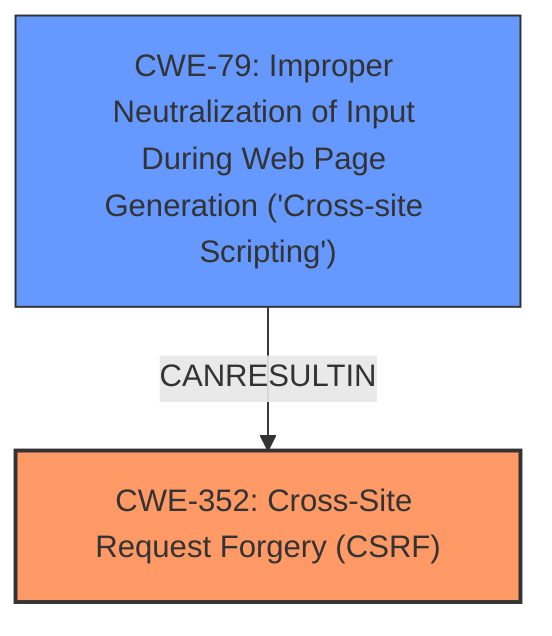

# Analysis for CVE-2025-28901

# Summary
| CWE ID    | CWE Name                                                                   | Confidence | CWE Abstraction Level | CWE Vulnerability Mapping Label | CWE-Vulnerability Mapping Notes |
| :-------- | :------------------------------------------------------------------------- | :--------- | :---------------------- | :------------------------------ | :------------------------------ |
| CWE-352   | Cross-Site Request Forgery (CSRF)                                        | 0.9        | Compound                | Primary                         | Allowed                       |
| CWE-79    | Improper Neutralization of Input During Web Page Generation ('Cross-site Scripting') | 0.9        | Base                    | Secondary                       | Allowed                       |

## Evidence and Confidence

*   **Confidence Score:** 0.9
*   **Evidence Strength:** MEDIUM

## Relationship Analysis
The primary weakness is **CWE-352 Cross-Site Request Forgery (CSRF)**, which can lead to other vulnerabilities like **CWE-79 Improper Neutralization of Input During Web Page Generation ('Cross-site Scripting')**. **CWE-352** is a compound weakness, which means it's a combination of multiple weaknesses. **CWE-79** is a base weakness. The vulnerability description mentions both **CSRF** and **XSS**, indicating that both weaknesses are present.

## Vulnerability Chain
The vulnerability chain starts with the **CWE-352 Cross-Site Request Forgery (CSRF)** vulnerability, which allows an attacker to perform actions on behalf of a logged-in user without their knowledge or consent. This can then be exploited to inject malicious scripts, leading to **CWE-79 Improper Neutralization of Input During Web Page Generation ('Cross-site Scripting')**. The **CSRF** vulnerability is the root cause, and the **XSS** vulnerability is the result of successful exploitation of the **CSRF** vulnerability.

## Summary of Analysis
The vulnerability description clearly states that a **Cross-Site Request Forgery (CSRF)** vulnerability exists in the Naren Members page, which can be exploited to perform Stored **XSS**. The description explicitly mentions both **CSRF** and **XSS**, making **CWE-352 Cross-Site Request Forgery (CSRF)** and **CWE-79 Improper Neutralization of Input During Web Page Generation ('Cross-site Scripting')** the most relevant CWEs.

The evidence is based on the following excerpt: "Cross-Site Request Forgery (CSRF) vulnerability in Naren Members page only for logged in users allows Stored **XSS**."

The graph relationships influenced the selection by showing how **CSRF** can lead to **XSS**.

The selected CWEs are at the optimal level of specificity because they directly represent the identified weaknesses. **CWE-352** accurately describes the **CSRF** vulnerability, and **CWE-79** accurately describes the resulting **XSS** vulnerability.

**CWEs Considered But Not Used:**

*   **CWE-116: Improper Encoding or Escaping of Output:** While encoding issues can contribute to XSS, the core problem is the lack of CSRF protection and the subsequent improper neutralization of input. Therefore, it's a secondary concern.
*   **CWE-89: Improper Neutralization of Special Elements used in an SQL Command ('SQL Injection'):** There is no evidence of SQL injection in the description.
*   **CWE-918: Server-Side Request Forgery (SSRF):** There is no evidence of SSRF in the description.
*   **CWE-80: Improper Neutralization of Script-Related HTML Tags in a Web Page (Basic XSS):** While related to XSS, CWE-79 is a more general and appropriate fit.
*   **CWE-601: URL Redirection to Untrusted Site ('Open Redirect'):** Not applicable, as there is no mention of URL redirection.
*   **CWE-434: Unrestricted Upload of File with Dangerous Type:** There is no evidence of file uploads being involved in the vulnerability.
*   **CWE-540: Inclusion of Sensitive Information in Source Code:** Not applicable, as it's not related to the described vulnerability.