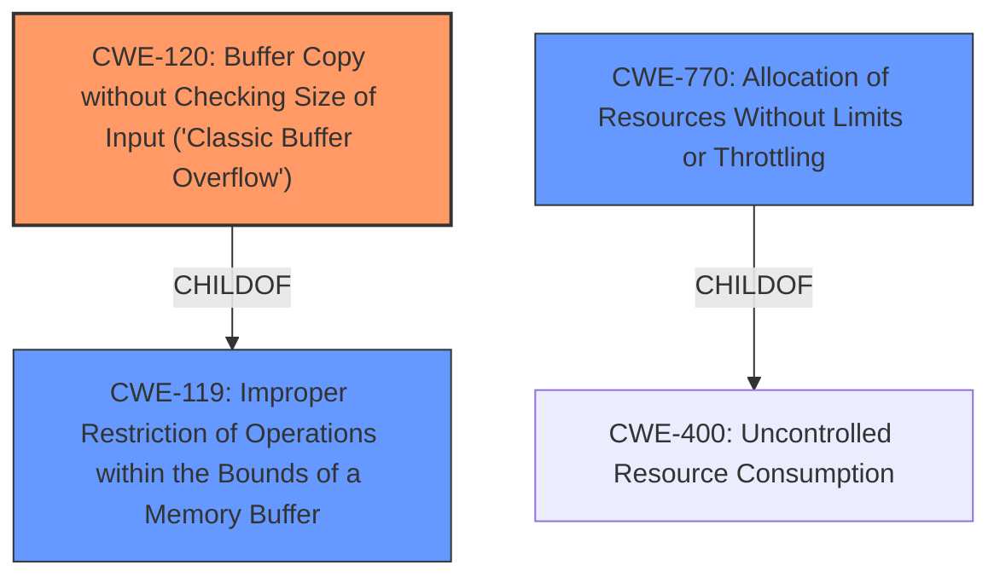

# Analysis for CVE-2025-2900

# Summary
| CWE ID  | CWE Name | Confidence | CWE Abstraction Level | CWE Vulnerability Mapping Label | CWE-Vulnerability Mapping Notes |
|-----------------|-------------------------------------------------------------------------------------------|----------------|---------------------------|------------------------------------|-----------------------------------|
| CWE-120  | Buffer Copy without Checking Size of Input ('Classic Buffer Overflow') | 0.8  | Base   | Allowed-with-Review | Primary CWE |
| CWE-770  | Allocation of Resources Without Limits or Throttling | 0.4  | Base   | Allowed | Secondary Candidate  |
| CWE-119 | Improper Restriction of Operations within the Bounds of a Memory Buffer | 0.4  | Class | Discouraged | Secondary Candidate  |

## Evidence and Confidence

*   **Confidence Score:** 0.8
*   **Evidence Strength:** MEDIUM

## Relationship Analysis
The primary relationship that influenced the decision was the child-of relationship. CWE-120 is a base CWE that is related to buffer overflows. CWE-119 is a parent class of CWE-120, representing a broader category of memory buffer errors, but is too general. The vulnerability description points to a specific instance of buffer overflow due to unchecked size during copy operations.

## Vulnerability Chain
The vulnerability chain starts with a **buffer overflow** in the AES/CBC encryption implementation (CWE-120). This leads to a crash, causing a denial of service.

## Summary of Analysis
The primary CWE is CWE-120 because the vulnerability is explicitly described as a **buffer overflow** due to a defect in the AES/CBC encryption implementation, which directly relates to copying a buffer without proper size checks. The retriever results also list CWE-120 as a possible candidate. The description mentions that a **buffer overflow** leads to a crash, and the crash leads to a denial of service.

CWE-119 was considered, but it is too general. It's a class-level CWE, and the vulnerability description has sufficient detail to pinpoint the root cause as a buffer copy without checking size (CWE-120).

CWE-770 was considered because buffer overflows can lead to resource exhaustion. However, the primary impact described is a crash leading to denial of service, and there is no indication of resource limits or throttling issues in the provided description.

The final selection of CWE-120 provides the most specific and accurate representation of the **buffer overflow** vulnerability.

Relevant CWE Information:

# Enhanced Context (25 CWEs)
The following CWEs were identified as potentially relevant to this vulnerability:

## CWE-119: Improper Restriction of Operations within the Bounds of a Memory Buffer
**Abstraction Level**: Class
**Similarity Score**: 0.70
**Source**: dense

**Description**:
The product performs operations on a memory buffer, but it reads from or writes to a memory location outside the buffer's intended boundary. This may result in read or write operations on unexpected memory locations that could be linked to other variables, data structures, or internal program data.

**Mapping Guidance**:
- Usage: Discouraged
- Rationale: CWE-119 is commonly misused in low-information vulnerability reports when lower-level CWEs could be used instead, or when more details about the vulnerability are available.

**Explanation**: CWE-119 is too general, the description states it is a **buffer overflow** condition and not just a general memory corruption issue.

## CWE-327: Use of a Broken or Risky Cryptographic Algorithm
**Abstraction Level**: Class
**Similarity Score**: 0.70
**Source**: dense

**Description**:
The product uses a broken or risky cryptographic algorithm or protocol.

**Mapping Guidance**:
- Usage: Allowed-with-Review
- Rationale: This CWE entry is a Class and might have Base-level children that would be more appropriate

**Explanation**: While the vulnerability is in the AES/CBC encryption implementation, the root cause is not the algorithm itself but a coding error during the buffer copy operation.

## CWE-755: Improper Handling of Exceptional Conditions
**Abstraction Level**: Class
**Similarity Score**: 0.69
**Source**: dense

**Description**:
The product does not handle or incorrectly handles an exceptional condition.

**Mapping Guidance**:
- Usage: Discouraged
- Rationale: This CWE entry is a level-1 Class (i.e., a child of a Pillar). It might have lower-level children that would be more appropriate

**Explanation**: The description doesn't point to a lack of handling exceptions, but to a **buffer overflow**.

## CWE-131: Incorrect Calculation of Buffer Size
**Abstraction Level**: Base
**Similarity Score**: 0.69
**Source**: dense

**Description**:
The product does not correctly calculate the size to be used when allocating a buffer, which could lead to a buffer overflow.

**Mapping Guidance**:
- Usage: Allowed
- Rationale: This CWE entry is at the Base level of abstraction, which is a preferred level of abstraction for mapping to the root causes of vulnerabilities.

**Explanation**: This is a possible cause of a **buffer overflow**, but the description is more specific, describing the overflow as a **buffer copy** issue, hence CWE-120 being the better choice.

## CWE-1391: Use of Weak Credentials
**Abstraction Level**: Class
**Similarity Score**: 0.69
**Source**: dense

**Description**:
The product uses weak credentials (such as a default key or hard-coded password) that can be calculated, derived, reused, or guessed by an attacker.

**Mapping Guidance**:
- Usage: Allowed-with-Review
- Rationale: This CWE entry is a Class and might have Base-level children that would be more appropriate

**Explanation**: This CWE is not related to the described vulnerability.

## CWE-326: Inadequate Encryption Strength
**Abstraction Level**: Class
**Similarity Score**: 0.69
**Source**: dense

**Description**:
The product stores or transmits sensitive data using an encryption scheme that is theoretically sound, but is not strong enough for the level of protection required.

**Mapping Guidance**:
- Usage: Allowed-with-Review
- Rationale: This CWE entry is a Class and might have Base-level children that would be more appropriate

**Explanation**: This is not related to the described vulnerability.

## CWE-1285: Improper Validation of Specified Index, Position, or Offset in Input
**Abstraction Level**: Base
**Similarity Score**: 0.69
**Source**: dense

**Description**:
The product receives input that is expected to specify an index, position, or offset into an indexable resource such as a buffer or file, but it does not validate or incorrectly validates that the specified index/position/offset has the required properties.

**Mapping Guidance**:
- Usage: Allowed
- Rationale: This CWE entry is at the Base level of abstraction, which is a preferred level of abstraction for mapping to the root causes of vulnerabilities.

**Explanation**: This is not related to the described vulnerability.

## CWE-824: Access of Uninitialized Pointer
**Abstraction Level**: Base
**Similarity Score**: 0.68
**Source**: dense

**Description**:
The product accesses or uses a pointer that has not been initialized.

**Mapping Guidance**:
- Usage: Allowed
- Rationale: This CWE entry is at the Base level of abstraction, which is a preferred level of abstraction for mapping to the root causes of vulnerabilities.

**Explanation**: This is not related to the described vulnerability.

## CWE-203: Observable Discrepancy
**Abstraction Level**: Base
**Similarity Score**: 0.68
**Source**: dense

**Description**:
The product behaves differently or sends different responses under different circumstances in a way that is observable to an unauthorized actor, which exposes security-relevant information about the state of the product, such as whether a particular operation was successful or not.

**Mapping Guidance**:
- Usage: Allowed
- Rationale: This CWE entry is at the Base level of abstraction, which is a preferred level of abstraction for mapping to the root causes of vulnerabilities.

**Explanation**: This is not related to the described vulnerability.

## CWE-200: Exposure of Sensitive Information to an Unauthorized Actor
**Abstraction Level**: Class
**Similarity Score**: 0.68
**Source**: dense

**Description**:
The product exposes sensitive information to an actor that is not explicitly authorized to have access to that information.

**Mapping