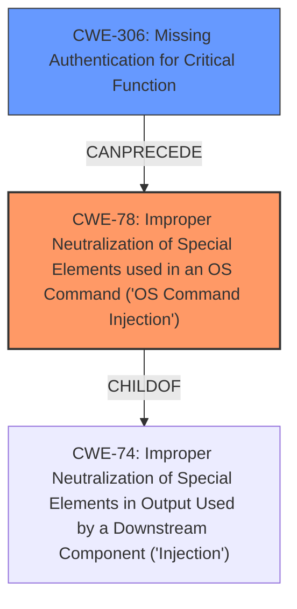

# Raw Analyzer Response for CVE-2025-29209

# Summary
| CWE ID | CWE Name | Confidence | CWE Abstraction Level | CWE Vulnerability Mapping Label | CWE-Vulnerability Mapping Notes |
|---|---|---|---|---|---|
| CWE-78 | Improper Neutralization of Special Elements used in an OS Command ('OS Command Injection') | 1.0 | Base | Allowed | Primary CWE. The vulnerability description explicitly mentions "unauthorized arbitrary command execution," indicating command injection. |
| CWE-306 | Missing Authentication for Critical Function | 0.7 | Base | Allowed | Secondary CWE. The vulnerability description explicitly mentions unauthorized access, suggesting a lack of authentication for the vulnerable function. |

## Evidence and Confidence

*   **Confidence Score:** 0.9
*   **Evidence Strength:** HIGH

## Relationship Analysis
The primary relationship that impacted my decision was the parent-child relationship between CWE-74 (Improper Neutralization of Special Elements in Output Used by a Downstream Component ('Injection')) and CWE-78. CWE-78 is a specific type of injection related to OS commands, making it a more precise classification than the more general CWE-74.

## Vulnerability Chain
The vulnerability chain starts with **missing authentication** (CWE-306), which allows an attacker to reach a vulnerable function. This function then suffers from **improper neutralization of special elements** (CWE-78) during the construction of an OS command, leading to **unauthorized arbitrary command execution**.

## Summary of Analysis
The initial analysis strongly pointed towards CWE-78 due to the explicit mention of "unauthorized arbitrary command execution." This aligns perfectly with the definition of OS Command Injection. The presence of "unauthorized" also suggested a potential authentication issue, leading to the inclusion of CWE-306 as a secondary weakness.

The graph relationships reinforced the selection of CWE-78 as a more specific child of CWE-74. The evidence is strong, with the vulnerability description directly mentioning the impact and the affected component. The chosen CWEs are at the optimal level of specificity, accurately reflecting both the root cause and a contributing factor to the vulnerability.

Relevant CWE Information:

# Enhanced Context (25 CWEs)
The following CWEs were identified as potentially relevant to this vulnerability:

## Vulnerability Description
TOTOLINK X18 v9.1.0cu.2024_B20220329 has an unauthorized arbitrary command execution in the enable parameter of the sub_41105C function of cstecgi .cgi.

### Vulnerability Description Key Phrases
- **impact:** unauthorized arbitrary command execution
- **product:** TOTOLINK X18
- **version:** v9.1.0cu.2024_B20220329
- **component:** cstecgi .cgi

## Retriever Results

### Top Combined Results

| Rank | CWE ID | Name | Abstraction | Usage  | Retrievers | Individual Scores |
|------|--------|------|-------------|-------|------------|-------------------|
| 1 | 78 | Improper Neutralization of Special Elements used in an OS Command ('OS Command Injection') | Base | Allowed | sparse | 0.057 |
| 2 | 790 | Improper Filtering of Special Elements | Class | Allowed-with-Review | sparse | 0.052 |
| 3 | 121 | Stack-based Buffer Overflow | Variant | Allowed | sparse | 0.047 |
| 4 | 77 | Improper Neutralization of Special Elements used in a Command ('Command Injection') | Class | Allowed-with-Review | sparse | 0.046 |
| 5 | 259 | Use of Hard-coded Password | Variant | Allowed | sparse | 0.040 |
| 6 | 306 | Missing Authentication for Critical Function | Base | Allowed | sparse | 0.039 |
| 7 | 1287 | Improper Validation of Specified Type of Input | Base | Allowed | sparse | 0.037 |
| 8 | 138 | Improper Neutralization of Special Elements | Class | Discouraged | sparse | 0.037 |
| 9 | 96 | Improper Neutralization of Directives in Statically Saved Code ('Static Code Injection') | Base | Allowed | dense | 0.537 |
| 10 | 88 | Improper Neutralization of Argument Delimiters in a Command ('Argument Injection') | Base | Allowed | graph | 0.002 |

**CWE-78: Improper Neutralization of Special Elements used in an OS Command ('OS Command Injection')**

The product constructs all or part of an OS command using externally-influenced input from an upstream component, but it does not neutralize or incorrectly neutralizes special elements that could modify the intended OS command when it is sent to a downstream component.

This CWE perfectly matches the vulnerability description, which indicates arbitrary command execution, a direct consequence of **improper neutralization** in OS command construction.

**CWE-306: Missing Authentication for Critical Function**

The product does not perform any authentication for a critical function.

The "unauthorized" aspect of the vulnerability description suggests that the affected function lacks proper authentication, aligning with this CWE.

**CWEs Considered But Not Used:**

*   **CWE-790: Improper Filtering of Special Elements:** While filtering is a relevant concept, the description focuses on command execution, making CWE-78 more appropriate.
*   **CWE-121: Stack-based Buffer Overflow:** There is no explicit mention of buffer overflows in the description.
*   **CWE-77: Improper Neutralization of Special Elements used in a Command ('Command Injection'):** CWE-78 is a more specific instance of command injection dealing with OS commands.
*   **CWE-259: Use of Hard-coded Password:** No evidence to suggest the use of hardcoded passwords.
*   **CWE-1287: Improper Validation of Specified Type of Input:** Input validation is a general concept, but the focus is on command execution.
*   **CWE-138: Improper Neutralization of Special Elements:** Too generic; CWE-78 is more specific.
*   **CWE-96: Improper Neutralization of Directives in Statically Saved Code ('Static Code Injection'):** There is no indication of code injection.
*   **CWE-88: Improper Neutralization of Argument Delimiters in a Command ('Argument Injection'):** There is no indication of argument injection.