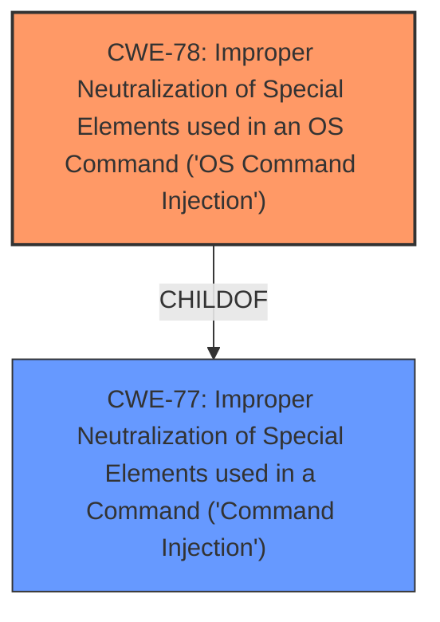

# Analysis Report for CVE-2025-29227

# Vulnerability Analysis Report: CVE-2025-29227

## Description

In Linksys E5600 V1.1.0.26, the \\usr\\share\\lua\\runtime.lua file contains a **command injection** vulnerability in the runtime.pingTest function via the pt[pkgsize] parameter.

## Vulnerability Description Key Phrases

- **Weakness:** command injection
- **Vector:** pt[pkgsize] parameter
- **Product:** Linksys E5600
- **Version:** V1.1.0.26
- **Component:** runtime.pingTest function in usr/share/lua/runtime.lua file

## Analysis (with Relationship Data)

# Summary
| CWE ID | CWE Name | Confidence | CWE Abstraction Level | CWE Vulnerability Mapping Label | CWE-Vulnerability Mapping Notes |
|---|---|---|---|---|---|
| CWE-78 | Improper Neutralization of Special Elements used in an OS Command ('OS Command Injection') | 1.0 | Base | Primary | Allowed |

## Evidence and Confidence

*   **Confidence Score:** 1.0
*   **Evidence Strength:** HIGH

## Relationship Analysis
The primary CWE is CWE-78, which is a base-level CWE. It's a child of the class-level CWE-77. The vulnerability description clearly points to an OS command injection vulnerability, making CWE-78 the most specific and appropriate choice.



## Vulnerability Chain
The vulnerability chain starts with the **improper neutralization** of special elements, leading to OS command injection. The chain is short and direct:
1.  **Improper Neutralization of Special Elements** (CWE-78)

## Summary of Analysis
The vulnerability description explicitly mentions a **command injection** vulnerability in the `runtime.pingTest` function, specifically through the `pt[pkgsize]` parameter. This directly aligns with the characteristics of CWE-78, "Improper Neutralization of Special Elements used in an OS Command ('OS Command Injection')." The `Vulnerability Description Key Phrases` also indicate the presence of a **command injection** **weakness**.

The retriever results also support this assessment, with CWE-77 and CWE-78 being the top candidates. While CWE-77 is a broader class, CWE-78 is more specific as the injection occurs within an OS command.

The choice of CWE-78 is further supported by its Base abstraction level, which is preferred for root cause analysis. The MITRE mapping guidance allows its usage.

CWE-77 was considered but not chosen because it is a class-level CWE, and the vulnerability is specifically an OS command injection. CWE-88 was considered as a possible alternative since it involves argument injection, but the description clearly points to a full command injection, not just argument manipulation. CWE-94 was considered because the command injection can lead to arbitrary code execution, but CWE-78 is more specific to the root cause, which is the **improper neutralization** of special elements in an OS command.


## CWE Relationship Analysis

Current CWEs represent these abstraction levels: .


### Vulnerability Chain Analysis

**Chain starting from CWE-88:**
- 88 (Improper Neutralization of Argument Delimiters in a Command ('Argument Injection')) - ROOT


**Chain starting from CWE-77:**
- 77 (Improper Neutralization of Special Elements used in a Command ('Command Injection')) - ROOT


### CWE Relationship Diagram

```mermaid
graph TD
    classDef primary fill:#f96,stroke:#333,stroke-width:2px
    classDef secondary fill:#69f,stroke:#333
    classDef tertiary fill:#9e9,stroke:#333
```


*Report generated on 2025-07-14 16:20:23*
