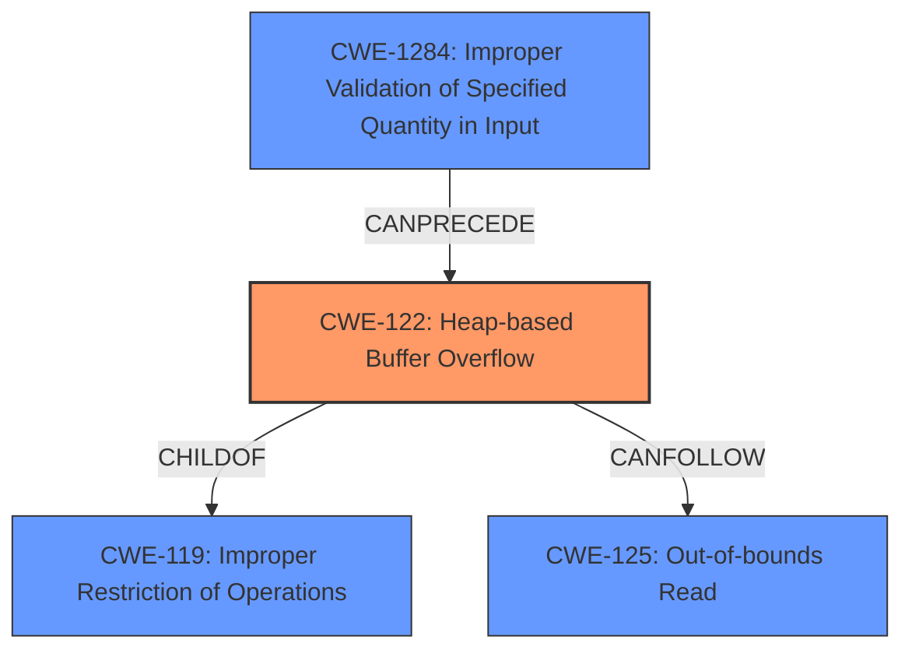

# Analysis Report for CVE-2025-2924

# Vulnerability Analysis Report: CVE-2025-2924

## Description

A vulnerability, which was classified as problematic, was found in HDF5 up to 1.14.6. This affects the function H5HL__fl_deserialize of the file src/H5HLcache.c. The manipulation of the argument free_block leads to **heap-based buffer overflow**. It is possible to launch the attack on the local host. The exploit has been disclosed to the public and may be used.

## Vulnerability Description Key Phrases

- **Weakness:** heap-based buffer overflow
- **Vector:** manipulation of free_block argument
- **Product:** HDF5
- **Version:** up to 1.14.6
- **Component:** H5HL__fl_deserialize function of src/H5HLcache.c file

## Analysis (with Relationship Data)

# Summary

| CWE ID  | CWE Name                                                                     | Confidence | CWE Abstraction Level | CWE Vulnerability Mapping Label | CWE-Vulnerability Mapping Notes |
| :-------- | :--------------------------------------------------------------------------- | :--------- | :-------------------- | :------------------------------ | :------------------------------ |
| CWE-122   | Heap-based Buffer Overflow                                                   | 1          | Variant               | Primary                         | Allowed                       |
| CWE-125   | Out-of-bounds Read                                                       | 0.7        | Base                  | Secondary                       | Allowed                       |
| CWE-1284  | Improper Validation of Specified Quantity in Input                           | 0.6        | Base                  | Secondary                       | Allowed                       |

## Evidence and Confidence

*   **Confidence Score:** 0.9
*   **Evidence Strength:** HIGH

## Relationship Analysis

The primary CWE is CWE-122 Heap-based Buffer Overflow, which is a variant of CWE-119 Improper Restriction of Operations within the Bounds of a Memory Buffer. The vulnerability description clearly indicates a heap-based buffer overflow due to the manipulation of the `free_block` argument. CWE-125 Out-of-bounds Read is a related weakness, and a likely consequence of the overflow, as the code attempts to read data from an invalid memory location. CWE-1284, Improper Validation of Specified Quantity in Input, is also relevant since the `free_block` argument is not validated, which leads to the overflow.



## Vulnerability Chain

The vulnerability chain starts with the lack of input validation for the `free_block` argument (CWE-1284). This leads to a heap-based buffer overflow (CWE-122) when the program attempts to write data to an invalid memory location. The overflow then results in an out-of-bounds read (CWE-125) when subsequent code attempts to access the corrupted heap.

## Summary of Analysis

The analysis is primarily based on the provided vulnerability description and the CVE Reference Links Content Summary. The content explicitly mentions a **heap-based buffer overflow** due to the manipulation of the `free_block` argument in the `H5HL__fl_deserialize` function. The ASan report further confirms the heap-buffer-overflow.

The graph relationships helped in understanding the context and potential related weaknesses, such as CWE-125 and CWE-1284. CWE-122 is chosen as the primary CWE because it accurately reflects the root cause of the vulnerability, which is a **heap-based buffer overflow**. It is also at the Variant level of abstraction, which is preferred for mapping root causes.

The selection of CWE-122 is strongly supported by the following evidence from the vulnerability description: "This affects the function H5HL__fl_deserialize of the file src/H5HLcache.c. The manipulation of the argument free_block leads to **heap-based buffer overflow**."

CWE-125 is considered a secondary CWE as it is a likely consequence of the heap-based buffer overflow. The CVE Reference Links Content Summary states that the out-of-bounds read can lead to a segmentation fault.

CWE-1284 is also considered a secondary CWE as the lack of input validation is the prerequisite condition that allows the heap-based buffer overflow to occur.

Relevant CWE Information:

# Enhanced Context (25 CWEs)
The following CWEs were identified as potentially relevant to this vulnerability:

## CWE-129: Improper Validation of Array Index
**Abstraction Level**: Variant
**Similarity Score**: 0.75
**Source**: dense

**Description**:
The product uses untrusted input when calculating or using an array index, but the product does not validate or incorrectly validates the index to ensure the index references a valid position within the array.

**Mapping Guidance**:
- Usage: Allowed
- Rationale: This CWE entry is at the Variant level of abstraction, which is a preferred level of abstraction for mapping to the root causes of vulnerabilities.

## CWE-193: Off-by-one Error
**Abstraction Level**: Base
**Similarity Score**: 0.74
**Source**: dense

**Description**:
A product calculates or uses an incorrect maximum or minimum value that is 1 more, or 1 less, than the correct value.

**Mapping Guidance**:
- Usage: Allowed
- Rationale: This CWE entry is at the Base level of abstraction, which is a preferred level of abstraction for mapping to the root causes of vulnerabilities.

## CWE-125: Out-of-bounds Read
**Abstraction Level**: Base
**Similarity Score**: 0.74
**Source**: dense

**Description**:
The product reads data past the end, or before the beginning, of the intended buffer.

**Mapping Guidance**:
- Usage: Allowed
- Rationale: This CWE entry is at the Base level of abstraction, which is a preferred level of abstraction for mapping to the root causes of vulnerabilities.

## CWE-131: Incorrect Calculation of Buffer Size
**Abstraction Level**: Base
**Similarity Score**: 0.74
**Source**: dense

**Description**:
The product does not correctly calculate the size to be used when allocating a buffer, which could lead to a buffer overflow.

**Mapping Guidance**:
- Usage: Allowed
- Rationale: This CWE entry is at the Base level of abstraction, which is a preferred level of abstraction for mapping to the root causes of vulnerabilities.

## CWE-122: Heap-based Buffer Overflow
**Abstraction Level**: Variant
**Similarity Score**: 0.73
**Source**: dense

**Description**:
A heap overflow condition is a buffer overflow, where the buffer that can be overwritten is allocated in the heap portion of memory, generally meaning that the buffer was allocated using a routine such as malloc().

**Mapping Guidance**:
- Usage: Allowed
- Rationale: This CWE entry is at the Variant level of abstraction, which is a preferred level of abstraction for mapping to the root causes of vulnerabilities.

## CWE-789: Memory Allocation with Excessive Size Value
**Abstraction Level**: Variant
**Similarity Score**: 0.73
**Source**: dense

**Description**:
The product allocates memory based on an untrusted, large size value, but it does not ensure that the size is within expected limits, allowing arbitrary amounts of memory to be allocated.

**Mapping Guidance**:
- Usage: Allowed
- Rationale: This CWE entry is at the Variant level of abstraction, which is a preferred level of abstraction for mapping to the root causes of vulnerabilities.

## CWE-908: Use of Uninitialized Resource
**Abstraction Level**: Base
**Similarity Score**: 0.72
**Source**: dense

**Description**:
The product uses or accesses a resource that has not been initialized.

**Mapping Guidance**:
- Usage: Allowed
- Rationale: This CWE entry is at the Base level of abstraction, which is a preferred level of abstraction for mapping to the root causes of vulnerabilities.

## CWE-824: Access of Uninitialized Pointer
**Abstraction Level**: Base
**Similarity Score**: 0.72
**Source**: dense

**Description**:
The product accesses or uses a pointer that has not been initialized.

**Mapping Guidance**:
- Usage: Allowed
- Rationale: This CWE entry is at the Base level of abstraction, which is a preferred level of abstraction for mapping to the root causes of vulnerabilities.

## CWE-190: Integer Overflow or Wraparound
**Abstraction Level**: Base
**Similarity Score**: 0.72
**Source**: dense

**Description**:
The product performs a calculation that can
         produce an integer overflow or wraparound when the logic
         assumes that the resulting value will always be larger than
         the original value. This occurs when an integer value is
         incremented to a value that is too large to store in the
         associated representation. When this occurs, the value may
         become a very small or negative number.

**Mapping Guidance**:
- Usage: Allowed
- Rationale: This CWE entry is at the Base level of abstraction, which is a preferred level of abstraction for mapping to the root causes of vulnerabilities.

## CWE-126: Buffer Over-read
**Abstraction Level**: Variant
**Similarity Score**: 0.71
**Source**: dense

**Description**:
The product reads from a buffer using


## CWE Relationship Analysis

Current CWEs represent these abstraction levels: .


### Vulnerability Chain Analysis

**Chain starting from CWE-1284:**
- 1284 (Improper Validation of Specified Quantity in Input) - ROOT


**Chain starting from CWE-125:**
- 125 (Out-of-bounds Read) - ROOT


### CWE Relationship Diagram

```mermaid
graph TD
    classDef primary fill:#f96,stroke:#333,stroke-width:2px
    classDef secondary fill:#69f,stroke:#333
    classDef tertiary fill:#9e9,stroke:#333
```


*Report generated on 2025-07-14 16:21:30*
