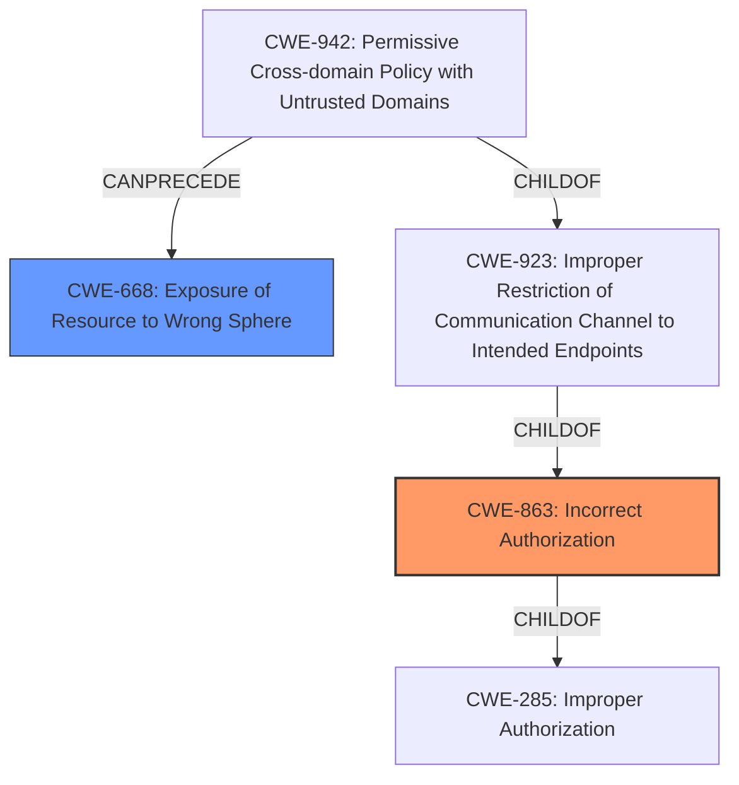

# Analysis Report for CVE-2025-29316

# Vulnerability Analysis Report: CVE-2025-29316

## Description

An issue in DataPatrol Screenshot watermark, printing watermark agent v.3.5.2.0 allows a physically proximate attacker to obtain sensitive information. NOTE the Supplier disputes the Print Job Watermark Bypass claim because the watermark is added by hooking into the OS printing mechanism, and thus is not supposed to be visible when previewing a generated printout on screen. The Supplier disputes the Screenshot Watermark Bypass claim because the products documentation explains the step of setting Developer Tools to Disallowed through AD Group Policy.

## Vulnerability Description Key Phrases

- **Impact:** obtain sensitive information
- **Attacker:** physically proximate attacker
- **Product:** DataPatrol Screenshot watermark, printing watermark agent
- **Version:** v.3.5.2.0

## Analysis (with Relationship Data)

# Summary
| CWE ID | CWE Name | Confidence | CWE Abstraction Level | CWE Vulnerability Mapping Label | CWE-Vulnerability Mapping Notes |
|---|---|---|---|---|---|
| CWE-863 | Incorrect Authorization | 0.8 | Class | Primary | Allowed-with-Review |
| CWE-668 | Exposure of Resource to Wrong Sphere | 0.6 | Class | Secondary | Discouraged |

## Evidence and Confidence

*   **Confidence Score:** 0.7
*   **Evidence Strength:** MEDIUM

## Relationship Analysis
The primary CWE is CWE-863, which is a Class-level CWE. Although it is better to have a Base-level CWE, there isn't a more specific CWE that fits the description.
CWE-668 is related as a resource is exposed to the wrong control sphere by allowing unauthorized access via developer tools.



## Vulnerability Chain
1.  **Root Cause:** **Incorrect Authorization** (CWE-863) – The application **incorrectly authorizes** access to sensitive content, failing to prevent unauthorized access via developer tools.
2.  **Weakness:** **Exposure of Resource to Wrong Sphere** (CWE-668) – Because of the **incorrect authorization**, sensitive resources are exposed to unauthorized actors (those using developer tools).
3.  **Impact:** Obtain sensitive information – A physically proximate attacker can bypass watermarks and obtain sensitive information through screenshots or print jobs initiated via developer tools.

## Summary of Analysis
The primary weakness identified is **Incorrect Authorization** (CWE-863), as the application fails to properly restrict access to sensitive content, allowing it to be bypassed. The vulnerability description and CVE reference links content summary both highlight the bypass of watermarks through the use of standard browser developer tools. This indicates a failure in authorization controls, as the application does not adequately prevent unauthorized access to the underlying content.

Supporting evidence is drawn from the CVE Reference Links Content Summary, which states, "The vulnerability stems from the watermark implementation being applied at the UI level rather than the content rendering level. This allows attackers to bypass the watermark by manipulating the content before it's rendered for screenshots or printing."

CWE-668 (Exposure of Resource to Wrong Sphere) is a secondary consideration, as it represents the consequence of the **incorrect authorization**. The application exposes sensitive resources to unauthorized actors through the use of developer tools.

The retriever results suggested several other CWEs, including:

*   CWE-732 (Incorrect Permission Assignment for Critical Resource): While related to access control, this CWE is more focused on file system permissions and doesn't directly address the bypass of watermarks through UI manipulation.
*   CWE-287 (Improper Authentication): Authentication isn't the primary issue, as the vulnerability focuses on access control after authentication has occurred.

The final selection prioritizes CWE-863 as the root cause, with CWE-668 as a secondary factor representing the impact of the vulnerability. These choices are at the optimal level of specificity, addressing the core issue of **incorrect authorization** and its subsequent impact.


## CWE Relationship Analysis

Current CWEs represent these abstraction levels: .


### Vulnerability Chain Analysis

**Chain starting from CWE-863:**
- 863 (Incorrect Authorization) - ROOT


**Chain starting from CWE-732:**
- 732 (Incorrect Permission Assignment for Critical Resource) - ROOT


### CWE Relationship Diagram

```mermaid
graph TD
    classDef primary fill:#f96,stroke:#333,stroke-width:2px
    classDef secondary fill:#69f,stroke:#333
    classDef tertiary fill:#9e9,stroke:#333
```


*Report generated on 2025-07-14 16:23:40*
