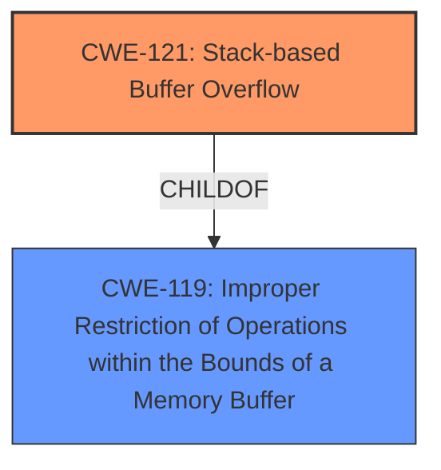

# Enhanced Analysis for CVE-2025-29384

# Summary
| CWE ID | CWE Name | Confidence | CWE Abstraction Level | CWE Vulnerability Mapping Label | CWE-Vulnerability Mapping Notes |
|---|---|---|---|---|---|
| CWE-121 | Stack-based Buffer Overflow | 1.0 | Variant | Primary | Allowed |
| CWE-119 | Improper Restriction of Operations within the Bounds of a Memory Buffer | 0.7 | Class | Secondary | Discouraged |

## Evidence and Confidence

*   **Confidence Score:** 0.9
*   **Evidence Strength:** HIGH

## Relationship Analysis
The primary relationship is that CWE-121 is a variant (more specific) of the class CWE-119. The vulnerability description explicitly mentions "stack overflow," making CWE-121 a more precise match than its parent, CWE-119. While CWE-119 broadly describes the issue, CWE-121 pinpoints the location of the buffer on the stack.mermaid



## Vulnerability Chain
The vulnerability chain starts with a **stack overflow** due to an unspecified reason and leads to remote arbitrary code execution.

## Summary of Analysis
The vulnerability description explicitly states a **stack overflow** vulnerability in the `wanMTU` parameter of `/goform/AdvSetMacMtuWan` in Tenda AC9, which leads to remote arbitrary code execution. The key phrase is "**stack overflow, buffer overflow**". The presence of "stack overflow" makes CWE-121 a strong candidate.

The **Retriever Results** also lists CWE-121 as one of the top candidates.

CWE-119 is a parent class of CWE-121 and represents a broader category of buffer-related vulnerabilities. Since the description specifies that the buffer is on the stack, CWE-121 is a more specific and accurate choice.

Relevant CWE Information:

# Enhanced Context (25 CWEs)
The following CWEs were identified as potentially relevant to this vulnerability:

## CWE-121: Stack-based Buffer Overflow
**Abstraction Level**: Variant
**Similarity Score**: 0.72
**Source**: dense

**Description**:
A stack-based buffer overflow condition is a condition where the buffer being overwritten is allocated on the stack (i.e., is a local variable or, rarely, a parameter to a function).

**Mapping Guidance**:
- Usage: Allowed
- Rationale: This CWE entry is at the Variant level of abstraction, which is a preferred level of abstraction for mapping to the root causes of vulnerabilities.
## CWE-119: Improper Restriction of Operations within the Bounds of a Memory Buffer
**Abstraction Level**: Class
**Similarity Score**: 1.00
**Source**: alternate_terms

**Description**: The product performs an operation on a memory buffer, but it does not correctly perform the operation within the bounds of that buffer.

## CWE-120: Buffer Copy without Checking Size of Input ('Classic Buffer Overflow')
**Abstraction Level**: Base
**Similarity Score**: 0.70
**Source**: sparse

**Description**:
The product copies an input buffer to an output buffer without verifying that the size of the input buffer is less than the size of the output buffer, leading to a buffer overflow.

**Mapping Guidance**:
- Usage: Allowed-with-Review
- Rationale: There are some indications that this CWE ID might be misused and selected simply because it mentions "buffer overflow" - an increasingly vague term. This CWE entry is only appropriate for "Buffer Copy" operations (not buffer reads), in which where there is no "Checking [the] Size of Input", and (by implication of the copy) writing past the end of the buffer.

Based on the presence of "**stack overflow**" and the retriever results, CWE-121 is the primary CWE. CWE-119 is also added as a secondary candidate because it represents the class of vulnerability.

CWE-120 was considered due to the phrase "**buffer overflow**" but it was not selected because there is no evidence of a copy operation without checking size.

CWE-190 was considered due to the potential for incorrect calculations leading to the overflow, but there is no direct evidence to support it.
```


## CWE Relationship Analysis

Current CWEs represent these abstraction levels: .


### Vulnerability Chain Analysis

**Chain starting from CWE-190:**
- 190 (Integer Overflow or Wraparound) - ROOT


**Chain starting from CWE-119:**
- 119 (Improper Restriction of Operations within the Bounds of a Memory Buffer) - ROOT


### CWE Relationship Diagram

```mermaid
graph TD
    classDef primary fill:#f96,stroke:#333,stroke-width:2px
    classDef secondary fill:#69f,stroke:#333
    classDef tertiary fill:#9e9,stroke:#333
```