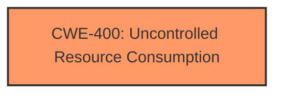

# Analysis Report for CVE-2025-29477

# Vulnerability Analysis Report: CVE-2025-29477

## Description

An issue in fluent-bit v.3.7.2 allows a local attacker to cause a denial of service via the function consume_event.

## Vulnerability Description Key Phrases

- **Impact:** denial of service
- **Attacker:** local attacker
- **Product:** fluent-bit
- **Version:** v.3.7.2
- **Component:** function consume_event

## Analysis (with Relationship Data)

# Summary
| CWE ID | CWE Name | Confidence | CWE Abstraction Level | CWE Vulnerability Mapping Label | CWE-Vulnerability Mapping Notes |
|---|---|---|---|---|---|
| CWE-400 | Uncontrolled Resource Consumption | 0.7 | Class | Primary CWE | Allowed-with-Review |

## Evidence and Confidence

*   **Confidence Score:** 0.7
*   **Evidence Strength:** LOW

## Relationship Analysis
The primary relationship considered was the hierarchical structure with CWE-400 as a Class-level weakness. While more specific Base or Variant level CWEs exist, the provided description lacks specific details to pinpoint the exact resource consumption issue. Therefore, CWE-400 is chosen as the most appropriate, albeit generic, classification.



## Vulnerability Chain
The vulnerability chain starts with the **uncontrolled resource consumption** due to a flaw in the `consume_event` function. This **uncontrolled resource consumption** leads to a denial of service (DoS).

## Summary of Analysis
The analysis is based on limited evidence, as the CVE description is concise and lacks technical details. The primary indicator is the "denial of service" impact caused by a flaw within the `consume_event` function of fluent-bit. The **Retriever Results** suggest several potential CWEs, including CWE-770 (Allocation of Resources Without Limits or Throttling) and CWE-789 (Memory Allocation with Excessive Size Value). However, without further information about the root cause of the resource consumption (e.g., whether it's due to excessive memory allocation, CPU usage, or other factors), assigning a more specific CWE would be speculative.

Given the available information, CWE-400 (Uncontrolled Resource Consumption) is the most appropriate CWE because the description explicitly states that a local attacker can cause a denial of service.

Relevant CWE Information:

# Enhanced Context (25 CWEs)
The following CWEs were identified as potentially relevant to this vulnerability:

## CWE-400: Uncontrolled Resource Consumption
**Abstraction Level**: Class
**Similarity Score**: 0.65
**Source**: dense

**Description**:
The product does not properly control the allocation and maintenance of a limited resource, thereby enabling an actor to influence the amount of resources consumed, eventually leading to the exhaustion of available resources.

**Mapping Guidance**:
- Usage: Discouraged
- Rationale: CWE-400 is intended for incorrect behaviors in which the product is expected to track and restrict how many resources it consumes, but CWE-400 is often misused because it is conflated with the "technical impact" of vulnerabilities in which resource consumption occurs. It is sometimes used for low-information vulnerability reports. It is a level-1 Class (i.e., a child of a Pillar).

**CWE-770:** Allocation of Resources Without Limits or Throttling was considered, but the description does not explicitly mention allocation of resources.

**CWE-789:** Memory Allocation with Excessive Size Value was considered, but the description does not provide any details regarding memory allocation issues.

**CWE-1284:** Improper Validation of Specified Quantity in Input was considered, but there is no evidence in the description.


## CWE Relationship Analysis

Current CWEs represent these abstraction levels: .


### Vulnerability Chain Analysis

**Chain starting from CWE-1284:**
- 1284 (Improper Validation of Specified Quantity in Input) - ROOT


**Chain starting from CWE-400:**
- 400 (Uncontrolled Resource Consumption) - ROOT


### CWE Relationship Diagram

```mermaid
graph TD
    classDef primary fill:#f96,stroke:#333,stroke-width:2px
    classDef secondary fill:#69f,stroke:#333
    classDef tertiary fill:#9e9,stroke:#333
```


*Report generated on 2025-07-14 16:25:59*
