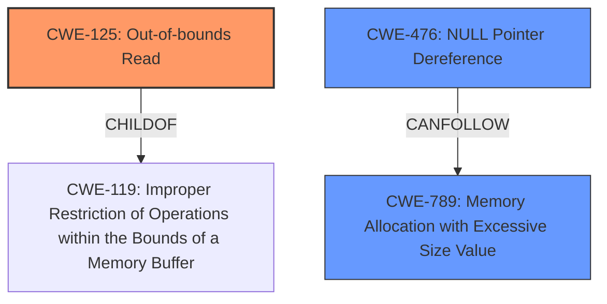

# Analysis Report for CVE-2025-29485

# Vulnerability Analysis Report: CVE-2025-29485

## Description

libming v0.4.8 was discovered to contain a segmentation fault via the decompileRETURN function. This vulnerability allows attackers to cause a Denial of Service (DoS) via a crafted SWF file.

## Vulnerability Description Key Phrases

- **Impact:** ['Denial of Service (DoS)', 'segmentation fault']
- **Vector:** crafted SWF file
- **Attacker:** attackers
- **Product:** libming
- **Version:** v0.4.8
- **Component:** decompileRETURN function

## Analysis (with Relationship Data)

# Summary
| CWE ID | CWE Name | Confidence | CWE Abstraction Level | CWE Vulnerability Mapping Label | CWE-Vulnerability Mapping Notes |
|---|---|---|---|---|---|
| CWE-125 | Out-of-bounds Read | 0.9 | Base | Primary | Allowed |
| CWE-476 | NULL Pointer Dereference | 0.7 | Base | Secondary | Allowed |
| CWE-789 | Memory Allocation with Excessive Size Value | 0.6 | Variant | Secondary | Allowed |

## Evidence and Confidence

*   **Confidence Score:** 0.8
*   **Evidence Strength:** MEDIUM

## Relationship Analysis
The primary relationship that influenced the decision was the parent-child relationship between CWE-119 (Improper Restriction of Operations within the Bounds of a Memory Buffer) and CWE-125 (Out-of-bounds Read). CWE-125 is a more specific child of CWE-119, making it a better fit for the vulnerability description, which explicitly mentions segmentation faults due to read access violations. Additionally, chain relationships helped to understand potential vulnerability progression.



## Vulnerability Chain
The vulnerability chain starts with a crafted SWF file, which leads to out-of-bounds reads in the `decompileRETURN` function, resulting in a segmentation fault and Denial of Service (DoS). Excessive memory allocation might contribute to the vulnerability.

Crafted SWF File --> **CWE-125** Out-of-bounds Read --> Segmentation Fault --> Denial of Service

## Summary of Analysis
The primary CWE identified is CWE-125 (Out-of-bounds Read). This is based on the vulnerability description mentioning segmentation faults due to read access violations, particularly in functions like `decompileRETURN`. The "CVE Reference Links Content Summary" states: "Segmentation Faults: Triggered in `decompileRETURN`, `decompileCALLMETHOD`, `decompileGETPROPERTY`, `decompileGETMEMBER`, `decompileIMPLEMENTS`, and `decompileDUPLICATECLIP` due to read access violations (accessing the zero page)."

CWE-476 (NULL Pointer Dereference) and CWE-789 (Memory Allocation with Excessive Size Value) are considered as secondary candidates, as the content summary mentions memory management issues and large memory allocation requests.

The choice of CWE-125 is at the Base level of abstraction, providing a specific classification for the **root cause** of the vulnerability. The relationship context, particularly the child-of relationship with CWE-119, reinforces this choice. The MITRE mapping guidance allows for the use of CWE-125.

CWE-119 (Improper Restriction of Operations within the Bounds of a Memory Buffer) was considered, but ultimately rejected as CWE-125 provides a more specific description of the **root cause**. The Usage for CWE-119 is Discouraged and the Rationale is that CWE-119 is commonly misused in low-information vulnerability reports when lower-level CWEs could be used instead, or when more details about the vulnerability are available.

# Enhanced Context (25 CWEs)
The following CWEs were identified as potentially relevant to this vulnerability:

## CWE-125: Out-of-bounds Read
**Abstraction Level**: Base
**Similarity Score**: 0.78
**Source**: dense

**Description**:
The product reads data past the end, or before the beginning, of the intended buffer.

**Mapping Guidance**:
- Usage: Allowed
- Rationale: This CWE entry is at the Base level of abstraction, which is a preferred level of abstraction for mapping to the root causes of vulnerabilities.

**Technical Explanation**: The vulnerability description indicates segmentation faults due to read access violations, which aligns directly with the definition of an out-of-bounds read. Reading past the end of a buffer can lead to accessing invalid memory locations, triggering a segmentation fault.
**Security Implications**: Out-of-bounds reads can lead to information disclosure, denial of service, or potentially arbitrary code execution if the read data influences program control flow.
**Relationship Impact**: CWE-125 is a child of CWE-119 (Improper Restriction of Operations within the Bounds of a Memory Buffer), indicating a more specific type of buffer handling issue.
**Mapping Guidance Impact**: The "Usage: Allowed" mapping guidance supports the selection of CWE-125.

## CWE-476: NULL Pointer Dereference
**Abstraction Level**: Base
**Similarity Score**: 0.75
**Source**: dense

**Description**:
The product dereferences a pointer that it expects to be valid but is NULL.

**Mapping Guidance**:
- Usage: Allowed
- Rationale: This CWE entry is at the Base level of abstraction, which is a preferred level of abstraction for mapping to the root causes of vulnerabilities.

**Technical Explanation**: While the primary symptom is a segmentation fault, the underlying cause could involve a NULL pointer dereference if the code attempts to read from an invalid memory location pointed to by a NULL pointer.
**Security Implications**: NULL pointer dereferences can cause denial of service or, in some cases, be exploited for code execution.
**Relationship Impact**: No significant direct relationship impacting the primary mapping.
**Mapping Guidance Impact**: The "Usage: Allowed" mapping guidance supports the selection of CWE-476.

## CWE-789: Memory Allocation with Excessive Size Value
**Abstraction Level**: Variant
**Similarity Score**: 0.76
**Source**: dense

**Description**:
The product allocates memory based on an untrusted, large size value, but it does not ensure that the size is within expected limits, allowing arbitrary amounts of memory to be allocated.

**Mapping Guidance**:
- Usage: Allowed
- Rationale: This CWE entry is at the Variant level of abstraction, which is a preferred level of abstraction for mapping to the root causes of vulnerabilities.

**Technical Explanation**: The "CVE Reference Links Content Summary" mentions "Allocation-Size-Too-Big Error" and "Lack of input validation (leading to excessive memory allocation requests)." This suggests that an excessively large memory allocation might be triggered, which could lead to a segmentation fault or other memory-related issues.
**Security Implications**: Allocating excessive memory can lead to denial of service due to resource exhaustion or memory corruption.
**Relationship Impact**: CWE-789 is related to CWE-770 (Allocation of Resources Without Limits or Throttling), indicating a broader issue of resource management.
**Mapping Guidance Impact**: The "Usage: Allowed" mapping guidance supports the selection of CWE-789.


## CWE Relationship Analysis

Current CWEs represent these abstraction levels: .


### Vulnerability Chain Analysis

**Chain starting from CWE-476:**
- 476 (NULL Pointer Dereference) - ROOT


**Chain starting from CWE-770:**
- 770 (Allocation of Resources Without Limits or Throttling) - ROOT


### CWE Relationship Diagram

```mermaid
graph TD
    classDef primary fill:#f96,stroke:#333,stroke-width:2px
    classDef secondary fill:#69f,stroke:#333
    classDef tertiary fill:#9e9,stroke:#333
```


*Report generated on 2025-07-14 16:27:03*
