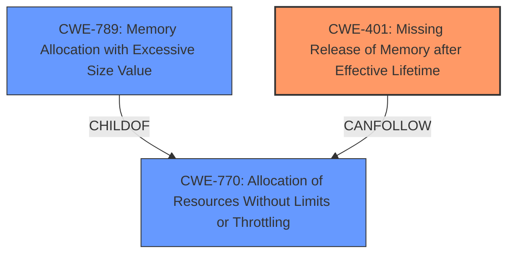

# Analysis Report for CVE-2025-29493

# Vulnerability Analysis Report: CVE-2025-29493

## Description

libming v0.4.8 was discovered to contain a segmentation fault via the decompileGETPROPERTY function. This vulnerability allows attackers to cause a Denial of Service (DoS) via a crafted SWF file.

## Vulnerability Description Key Phrases

- **Impact:** ['Denial of Service (DoS)', 'segmentation fault']
- **Vector:** crafted SWF file
- **Attacker:** attackers
- **Product:** libming
- **Version:** v0.4.8
- **Component:** decompileGETPROPERTY function

## Analysis (with Relationship Data)

# Summary
| CWE ID | CWE Name | Confidence | CWE Abstraction Level | CWE Vulnerability Mapping Label | CWE-Vulnerability Mapping Notes |
|---|---|---|---|---|---|
| CWE-401 | Missing Release of Memory after Effective Lifetime | 0.7 | Variant |  Primary | Allowed |
| CWE-770 | Allocation of Resources Without Limits or Throttling | 0.6 | Base | Secondary Candidate | Allowed |
| CWE-789 | Memory Allocation with Excessive Size Value | 0.5 | Variant | Secondary Candidate | Allowed |

## Evidence and Confidence

*   **Confidence Score:** 0.7
*   **Evidence Strength:** MEDIUM

## Relationship Analysis
The primary CWE is CWE-401, Missing Release of Memory after Effective Lifetime, which directly addresses the identified **memory leaks** in the vulnerability description. While CWE-770 and CWE-789 are related to resource allocation issues, they are secondary to the specific problem of memory not being released. The relationships between these CWEs show that CWE-770 (Allocation of Resources Without Limits or Throttling) can lead to CWE-789 (Memory Allocation with Excessive Size Value), and both could potentially contribute to memory exhaustion, a consequence of memory leaks. The abstraction levels are appropriate, with CWE-401 being a Variant, providing a specific description of the weakness, and CWE-770 being a Base, giving a broader view of the resource allocation issue.



## Vulnerability Chain
The vulnerability chain starts with:
1.  **Memory allocation** without proper tracking or limits (CWE-770).
2.  Potential **allocation of excessive memory** based on untrusted size values (CWE-789).
3.  **Failure to release allocated memory** after it's no longer needed (CWE-401).
4.  Resulting in **memory exhaustion** and ultimately leading to a **Denial of Service (DoS)**.

The root cause is the **missing release of memory**, which is the most direct cause of the memory exhaustion.

## Summary of Analysis
The analysis is based on the provided evidence, particularly the CVE Reference Links Content Summary, which details **memory leaks** in specific functions of libming. The selection of CWE-401 is based on the direct mention of memory leaks, while CWE-770 and CWE-789 are included as contributing factors related to resource allocation. The graph relationships helped illustrate how these CWEs are interconnected.

The decision to prioritize CWE-401 is based on its direct relevance to the reported memory leaks, making it the most specific and accurate representation of the vulnerability's root cause. The other CWEs were considered due to their potential contribution to memory-related issues but were deemed secondary.

Relevant CWE Information:

# Enhanced Context (25 CWEs)
The following CWEs were identified as potentially relevant to this vulnerability:

## CWE-125: Out-of-bounds Read
**Abstraction Level**: Base
**Similarity Score**: 0.74
**Source**: dense

**Description**:
The product reads data past the end, or before the beginning, of the intended buffer.

**Mapping Guidance**:
- Usage: Allowed
- Rationale: This CWE entry is at the Base level of abstraction, which is a preferred level of abstraction for mapping to the root causes of vulnerabilities.

*NOT USED*: While Out-of-bounds Read is mentioned in the content summary as Invalid memory access, the vulnerability description focuses on the segmentation fault cause by the decompileGETPROPERTY function.

## CWE-789: Memory Allocation with Excessive Size Value
**Abstraction Level**: Variant
**Similarity Score**: 0.71
**Source**: dense

**Description**:
The product allocates memory based on an untrusted, large size value, but it does not ensure that the size is within expected limits, allowing arbitrary amounts of memory to be allocated.

**Mapping Guidance**:
- Usage: Allowed
- Rationale: This CWE entry is at the Variant level of abstraction, which is a preferred level of abstraction for mapping to the root causes of vulnerabilities.

*USED*: As a secondary candidate CWE.

## CWE-126: Buffer Over-read
**Abstraction Level**: Variant
**Similarity Score**: 0.70
**Source**: dense

**Description**:
The product reads from a buffer using buffer access mechanisms such as indexes or pointers that reference memory locations after the targeted buffer.

**Mapping Guidance**:
- Usage: Allowed
- Rationale: This CWE entry is at the Variant level of abstraction, which is a preferred level of abstraction for mapping to the root causes of vulnerabilities.

*NOT USED*: Similar to CWE-125, Buffer Over-read is mentioned in the content summary as Invalid memory access, the vulnerability description focuses on the segmentation fault cause by the decompileGETPROPERTY function.

## CWE-788: Access of Memory Location After End of Buffer
**Abstraction Level**: Base
**Similarity Score**: 0.70
**Source**: dense

**Description**:
The product reads or writes to a buffer using an index or pointer that references a memory location after the end of the buffer.

**Mapping Guidance**:
- Usage: Discouraged
- Rationale: The CWE entry might be misused when lower-level CWE entries might be available. It also overlaps existing CWE entries and might be deprecated in the future.

*NOT USED*: This is more specific than the vulnerability details provides, so it is not used.

## CWE-476: NULL Pointer Dereference
**Abstraction Level**: Base
**Similarity Score**: 0.70
**Source**: dense

**Description**:
The product dereferences a pointer that it expects to be valid but is NULL.

**Mapping Guidance**:
- Usage: Allowed
- Rationale: This CWE entry is at the Base level of abstraction, which is a preferred level of abstraction for mapping to the root causes of vulnerabilities.

*NOT USED*: While a segmentation fault did occur, the content summary doesn't mention a NULL pointer dereference.

## CWE-401: Missing Release of Memory after Effective Lifetime
**Abstraction Level**: Variant
**Similarity Score**: 0.69
**Source**: dense

**Description**:
The product does not sufficiently track and release allocated memory after it has been used, which slowly consumes remaining memory.

**Mapping Guidance**:
- Usage: Allowed
- Rationale: This CWE entry is at the Variant level of abstraction, which is a preferred level of abstraction for mapping to the root causes of vulnerabilities.

*USED*: As the primary CWE.

## CWE-119: Improper Restriction of Operations within the Bounds of a Memory Buffer
**Abstraction Level**: Class
**Similarity Score**: 0.69
**Source**: dense

**Description**:
The product performs operations on a memory buffer, but it reads from or writes to a memory location outside the buffer's intended boundary. This may result in read or write operations on unexpected memory locations that could be linked to other variables, data structures, or internal program data.

**Mapping Guidance**:
- Usage: Discouraged
- Rationale: CWE-119 is commonly misused in low-information vulnerability reports when lower-level CWEs could be used instead, or when more details about the vulnerability are available.

*NOT USED*: The documentation discourages its use when more specific CWEs are available.

## CWE-843: Access of Resource Using Incompatible Type ('Type Confusion')
**Abstraction Level**: Base
**Similarity Score**: 0.69
**Source**: dense

**Description**:
The product allocates or initializes a resource such as a pointer, object, or variable using one type, but it later accesses that resource using a type that is incompatible with the original type.

**Mapping Guidance**:
- Usage: Allowed
- Rationale: This CWE entry is at the Base level of abstraction, which is a preferred level of abstraction for mapping to the root causes of vulnerabilities.

*NOT USED*: This is not mentioned in the content summary.

## CWE-134: Use of Externally-Controlled Format String
**Abstraction Level**: Base
**Similarity Score**: 0.68
**Source**: dense

**Description**:
The product uses a function that accepts a format string as an argument, but the format string originates from an external source.

**Mapping Guidance**:
- Usage: Allowed
- Rationale: This CWE entry is at the Base level of abstraction, which is a preferred level of abstraction for mapping to the root causes of vulnerabilities.

*NOT USED*: This is not mentioned in the content summary.

## CWE-787: Out-of-bounds


## CWE Relationship Analysis

Current CWEs represent these abstraction levels: .


### Vulnerability Chain Analysis

**Chain starting from CWE-476:**
- 476 (NULL Pointer Dereference) - ROOT


**Chain starting from CWE-770:**
- 770 (Allocation of Resources Without Limits or Throttling) - ROOT


### CWE Relationship Diagram

```mermaid
graph TD
    classDef primary fill:#f96,stroke:#333,stroke-width:2px
    classDef secondary fill:#69f,stroke:#333
    classDef tertiary fill:#9e9,stroke:#333
```


*Report generated on 2025-07-14 16:29:53*
