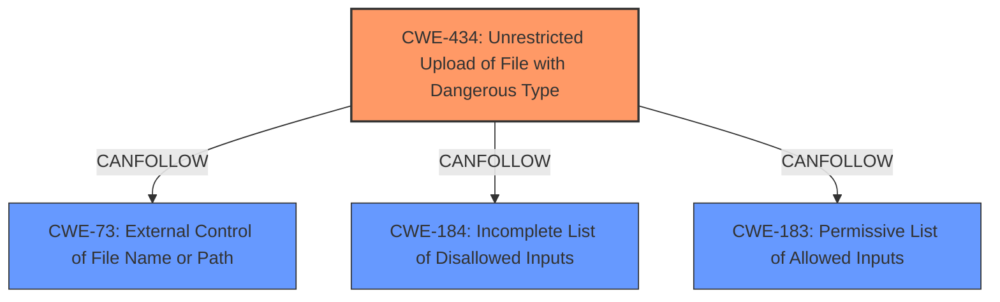

# Analysis Report for CVE-2025-2973

# Vulnerability Analysis Report: CVE-2025-2973

## Description

A vulnerability, which was classified as critical, was found in code-projects College Management System 1.0. This affects an unknown part of the file /Admin/student.php. The manipulation of the argument profile_image leads to **unrestricted upload**. It is possible to initiate the attack remotely. The exploit has been disclosed to the public and may be used.

## Vulnerability Description Key Phrases

- **Weakness:** unrestricted upload
- **Vector:** manipulation of the argument profile_image
- **Product:** code-projects College Management System
- **Version:** 1.0
- **Component:** /Admin/student.php

## Analysis (with Relationship Data)

# Summary
| CWE ID | CWE Name | Confidence | CWE Abstraction Level | CWE Vulnerability Mapping Label | CWE-Vulnerability Mapping Notes |
|---|---|---|---|---|---|
| CWE-434 | Unrestricted Upload of File with Dangerous Type | 1.0 | Base | Allowed | Primary CWE. The vulnerability description explicitly mentions "unrestricted upload". |

## Evidence and Confidence

*   **Confidence Score:** 1.0
*   **Evidence Strength:** HIGH

## Relationship Analysis
There are several relationships to consider for CWE-434:
- CANFOLLOW: CWE-73 (External Control of File Name or Path), CWE-184 (Incomplete List of Disallowed Inputs), CWE-183 (Permissive List of Allowed Inputs)
- PEEROF: CWE-430 (File Name Extension Blacklist for Dangerous Types), CWE-436 (Interpretation Conflict)

The primary relationship that influences the selection is the CANFOLLOW relationship to CWE-184, which suggests that after an unrestricted upload, there might be an incomplete list of disallowed inputs. However, the initial weakness is the unrestricted upload itself.



## Vulnerability Chain
The vulnerability chain starts with the **unrestricted upload** (CWE-434). A potential next step could be related to how the uploaded file is handled, potentially leading to other weaknesses.

## Summary of Analysis
The analysis is based on the clear statement in the vulnerability description: "The manipulation of the argument profile_image leads to **unrestricted upload**." This directly maps to CWE-434.

The retriever results also list CWE-434 as a highly relevant CWE.

The selection of CWE-434 is at the base level of specificity, as it directly describes the **weakness** of allowing unrestricted file uploads.

Relevant CWE Information:

# Enhanced Context (25 CWEs)
The following CWEs were identified as potentially relevant to this vulnerability:

## CWE-434: Unrestricted Upload of File with Dangerous Type
**Abstraction Level**: Base
**Similarity Score**: 0.83
**Source**: dense

**Description**:
The product allows the upload or transfer of dangerous file types that are automatically processed within its environment.

**Mapping Guidance**:
- Usage: Allowed
- Rationale: This CWE entry is at the Base level of abstraction, which is a preferred level of abstraction for mapping to the root causes of vulnerabilities.


## CWE Relationship Analysis

Current CWEs represent these abstraction levels: .


### Vulnerability Chain Analysis

**Chain starting from CWE-183:**
- 183 (Permissive List of Allowed Inputs) - ROOT


**Chain starting from CWE-73:**
- 73 (External Control of File Name or Path) - ROOT


### CWE Relationship Diagram

```mermaid
graph TD
    classDef primary fill:#f96,stroke:#333,stroke-width:2px
    classDef secondary fill:#69f,stroke:#333
    classDef tertiary fill:#9e9,stroke:#333
```


*Report generated on 2025-07-14 16:34:41*
