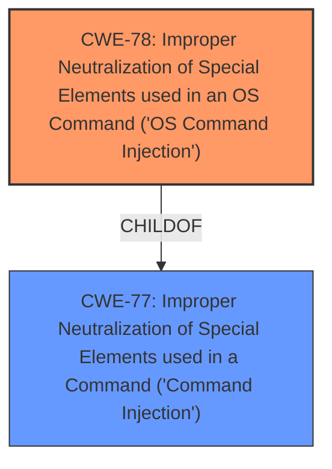

# Analysis for CVE-2025-29743

# Summary
| CWE ID | CWE Name | Confidence | CWE Abstraction Level | CWE Vulnerability Mapping Label | CWE-Vulnerability Mapping Notes |
|---|---|---|---|---|---|
| CWE-78 | Improper Neutralization of Special Elements used in an OS Command ('OS Command Injection') | 1.0 | Base | Allowed | Primary CWE |

## Evidence and Confidence

*   **Confidence Score:** 1.0
*   **Evidence Strength:** HIGH

## Relationship Analysis
The primary relationship that influenced the decision was the child-of relationship between CWE-78 and CWE-77. While CWE-77 is a broader category, the description specifically points to an OS command injection, making CWE-78 the more appropriate choice.

## Vulnerability Chain
The vulnerability chain consists of a single step: **improper neutralization** of input leading directly to **OS Command Injection**.

## Summary of Analysis
The vulnerability description explicitly states "**command injection** in /goform/delRouting," indicating that the software is vulnerable to command injection. The retriever results also suggest CWE-77 and CWE-78 as top candidates. Given the explicit mention of a command related to the OS, CWE-78 is the best fit as it is a 'OS Command Injection'. The evidence is strong, and the selection is well-supported by both the vulnerability description and the retriever results. CWE-78 is at the Base level of abstraction, which is the preferred level.

Relevant CWE Information:

# Enhanced Context (25 CWEs)
The following CWEs were identified as potentially relevant to this vulnerability:

## CWE-78: Improper Neutralization of Special Elements used in an OS Command ('OS Command Injection')
**Abstraction Level**: Base
**Similarity Score**: 0.73
**Source**: dense

**Description**:
The product constructs all or part of an OS command using externally-influenced input from an upstream component, but it does not neutralize or incorrectly neutralizes special elements that could modify the intended OS command when it is sent to a downstream component.

**Mapping Guidance**:
- Usage: Allowed
- Rationale: This CWE entry is at the Base level of abstraction, which is a preferred level of abstraction for mapping to the root causes of vulnerabilities.

## CWE-77: Improper Neutralization of Special Elements used in a Command ('Command Injection')
**Abstraction Level**: Class
**Similarity Score**: 0.70
**Source**: dense

**Description**:
The product constructs all or part of a command using externally-influenced input from an upstream component, but it does not neutralize or incorrectly neutralizes special elements that could modify the intended command when it is sent to a downstream component.

**Mapping Guidance**:
- Usage: Allowed-with-Review
- Rationale: CWE-77 is often misused when OS command injection (CWE-78) was intended instead [REF-1287].

CWE-77 was considered but not selected because CWE-78 is a more specific and accurate representation of the vulnerability, aligning with the "OS Command Injection" description.