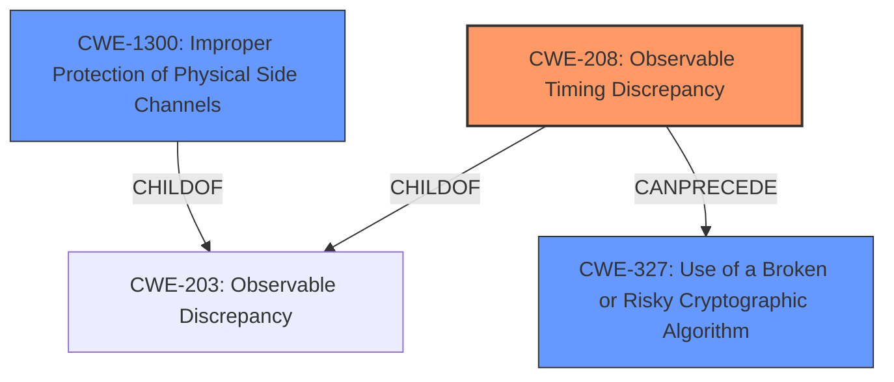

# Analysis Report for CVE-2025-29779

# Vulnerability Analysis Report: CVE-2025-29779

## Description

Post-Quantum Secure Feldmans Verifiable Secret Sharing provides a Python implementation of Feldmans Verifiable Secret Sharing (VSS) scheme. In versions 0.8.0b2 and prior, the `secure_redundant_execution` function in feldman_vss.py attempts to mitigate fault injection attacks by executing a function multiple times and comparing results. However, several critical weaknesses exist. Pythons execution environment cannot guarantee true isolation between redundant executions, the constant-time comparison implementation in Python is subject to **timing variations**, the randomized execution order and timing provide insufficient protection against sophisticated fault attacks, and the error handling may leak timing information about partial execution results. These limitations make the protection ineffective against targeted fault injection attacks, especially from attackers with physical access to the hardware. A successful fault injection attack could allow an attacker to bypass the redundancy check mechanisms, extract secret polynomial coefficients during share generation or verification, force the acceptance of invalid shares during verification, and/or manipulate the commitment verification process to accept fraudulent commitments. This undermines the core security guarantees of the Verifiable Secret Sharing scheme. As of time of publication, no patched versions of Post-Quantum Secure Feldmans Verifiable Secret Sharing exist, but other mitigations are available. Long-term remediation requires reimplementing the security-critical functions in a lower-level language like Rust. Short-term mitigations include deploying the software in environments with physical security controls, increasing the redundancy count (from 5 to a higher number) by modifying the source code, adding external verification of cryptographic operations when possible, considering using hardware security modules (HSMs) for key operations.

## Vulnerability Description Key Phrases

- **Component:** secure_redundant_execution function in feldman_vss.py
- **Rootcause:** timing variations, constant-time comparison implementation, insufficient protection against sophisticated fault attacks
- **Weakness:** timing variations
- **Product:** Post-Quantum Secure Feldmans Verifiable Secret Sharing
- **Impact:** bypass the redundancy check mechanisms, extract secret polynomial coefficients, force the acceptance of invalid shares, manipulate the commitment verification process
- **Attacker:** attackers with physical access to the hardware
- **Version:** 0.8.0b2 and prior

## Analysis (with Relationship Data)

# Summary

| CWE ID  | CWE Name                                                         | Confidence | CWE Abstraction Level | CWE Vulnerability Mapping Label | CWE-Vulnerability Mapping Notes |
| :-------- | :--------------------------------------------------------------- | :--------- | :-------------------- | :------------------------------ | :------------------------------ |
| CWE-208 | Observable Timing Discrepancy                                    | 0.9       | Base                  | Primary                          | Allowed                      |
| CWE-327 | Use of a Broken or Risky Cryptographic Algorithm               | 0.7       | Class                 | Secondary                      | Allowed-with-Review           |
| CWE-1300 | Improper Protection of Physical Side Channels | 0.6       | Base                 | Secondary                      | Allowed           |

## Evidence and Confidence

*   **Confidence Score:** 0.8
*   **Evidence Strength:** HIGH

## Relationship Analysis
The primary CWE is CWE-208 Observable Timing Discrepancy, a base-level CWE. CWE-327 Use of a Broken or Risky Cryptographic Algorithm is a class-level CWE and a parent of CWE-916 Use of Password Hash With Insufficient Computational Effort. CWE-1300 Improper Protection of Physical Side Channels is a base level CWE. CWE-208 is related to CWE-1300 as a child of CWE-203 and can precede CWE-327. The final selection was based on the explicit mention of timing variations in the vulnerability description and the potential use of risky cryptographic algorithms and the possibility of side-channel attacks due to physical access.



## Vulnerability Chain
The vulnerability chain starts with the **timing variations** in the constant-time comparison implementation (CWE-208), potentially combined with the use of risky cryptographic algorithms (CWE-327). This can lead to bypassing redundancy checks, extracting secret polynomial coefficients, forcing the acceptance of invalid shares, and manipulating the commitment verification process, ultimately undermining the VSS scheme's security. The attacker has physical access which brings in the possibility of side channel attacks (CWE-1300).

## Summary of Analysis
The primary assessment focuses on the **timing variations** within the `secure_redundant_execution` function. The evidence supports this due to the explicit mention of "**timing variations**, constant-time comparison implementation, insufficient protection against sophisticated fault attacks" in the "Vulnerability Description Key Phrases". The retriever results and graph relationships also support the selection of CWE-208.

CWE-327 is included as a secondary CWE because the vulnerability description mentions manipulation of cryptographic operations and the potential extraction of secret coefficients. Given the context of the application it's likely some broken or risky cryptography could be in play.

CWE-1300 is included as a secondary CWE because the attacker has physical access which means they can perform side channel attacks.

The selected CWEs are at the optimal level of specificity because they accurately represent the technical details of the vulnerability, focusing on the root cause (timing issues) and potential contributing factors (cryptographic algorithm weaknesses).

Relevant CWE Information:

# Enhanced Context (25 CWEs)
The following CWEs were identified as potentially relevant to this vulnerability:

## CWE-208: Observable Timing Discrepancy
**Abstraction Level**: Base
**Similarity Score**: 0.77
**Source**: dense

**Description**:
Two separate operations in a product require different amounts of time to complete, in a way that is observable to an actor and reveals security-relevant information about the state of the product, such as whether a particular operation was successful or not.

**Mapping Guidance**:
- Usage: Allowed
- Rationale: This CWE entry is at the Base level of abstraction, which is a preferred level of abstraction for mapping to the root causes of vulnerabilities.

**CWE-208 Selected:**
The vulnerability description states "the constant-time comparison implementation in Python is subject to **timing variations**," which directly aligns with CWE-208. This timing discrepancy can be observed by an attacker, potentially revealing sensitive information. The CWE is at the Base level and is ALLOWED per mapping guidance.

## CWE-327: Use of a Broken or Risky Cryptographic Algorithm
**Abstraction Level**: Class
**Similarity Score**: 1213.89
**Source**: sparse

**Description**:
The product uses a broken or risky cryptographic algorithm or protocol.

**Mapping Guidance**:
- Usage: Allowed-with-Review
- Rationale: This CWE entry is a Class and might have Base-level children that would be more appropriate

**CWE-327 Selected:**
The vulnerability description mentions the potential for extracting secret polynomial coefficients and manipulating commitment verification, suggesting that the cryptographic algorithms used might be weak or improperly implemented. This aligns with CWE-327. The Usage is Allowed-with-Review.

## CWE-1300: Improper Protection of Physical Side Channels
**Abstraction Level**: base
**Similarity Score**: 2.47
**Source**: graph

**Description**:
CWE-1300: Improper Protection of Physical Side Channels

**Mapping Guidance**:
- Usage: Allowed
- Rationale: This CWE entry is at the Base level of abstraction, which is a preferred level of abstraction for mapping to the root causes of vulnerabilities.

**CWE-1300 Selected:**
The vulnerability description mentions "attackers with physical access to the hardware." This access allows attackers to perform side-channel attacks.

## CWE-119: Improper Restriction of Operations within the Bounds of a Memory Buffer
**Abstraction Level**: class
**Similarity Score**: 2.55
**Source**: graph

**Description**:
CWE-119: Improper Restriction of Operations within the Bounds of a Memory Buffer

**Mapping Guidance**:
- Usage: Discouraged
- Rationale: CWE-119 is commonly misused in low-information vulnerability reports when lower-level CWEs could be used instead, or when more details about the vulnerability are available.

**CWE-119 Not Selected:**
While memory manipulation is a potential impact, the root cause is the timing discrepancy and the attacker's capabilities. CWE-119 is too broad and doesn't address the core issue. The Usage is Discouraged.


## CWE Relationship Analysis

Current CWEs represent these abstraction levels: .


### Vulnerability Chain Analysis

**Chain starting from CWE-203:**
- 203 (Observable Discrepancy) - ROOT


**Chain starting from CWE-327:**
- 327 (Use of a Broken or Risky Cryptographic Algorithm) - ROOT


### CWE Relationship Diagram

```mermaid
graph TD
    classDef primary fill:#f96,stroke:#333,stroke-width:2px
    classDef secondary fill:#69f,stroke:#333
    classDef tertiary fill:#9e9,stroke:#333
```


*Report generated on 2025-07-14 16:36:07*
