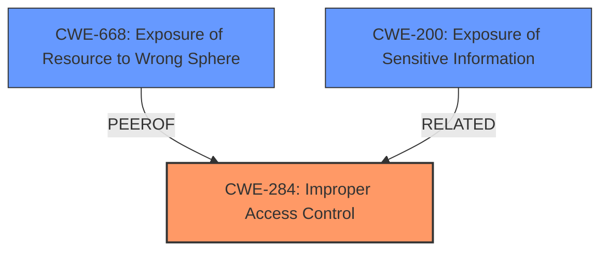

# Analysis for CVE-2025-29781

# Summary
| CWE ID | CWE Name | Confidence | CWE Abstraction Level | CWE Vulnerability Mapping Label | CWE-Vulnerability Mapping Notes |
|---|---|---|---|---|---|
| CWE-284 | Improper Access Control | 0.85 | Class | Primary CWE | Allowed-with-Review |
| CWE-668 | Exposure of Resource to Wrong Sphere | 0.70 | Class | Secondary Candidate | Discouraged |
| CWE-200 | Exposure of Sensitive Information | 0.60 | Class | Secondary Candidate | Allowed |

## Evidence and Confidence

*   **Confidence Score:** 0.80
*   **Evidence Strength:** MEDIUM

## Relationship Analysis
The primary CWE is CWE-284, "Improper Access Control," which is a high-level class. While more specific CWEs like CWE-863 ("Incorrect Authorization") or CWE-306 ("Missing Authentication for Critical Function") were considered, the provided information doesn't offer enough detail to definitively pinpoint whether the issue stems from incorrect authorization logic or a complete lack of authentication. CWE-284 acts as a suitable starting point when the root cause is not immediately clear. CWE-668 ("Exposure of Resource to Wrong Sphere") relates to exposing resources to unintended actors, which aligns with the secret leakage aspect of the vulnerability. However, it's a higher-level class and less specific than CWE-284 for access control issues.

## Vulnerability Chain
The vulnerability chain starts with **improper access control**, leading to the ability to load Secrets from unauthorized namespaces, and culminating in **Secret Leakage**.

Initial Flaw: **Improper Access Control** in BMO, allowing loading Secrets from arbitrary namespaces. (CWE-284)
|
V
Exploitation: An attacker creates a `BMCEventSubscription` to load Secrets from unauthorized namespaces.
|
V
Impact: **Secret Leakage**, where an attacker gains access to sensitive information they should not have. (CWE-200/668)

## Summary of Analysis
The initial assessment identified several potential CWEs. The primary concern is **improper access control**, as the vulnerability allows users to load Secrets from namespaces they should not have access to. The chosen CWEs reflect this, with CWE-284 as the primary cause and CWE-668 and CWE-200 representing the resulting exposure of sensitive information. The evidence supports the selection of CWE-284, "Improper Access Control," as the root cause, although the exact mechanism of the access control failure (e.g., missing checks or incorrect logic) is not fully detailed in the provided description. The "**rootcause: improper access control**" phrase in the "Vulnerability Description Key Phrases" section supports this selection. The mitigations mentioned (restricting BMO to read Secrets only from the same namespace as the BMH resource, configuring BMO RBAC to be namespace-scoped) further reinforce this.

The selection of CWE-284 is at the Class level, which is less specific than Base or Variant levels. However, given the available information, a more specific CWE cannot be confidently assigned. While CWE-863 ("Incorrect Authorization") or CWE-306 ("Missing Authentication for Critical Function") might be applicable, there is insufficient information to determine whether the authorization logic is incorrect or whether authentication is completely missing. Therefore, CWE-284 provides a suitable starting point.

The vulnerability results in **Secret Leakage**. This can be classified as CWE-668 "Exposure of Resource to Wrong Sphere" or CWE-200 "Exposure of Sensitive Information". The choice of CWE-668 is influenced by the fact that the secret is exposed to the wrong control sphere (the attacker's namespace). CWE-200 is more general but also applies.
The retriever identified the following CWEs:

*   CWE-923: Improper Restriction of Communication Channel to Intended Endpoints - Not applicable, as the vulnerability isn't about restricting communication channels.
*   CWE-863: Incorrect Authorization - Potentially applicable, but insufficient evidence to confirm the authorization logic is incorrect.
*   CWE-532: Insertion of Sensitive Information into Log File - Not applicable, as the vulnerability isn't about logging sensitive information.
*   CWE-668: Exposure of Resource to Wrong Sphere - As described above.
*   CWE-306: Missing Authentication for Critical Function - Potentially applicable, but insufficient evidence to confirm authentication is missing.
*   CWE-201: Insertion of Sensitive Information Into Sent Data - Not directly applicable but related as the secrets are being leaked/exposed.
*   CWE-285: Improper Authorization - Potentially applicable, but insufficient evidence to confirm improper authorization.
*   CWE-347: Improper Verification of Cryptographic Signature - Not applicable, as the vulnerability isn't about cryptographic signatures.
*   CWE-277: Insecure Inherited Permissions - Not applicable, as the vulnerability isn't about inherited permissions.
*   CWE-322: Key Exchange without Entity Authentication - Not applicable, as the vulnerability isn't about key exchange.