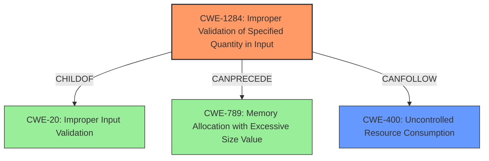

# Analysis for CVE-2025-29784

# Summary
| CWE ID  | CWE Name                                                              | Confidence | CWE Abstraction Level | CWE Vulnerability Mapping Label | CWE-Vulnerability Mapping Notes |
| :------- | :-------------------------------------------------------------------- | :--------- | :---------------------- | :------------------------------ | :-------------------------------- |
| CWE-1284 | Improper Validation of Specified Quantity in Input                   | 0.9        | Base                    | Primary                         | Allowed                           |
| CWE-400  | Uncontrolled Resource Consumption                                     | 0.7        | Class                   | Secondary                       | Discouraged                      |

## Evidence and Confidence

*   **Confidence Score:** 0.8
*   **Evidence Strength:** HIGH

## Relationship Analysis

The primary CWE is CWE-1284 (Improper Validation of Specified Quantity in Input), which is a Base level CWE and a child of CWE-20 (Improper Input Validation). CWE-1284 can precede CWE-789 (Memory Allocation with Excessive Size Value). CWE-400 (Uncontrolled Resource Consumption) is a Class level CWE and is considered as a potential impact of the **lack of length validation**.

## Vulnerability Chain

The vulnerability chain starts with the **lack of length validation** on the `s` parameter (CWE-1284). This leads to attackers submitting excessively long search queries, which can cause performance degradation and potentially lead to a denial-of-service (DoS) attack (CWE-400).

## Summary of Analysis

The analysis indicates that the primary weakness is the **lack of length validation** for the `s` parameter in GET requests (CWE-1284). The evidence supports this classification as the vulnerability description explicitly mentions this **lack of validation** as the root cause. The impact of this weakness is performance degradation and potential denial-of-service (DoS), which aligns with CWE-400.

The selection of CWE-1284 is based on the following evidence:

*   "**lacks length validation**" - directly points to a validation issue related to quantity (length).

CWE-400 is considered a secondary weakness as it represents the potential impact of the primary weakness (CWE-1284), but is a more general case, and not necessarily guaranteed.

The retriever results also support CWE-1284 as the top match.

CWE-20 (Improper Input Validation) was considered but not selected as the primary CWE because CWE-1284 provides a more specific description of the vulnerability. The mapping guidance for CWE-20 discourages its use when lower-level CWEs are available.
CWE-789 (Memory Allocation with Excessive Size Value) was considered but not selected because the description doesn't specifically state it's a memory allocation issue, but it is a possibility.
CWE-770 (Allocation of Resources Without Limits or Throttling) was considered but not selected because the description doesn't specifically state it's a resource allocation issue without limits, but it is a possibility.
CWE-1333 (Inefficient Regular Expression Complexity) was considered but not selected because it is not clear if the search functionality uses regular expressions or not.
CWE-90 (Improper Neutralization of Special Elements used in an LDAP Query ('LDAP Injection')) was considered but not selected because there is no evidence that LDAP queries are used by the application.

The selected CWEs are at the optimal level of specificity, with CWE-1284 being a Base level CWE that accurately represents the root cause of the vulnerability.