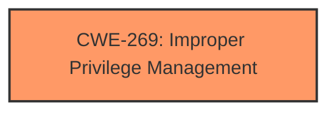

# Enhanced Analysis for CVE-2025-29800

# Summary
| CWE ID | CWE Name | Confidence | CWE Abstraction Level | CWE Vulnerability Mapping Label | CWE-Vulnerability Mapping Notes |
|---|---|---|---|---|---|
| CWE-269 | Improper Privilege Management | 0.75 | Class | Primary | Discouraged |

## Evidence and Confidence

*   **Confidence Score:** 0.75
*   **Evidence Strength:** LOW

## Relationship Analysis
The primary relationship identified is that CWE-269 is a Class-level CWE, which means it is a higher-level categorization. The retriever results also list several Base-level CWEs that could potentially be more specific. However, given the limited information, a more specific CWE cannot be determined.



## Vulnerability Chain
The vulnerability chain starts with **Improper privilege management** which leads to elevated privileges locally.

## Summary of Analysis
The initial analysis focuses on identifying the root cause of the vulnerability, which is described as **Improper privilege management**. The evidence for this is directly from the "Vulnerability Description Key Phrases". The retriever results also indicate that CWE-269 (Improper Privilege Management) is a potential candidate.

However, CWE-269 is a Class-level CWE and the mapping guidance discourages its use when more specific Base-level CWEs are available. Given the limited information provided in the vulnerability description and CVE Reference Links Content Summary (which is UNRELATED), it is difficult to determine a more specific CWE. The description only mentions "Improper privilege management" without specifying how the privilege management is improper.

Therefore, based on the available evidence, CWE-269 is chosen, but with a lower confidence score of 0.75 due to its high-level nature and the absence of specific details.

Relevant CWE Information:

# Enhanced Context (25 CWEs)
The following CWEs were identified as potentially relevant to this vulnerability:

## CWE-266: Incorrect Privilege Assignment
**Abstraction Level**: Base
**Similarity Score**: 0.79
**Source**: dense

**Description**:
A product incorrectly assigns a privilege to a particular actor, creating an unintended sphere of control for that actor.

**Mapping Guidance**:
- Usage: Allowed
- Rationale: This CWE entry is at the Base level of abstraction, which is a preferred level of abstraction for mapping to the root causes of vulnerabilities.

## CWE-250: Execution with Unnecessary Privileges
**Abstraction Level**: Base
**Similarity Score**: 0.103

**Description**:
The software component runs with more privileges than it needs to perform a specific task.

## CWE-284: Improper Access Control
**Abstraction Level**: Pillar
**Similarity Score**: 0.095

**Description**:
The software does not adequately control who can read or modify resources

## CWE-285: Improper Authorization
**Abstraction Level**: Class
**Similarity Score**: 0.093

**Description**:
The software performs an authorization check when an actor attempts to access a resource or perform an action, but it does not correctly perform the check.

## CWE-287: Improper Authentication
**Abstraction Level**: Class
**Similarity Score**: 0.091

**Description**:
The software does not correctly verify the identity of the user, device, or other entity (authentication).

## CWE-267: Privilege Defined With Unsafe Actions
**Abstraction Level**: Base
**Similarity Score**: 0.090

**Description**:
A particular privilege, role, capability, or right can be used to perform unsafe actions that were not intended, even when it is assigned to the correct entity.

## CWE-20: Improper Input Validation
**Abstraction Level**: Class
**Similarity Score**: 0.090

**Description**:
The product does not validate or incorrectly validates input that it receives.

## CWE-295: Improper Certificate Validation
**Abstraction Level**: Base
**Similarity Score**: 0.090

**Description**:
The software does not properly validate the certificates.

## CWE-648: Incorrect Use of Privileged APIs
**Abstraction Level**: Base
**Similarity Score**: 0.562

**Description**:
The software component does not follow the API requirements for a privileged API.

## CWE-613: Insufficient Session Expiration
**Abstraction Level**: Base
**Similarity Score**: 0.002

**Description**:
The software does not properly expire user sessions.

CWE-269 was selected because the vulnerability description explicitly mentions **Improper privilege management**. While the mapping guidance discourages the use of CWE-269 due to its high-level nature, the lack of specific details prevents the selection of a more granular CWE.

CWE-266, CWE-250, CWE-285, CWE-287, and CWE-648 were considered as more specific alternatives. However, without knowing the exact mechanism of the **Improper privilege management**, it is impossible to determine if it's due to incorrect assignment (CWE-266), unnecessary privileges (CWE-250), improper authorization checks (CWE-285), improper authentication (CWE-287), or incorrect use of privileged APIs (CWE-648).


## CWE Relationship Analysis

Current CWEs represent these abstraction levels: .


### Vulnerability Chain Analysis

**Chain starting from CWE-648:**
- 648 (Incorrect Use of Privileged APIs) - ROOT


**Chain starting from CWE-20:**
- 20 (Improper Input Validation) - ROOT


### CWE Relationship Diagram

```mermaid
graph TD
    classDef primary fill:#f96,stroke:#333,stroke-width:2px
    classDef secondary fill:#69f,stroke:#333
    classDef tertiary fill:#9e9,stroke:#333
```