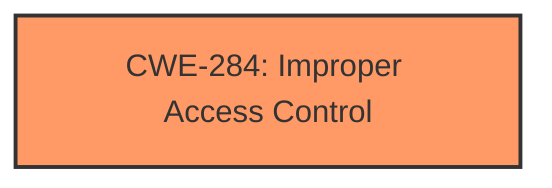

# Enhanced Analysis for CVE-2025-29810

# Summary
| CWE ID | CWE Name | Confidence | CWE Abstraction Level | CWE Vulnerability Mapping Label | CWE-Vulnerability Mapping Notes |
|---|---|---|---|---|---|
| CWE-284 | Improper Access Control | 0.75 | Pillar | Allowed-with-Review | Primary CWE. While more specific CWEs exist, the description lacks details to pinpoint the exact access control failure. |

## Evidence and Confidence

*   **Confidence Score:** 0.75
*   **Evidence Strength:** LOW

## Relationship Analysis
The primary CWE identified is CWE-284, which is a high-level category. Due to lack of details in the vulnerability description, a more specific CWE cannot be assigned. The guidance suggests avoiding CWE-284 if more specific children CWEs can be used.



## Vulnerability Chain
The vulnerability chain starts with **Improper access control** which leads to privilege escalation.
  - The **root cause** is a flaw in how access is controlled.
  - The **impact** is privilege escalation.
  - Specific details about the exact mechanism are missing.

## Summary of Analysis
The vulnerability description states that there is **Improper access control** in Active Directory Domain Services that allows an authorized attacker to elevate privileges over a network.

Based on the retriever results, the top CWE identified is CWE-284, Improper Access Control, which is a Pillar level CWE. The vulnerability description is very generic. I considered all the other CWEs, but they are not as applicable as CWE-284, as the details of the vulnerability are lacking. The Authentication vs Authorization vs Access Control Guidance section also suggests using CWE-284 when the access control failure exists but the root cause is unclear. The Privilege vs Permissions Guidance shows that if no specific privilege or permission mistake is identifiable, then CWE-284 should be used. This is often overused, and should only default to 284 if children like 285 or 266 don't fit.

Relevant CWE Information:

# Enhanced Context (25 CWEs)
The following CWEs were identified as potentially relevant to this vulnerability:

## CWE-284: Improper Access Control
**Abstraction Level**: Pillar
**Similarity Score**: 2163.66
**Source**: sparse

**Description**:
The software does not restrict or incorrectly restricts access to resources (data, files, actions, etc.) to only the intended users.

**Mapping Guidance**:
- Usage: Discouraged
- Rationale: This is a very high-level category. It is better to select a more specific child. This is frequently misused.

**Relationships**:
- CANFOLLOW -> CWE-20
- CANFOLLOW -> CWE-22
- CANFOLLOW -> CWE-73
- CANFOLLOW -> CWE-264
- CANFOLLOW -> CWE-266


## CWE Relationship Analysis

Current CWEs represent these abstraction levels: .


### Vulnerability Chain Analysis

**Chain starting from CWE-22:**
- 22 (Improper Limitation of a Pathname to a Restricted Directory ('Path Traversal')) - ROOT


**Chain starting from CWE-73:**
- 73 (External Control of File Name or Path) - ROOT


### CWE Relationship Diagram

```mermaid
graph TD
    classDef primary fill:#f96,stroke:#333,stroke-width:2px
    classDef secondary fill:#69f,stroke:#333
    classDef tertiary fill:#9e9,stroke:#333
```