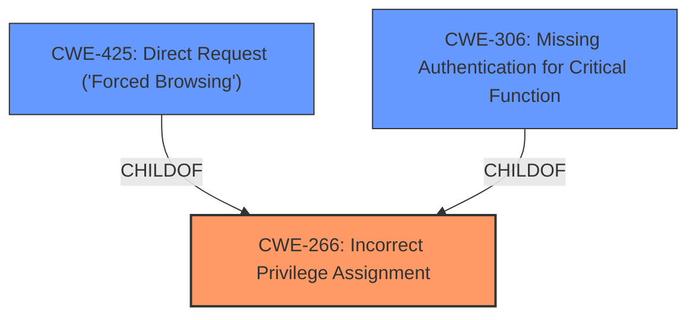

# Raw Analyzer Response for CVE-2025-2990

# Summary
| CWE ID | CWE Name | Confidence | CWE Abstraction Level | CWE Vulnerability Mapping Label | CWE-Vulnerability Mapping Notes |
|---|---|---|---|---|---|
| CWE-266 | Incorrect Privilege Assignment | 0.75 | Base | Allowed | Primary CWE |
| CWE-425 | Direct Request ('Forced Browsing') | 0.5 | Base | Allowed | Secondary Candidate |
| CWE-306 | Missing Authentication for Critical Function | 0.5 | Base | Allowed | Secondary Candidate |

## Evidence and Confidence

*   **Confidence Score:** 0.7
*   **Evidence Strength:** MEDIUM

## Relationship Analysis
The primary relationship influencing my decision is that CWE-266, CWE-425 and CWE-306 are at the Base level of abstraction, which is preferred. CWE-266 is the root cause, and CWE-425 and CWE-306 could result from it.

## Vulnerability Chain
The vulnerability chain starts with **improper access controls** (CWE-266). This can lead to users accessing resources or functionalities they are not authorized to use, which can manifest as Direct Request ('Forced Browsing') (CWE-425) or occur due to Missing Authentication for Critical Function (CWE-306).

## Summary of Analysis
The analysis is based on the provided vulnerability description, which indicates **improper access controls**. The retriever results provide several potential CWEs. Based on the description, the most appropriate CWE is CWE-266 Incorrect Privilege Assignment. The other CWEs like SQL Injection and XSS are not relevant as there is no mention of input being used in SQL queries or web pages.

The vulnerability description states that the manipulation leads to **improper access controls**, which directly aligns with CWE-266. The attack can be initiated remotely, suggesting that authentication or authorization mechanisms are either flawed or missing, which further supports CWE-266.

The retriever results also list CWE-425 Direct Request ('Forced Browsing') and CWE-306 Missing Authentication for Critical Function. These could be secondary issues stemming from the **improper access controls** (CWE-266). If privileges are incorrectly assigned, it could lead to direct requests being successful without proper authorization (CWE-425) or critical functions being accessed without authentication (CWE-306).

Relevant CWE Information:

*   **CWE-266: Incorrect Privilege Assignment** - This is the primary CWE as the description explicitly mentions **improper access controls**.
*   **CWE-425: Direct Request ('Forced Browsing')** - This is a secondary CWE, as **improper access controls** could lead to forced browsing.
*   **CWE-306: Missing Authentication for Critical Function** - This is a secondary CWE, as **improper access controls** could mean critical functions lack authentication.

CWE-79, CWE-89, CWE-117, CWE-78, CWE-1336, CWE-434 were considered but not selected as they relate to specific attack vectors (XSS, SQL Injection, OS Command Injection, etc.) that are not mentioned in the vulnerability description. The focus is on **improper access controls**, which makes CWE-266 the most appropriate primary CWE.