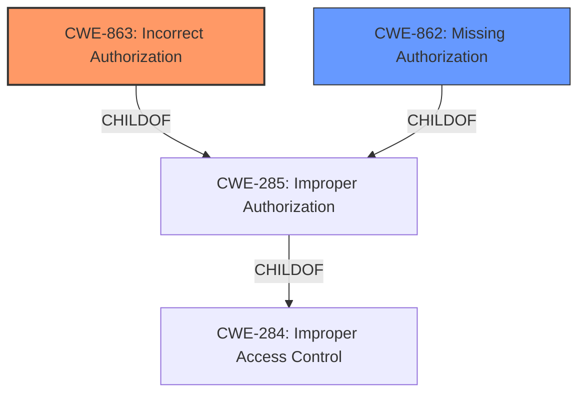

# Raw Analyzer Response for CVE-2025-29922

# Summary
| CWE ID    | CWE Name                                                                  | Confidence | CWE Abstraction Level | CWE Vulnerability Mapping Label | CWE-Vulnerability Mapping Notes |
| --------- | ------------------------------------------------------------------------- | ---------- | --------------------- | ------------------------------- | ------------------------------- |
| CWE-863   | Incorrect Authorization                                                   | 1          | Class                 | Primary                         | Allowed-with-Review             |
| CWE-862   | Missing Authorization                                                     | 0.7        | Class                 | Secondary                       | Allowed-with-Review             |

## Evidence and Confidence

*   **Confidence Score:** 0.9
*   **Evidence Strength:** HIGH

## Relationship Analysis
The primary CWE is CWE-863 (Incorrect Authorization), which is a Class-level CWE. The secondary CWE is CWE-862 (Missing Authorization), also a Class-level CWE. CWE-863 is chosen because the description indicates that authorization checks are present but flawed, leading to the vulnerability. CWE-862 is considered as a weaker, but still plausible, alternative if the authorization checks are effectively absent in certain scenarios. Both CWEs are related to access control issues.

## Vulnerability Chain
The vulnerability chain starts with an **incorrect authorization** mechanism (CWE-863) or a **missing authorization** (CWE-862). This allows an attacker to bypass intended access controls, leading to the **impact** of unauthorized object creation and deletion.

## Summary of Analysis
The vulnerability description clearly indicates an authorization issue within the `APIExport` Virtual Workspace of the kcp system. The system **does not properly** restrict access to resources, allowing unauthorized actors to create and delete objects in arbitrary workspaces.

The primary selection of CWE-863 (Incorrect Authorization) is based on the description stating that access control mechanisms are present but **insufficient** (i.e., **incorrect**), which allows an attacker to bypass intended restrictions. The "CVE Reference Links Content Summary" supports this by stating "Insufficient authorization checks within the `APIExport` Virtual Workspace."

CWE-862 (Missing Authorization) is considered as a secondary option because the vulnerability could also be interpreted as a complete absence of authorization checks in certain scenarios.

The retriever results list both CWE-863 and CWE-862 as possible matches. The "Privileges vs Permissions Guidance" section reinforced the importance of selecting the right CWE based on whether the authorization logic is flawed (CWE-863) or completely missing (CWE-862).

The final decision prioritizes CWE-863 due to the evidence suggesting existing but flawed authorization mechanisms, while acknowledging CWE-862 as a plausible alternative in cases where authorization might be effectively absent. The chosen CWEs are at the Class level because more specific Base or Variant level CWEs are not supported by the available evidence.

Other CWEs considered but not used:

*   CWE-266: Incorrect Privilege Assignment - This was not selected because the vulnerability focuses on authorization related to resources, not on the assignment of privileges to users.
*   CWE-285: Improper Authorization - It is a parent of CWE-863, therefore CWE-863 is more specific and more relevant.
*   CWE-306: Missing Authentication for Critical Function - Authentication is not discussed as a weakness, authorization is.
*   CWE-732: Incorrect Permission Assignment for Critical Resource - This CWE is about setting the wrong permissions initially, not about failing to check permissions during an operation.
*   CWE-668: Exposure of Resource to Wrong Sphere - This is a high-level CWE and the authorization issues are better represented by CWE-863.