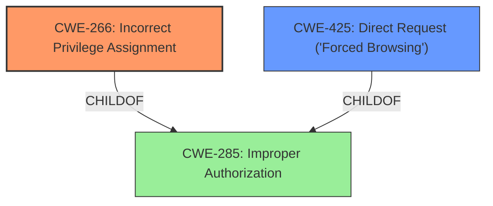

# Enhanced Analysis for CVE-2025-2993

# Summary
| CWE ID | CWE Name | Confidence | CWE Abstraction Level | CWE Vulnerability Mapping Label | CWE-Vulnerability Mapping Notes |
|---|---|---|---|---|---|
| CWE-266 | Incorrect Privilege Assignment | 0.8 | Base | Primary | Allowed |
| CWE-425 | Direct Request ('Forced Browsing') | 0.6 | Base | Secondary | Allowed |

## Evidence and Confidence

*   **Confidence Score:** 0.7
*   **Evidence Strength:** MEDIUM

## Relationship Analysis
The primary relationship that influenced my decision was the parent-child relationship between CWE-285 (Improper Authorization) and CWE-266 (Incorrect Privilege Assignment), where CWE-266 is a more specific type of improper authorization. CWE-425 (Direct Request) was considered a possible secondary CWE as it relates to missing authorization checks on specific URLs or files.



## Vulnerability Chain
The vulnerability chain starts with **improper access controls** (CWE-266), leading to unauthorized access to functionality via manipulation of arguments. The manipulation of the argument can lead to direct requests (CWE-425) to the /default.cfg file without proper privilege assignment.
  - Root Cause: CWE-266 (Incorrect Privilege Assignment)
  - Impact: Unauthorized access to /default.cfg due to missing checks (CWE-425).

## Summary of Analysis
The vulnerability description explicitly states **"improper access controls"** as the root cause, pointing directly to authorization issues. CWE-266 (Incorrect Privilege Assignment) best captures this because it addresses the assignment of incorrect privileges, while CWE-285 (Improper Authorization) is a more general class. CWE-425 (Direct Request) is added as a secondary weakness because the vulnerability allows direct requests to resources due to the lack of proper authorization checks. The analysis relies heavily on the provided vulnerability description key phrases.

CWE-89 (Improper Neutralization of Special Elements used in an SQL Command ('SQL Injection')), CWE-79 (Improper Neutralization of Input During Web Page Generation ('Cross-site Scripting')), CWE-78 (Improper Neutralization of Special Elements used in an OS Command ('OS Command Injection')), and CWE-1336 (Improper Neutralization of Special Elements Used in a Template Engine) were considered but not selected because the description does not indicate any form of injection. CWE-306 (Missing Authentication for Critical Function) and CWE-287 (Improper Authentication) were not chosen as the problem is not missing authentication, but rather incorrect privilege assignment.

Relevant CWE Information:
*   CWE-266: Incorrect Privilege Assignment
*   CWE-425: Direct Request ('Forced Browsing')


## CWE Relationship Analysis

Current CWEs represent these abstraction levels: .


### Vulnerability Chain Analysis

**Chain starting from CWE-89:**
- 89 (Improper Neutralization of Special Elements used in an SQL Command ('SQL Injection')) - ROOT


**Chain starting from CWE-79:**
- 79 (Improper Neutralization of Input During Web Page Generation ('Cross-site Scripting')) - ROOT


### CWE Relationship Diagram

```mermaid
graph TD
    classDef primary fill:#f96,stroke:#333,stroke-width:2px
    classDef secondary fill:#69f,stroke:#333
    classDef tertiary fill:#9e9,stroke:#333
```