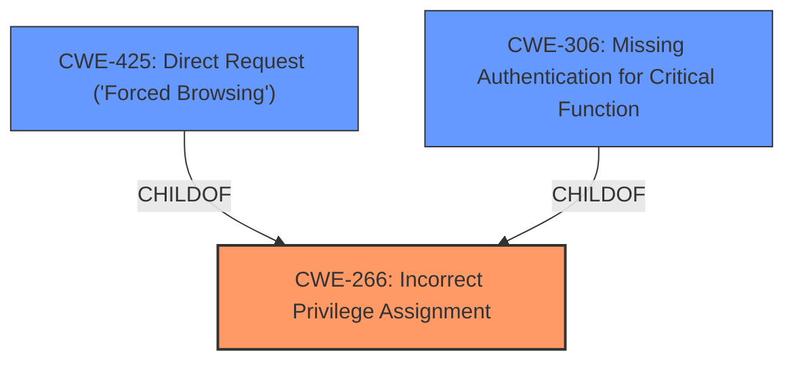

# Raw Analyzer Response for CVE-2025-2994

# Summary
| CWE ID | CWE Name | Confidence | CWE Abstraction Level | CWE Vulnerability Mapping Label | CWE-Vulnerability Mapping Notes |
|---|---|---|---|---|---|
| **CWE-266** | **Incorrect Privilege Assignment** | 0.9 | Base | Primary | Allowed |
| CWE-425 | Direct Request ('Forced Browsing') | 0.6 | Base | Secondary Candidate | Allowed |
| CWE-306 | Missing Authentication for Critical Function | 0.5 | Base | Secondary Candidate | Allowed |

## Evidence and Confidence

*   **Confidence Score:** 0.8
*   **Evidence Strength:** MEDIUM

## Relationship Analysis
The primary CWE selected is CWE-266 (Incorrect Privilege Assignment), which is a base-level CWE. While CWE-285 (Improper Authorization) exists and may seem relevant, CWE-266 is more specific as it addresses the root cause of incorrect privilege assignments leading to authorization issues. CWE-266 has several parent CWEs related to broader security issues. CWE-425 (Direct Request) and CWE-306 (Missing Authentication) are also considered as they represent potential ways the improper privilege assignment is exploited.

## Vulnerability Chain
The vulnerability chain starts with **improper access controls** (CWE-266). This leads to the possibility of direct requests (CWE-425) or missing authentication (CWE-306), ultimately allowing unauthorized access to sensitive functions in the Web Management Interface.

## Summary of Analysis
The primary vulnerability is classified as CWE-266 (Incorrect Privilege Assignment) because the vulnerability description explicitly mentions **improper access controls**, aligning with the core definition of CWE-266. The attack involves manipulating `/goform/qossetting` of the Web Management Interface, which suggests a privilege assignment issue within the web application's components.

The evidence, while limited, directly points to an access control problem, making CWE-266 the most relevant. The retriever results also list CWE-266 as a potential match. CWE-425 and CWE-306 are considered as potential secondary issues that could arise from the primary weakness.

The selection is based on the provided evidence and the definition of CWE-266, which directly addresses privilege assignment issues. While other CWEs like CWE-285 (Improper Authorization) could be related, CWE-266 provides a more specific classification of the root cause.

Relevant CWE Information:

# Enhanced Context (25 CWEs)
The following CWEs were identified as potentially relevant to this vulnerability:

## CWE-425: Direct Request ('Forced Browsing')
**Abstraction Level**: Base
**Similarity Score**: 0.75
**Source**: dense

**Description**:
The web application does not adequately enforce appropriate authorization on all restricted URLs, scripts, or files.

**Mapping Guidance**:
- Usage: Allowed
- Rationale: This CWE entry is at the Base level of abstraction, which is a preferred level of abstraction for mapping to the root causes of vulnerabilities.

## CWE-266: Incorrect Privilege Assignment
**Abstraction Level**: base
**Similarity Score**: 2.61
**Source**: graph

**Description**:
CWE-266: Incorrect Privilege Assignment

**Mapping Guidance**:
- Usage: Allowed
- Rationale: This CWE entry is at the Base level of abstraction, which is a preferred level of abstraction for mapping to the root causes of vulnerabilities.

**Relationships**:
- PARENTOF -> CWE-9
- PARENTOF -> CWE-556
- PARENTOF -> CWE-520
- PARENTOF -> CWE-1022
- CANALSOBE -> CWE-286

## CWE-306: Missing Authentication for Critical Function
**Abstraction Level**: base
**Similarity Score**: 2.33
**Source**: graph

**Description**:
CWE-306: Missing Authentication for Critical Function

**Mapping Guidance**:
- Usage: Allowed
- Rationale: This CWE entry is at the Base level of abstraction, which is a preferred level of abstraction for mapping to the root causes of vulnerabilities.

**Relationships**:
- PARENTOF -> CWE-322
- PARENTOF -> CWE-288
- CHILDOF -> CWE-287
- CHILDOF -> CWE-287
- CHILDOF -> CWE-306

CWE-285 (Improper Authorization) was considered but not used because it is a Class-level CWE, and CWE-266 offers a more specific Base-level classification. Several other CWEs related to input validation and injection were also considered but deemed less relevant as the primary issue is related to access control, not input handling.