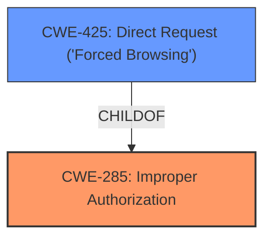

# Raw Analyzer Response for CVE-2025-2996

# Summary

| CWE ID | CWE Name | Confidence | CWE Abstraction Level | CWE Vulnerability Mapping Label | CWE-Vulnerability Mapping Notes |
|---|---|---|---|---|---|
| CWE-285 | Improper Authorization | 0.75 | Class | Primary | Allowed |
| CWE-425 | Direct Request ('Forced Browsing') | 0.6 | Base | Secondary | Allowed |

## Evidence and Confidence

*   **Confidence Score:** 0.7
*   **Evidence Strength:** MEDIUM

## Relationship Analysis

The primary CWE is CWE-285, which is a Class-level CWE. CWE-425 is a ChildOf CWE-285 and represents a more specific type of authorization issue, which is Direct Request ('Forced Browsing'). The relationship influenced the selection of CWE-425 as a secondary CWE to provide more context to the improper authorization.

## Vulnerability Chain

The vulnerability chain starts with **improper access controls** (CWE-285), potentially leading to a direct request to sensitive resources (CWE-425) due to the lack of sufficient authorization checks.

## Summary of Analysis

The primary weakness is **improper access controls**, which directly maps to CWE-285 (Improper Authorization). The vulnerability description mentions that manipulation of the file `/goform/SysToolDDNS` leads to this **improper access controls**. Given the specific nature of the attack being remotely initiated and exploiting a web management interface, CWE-425 (Direct Request ('Forced Browsing')) is considered as a secondary CWE, which is a more specific type of authorization issue where direct requests to restricted URLs are possible.

The selection is based on the evidence provided in the vulnerability description: "This issue affects some unknown processing of the file /goform/SysToolDDNS of the component Web Management Interface. The manipulation leads to **improper access controls**. The attack may be initiated remotely."

CWE-285 is chosen as the primary because the core issue is the lack of proper authorization. CWE-425 provides additional context about the specific type of authorization failure, which is direct access to resources.

The retriever results also point to CWE-425.

Other CWEs Considered:

*   CWE-78, CWE-89, CWE-79, CWE-1336: These are related to injection vulnerabilities, but the primary issue is about **improper access controls**, not about how input is handled.
*   CWE-266: Incorrect Privilege Assignment: While related to authorization, the description focuses on access control rather than the assignment of privileges.

Relevant CWE Information:

# Enhanced Context (25 CWEs)
The following CWEs were identified as potentially relevant to this vulnerability:

## CWE-425: Direct Request ('Forced Browsing')
**Abstraction Level**: Base
**Similarity Score**: 0.77
**Source**: dense

**Description**:
The web application does not adequately enforce appropriate authorization on all restricted URLs, scripts, or files.

**Mapping Guidance**:
- Usage: Allowed
- Rationale: This CWE entry is at the Base level of abstraction, which is a preferred level of abstraction for mapping to the root causes of vulnerabilities.

## CWE-285: Improper Authorization
**Abstraction Level**: Class
**Similarity Score**: 0.331
**Source**: sparse

**Description**:
The software performs an authorization check, but it does not correctly perform the check in a way that satisfies the relevant security requirements.

**Mapping Guidance**:
- Usage: Discouraged
- Rationale: This is a very broad CWE. More specific children are usually more appropriate.