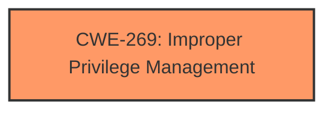

# Raw Analyzer Response for CVE-2025-29976

# Summary
| CWE ID | CWE Name | Confidence | CWE Abstraction Level | CWE Vulnerability Mapping Label | CWE-Vulnerability Mapping Notes |
|---|---|---|---|---|---|
| CWE-269 | Improper Privilege Management | 0.75 | Class | Primary | Discouraged |

## Evidence and Confidence

*   **Confidence Score:** 0.75
*   **Evidence Strength:** LOW

## Relationship Analysis
The primary consideration is the direct match of "**Improper privilege management**" in the vulnerability description to CWE-269. While CWE-269 is a class-level CWE and is generally discouraged, there is insufficient information to determine a more specific Base or Variant CWE. The other candidate CWEs, such as CWE-266, CWE-250, CWE-285, and CWE-863, were considered but require more specific details than provided in the vulnerability description.

## Vulnerability Chain
The vulnerability chain starts with **Improper privilege management** (CWE-269), which allows an authorized attacker to elevate privileges locally.

## Summary of Analysis
The initial assessment identified CWE-269 as the primary candidate due to the direct match with the key phrase "**Improper privilege management**" in the vulnerability description. The lack of specific root cause information limits the ability to select a more granular CWE. Given the limited evidence, the confidence level is moderate. Further information about the specific mechanism of privilege **improper management** is needed to refine the CWE selection.

Relevant CWE Information:

# Enhanced Context (25 CWEs)
The following CWEs were identified as potentially relevant to this vulnerability:

## CWE Classification Guidance

The following guidance has been automatically included because relevant keywords were detected in the vulnerability description:

### Privileges vs Permissions Guidance

## Vulnerability Description
**Improper privilege management** in Microsoft Office SharePoint allows an authorized attacker to elevate privileges locally.

### Vulnerability Description Key Phrases
- **rootcause:** **Improper privilege management**
- **impact:** elevate privileges
- **attacker:** authorized attacker
- **product:** Microsoft Office SharePoint

## Retriever Results

### Top Combined Results

| Rank | CWE ID | Name | Abstraction | Usage  | Retrievers | Individual Scores |
|------|--------|------|-------------|-------|------------|-------------------|
| 1 | 269 | Improper Privilege Management | Class | Discouraged | sparse | 0.110 |
| 2 | 250 | Execution with Unnecessary Privileges | Base | Allowed | sparse | 0.103 |
| 3 | 284 | Improper Access Control | Pillar | Discouraged | sparse | 0.102 |
| 4 | 472 | External Control of Assumed-Immutable Web Parameter | Base | Allowed | sparse | 0.101 |
| 5 | 285 | Improper Authorization | Class | Discouraged | sparse | 0.099 |
| 6 | 732 | Incorrect Permission Assignment for Critical Resource | Class | Allowed-with-Review | sparse | 0.095 |
| 7 | 287 | Improper Authentication | Class | Discouraged | sparse | 0.091 |
| 8 | 267 | Privilege Defined With Unsafe Actions | Base | Allowed | sparse | 0.090 |
| 9 | 266 | Incorrect Privilege Assignment | Base | Allowed | dense | 0.556 |
| 10 | 268 | Privilege Chaining | Base | Allowed | graph | 0.002 |

Based on the provided information, here's a detailed analysis of the CWE selection:

1.  **Content Matching:**
    *   The vulnerability description explicitly states "**Improper privilege management**". This directly aligns with the name and description of CWE-269, which is "Improper Privilege Management".
    *   The description also mentions "elevate privileges," which is a common impact associated with privilege management issues.

2.  **Relationship Analysis:**
    *   CWE-269 is a Class-level CWE. This means it's a higher-level categorization. Ideally, a more specific Base or Variant CWE would be preferred if more details were available.
    *   The child CWEs of CWE-269, such as CWE-266 ("Incorrect Privilege Assignment") and CWE-250 ("Execution with Unnecessary Privileges"), offer more specific classifications. However, the current description lacks the necessary details to confidently assign one of these child CWEs.
    *   The retriever results also list several other potential CWEs, including CWE-285 ("Improper Authorization") and CWE-863 ("Incorrect Authorization"). These CWEs relate to authorization, which is closely related to privilege management.

3.  **Mapping Guidance Analysis:**
    *   The mapping guidance for CWE-269 states it is "Discouraged" because it's commonly misused and conflated with privilege escalation (the impact, not the cause). The guidance suggests that if the cause is known, more specific CWEs like CWE-266 or CWE-863 should be used.
    *   Given the limited information, it is difficult to determine if the "**Improper privilege management**" stems from incorrect assignment (CWE-266), unnecessary privileges (CWE-250), or flawed authorization logic (CWE-863).
    *   The guidance suggests avoiding CWE-269 if a more specific cause can be identified. However, without further details, it remains the most direct match to the provided description.

4.  **Mitigation Analysis:**
    *   Mitigations for privilege management issues generally involve ensuring proper role assignments, enforcing the principle of least privilege, and correctly implementing authorization checks. These are all high-level mitigations that align with the general nature of CWE-269.

5.  **Evidence-Based Decision Making:**
    *   The primary evidence supporting the selection of CWE-269 is the direct match with the vulnerability description's key phrase.
    *   The retriever results support this selection, with CWE-269 being the top-ranked CWE.
    *   The lack of specific details about the root cause (e.g., how the privileges are improperly managed) prevents a more precise CWE assignment.

**Explanation for Not Using Other CWEs:**

*   **CWE-266 (Incorrect Privilege Assignment):** This CWE is more specific, indicating that the wrong privilege was assigned to a user. While possible, the description doesn't explicitly state this.
*   **CWE-250 (Execution with Unnecessary Privileges):** This CWE applies when code runs with higher privileges than necessary. Again, the description doesn't provide enough information to confirm this.
*   **CWE-285 (Improper Authorization) & CWE-863 (Incorrect Authorization):** These CWEs relate to flawed authorization logic. It's possible that the "**Improper privilege management**" involves incorrect authorization checks, but this is not explicitly stated. More details are required.
*   **CWE-284 (Improper Access Control):** This is a very high-level CWE and is discouraged when more specific CWEs are available. CWE-269 is a more specific classification in this case.

Given the limited evidence and the direct match with the vulnerability description, CWE-269 ("Improper Privilege Management") is selected as the primary CWE. However, the confidence level is moderate due to the lack of specific root cause information. With more details, a more precise CWE assignment would be possible.