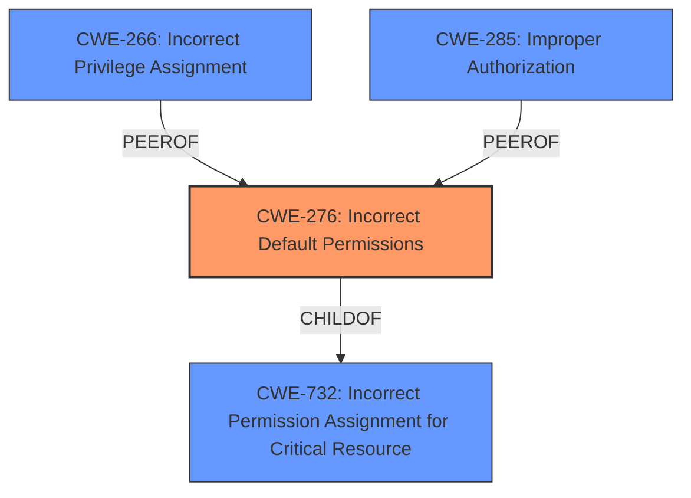

# Analysis for CVE-2025-29984

# Summary
| CWE ID | CWE Name | Confidence | CWE Abstraction Level | CWE Vulnerability Mapping Label | CWE-Vulnerability Mapping Notes |
|---|---|---|---|---|---|
| CWE-276 | Incorrect Default Permissions | 1.0 | Base | Allowed | Primary CWE: This CWE directly matches the **root cause** described in the vulnerability. |
| CWE-266 | Incorrect Privilege Assignment | 0.7 | Base | Allowed | Secondary Candidate: Considered due to similarity in concepts, but CWE-276 is a better fit for default permissions. |
| CWE-732 | Incorrect Permission Assignment for Critical Resource | 0.6 | Class | Allowed-with-Review | Secondary Candidate: Considered due to dealing with permission assignments but is too broad for this specific case of *default* permissions. |
| CWE-285 | Improper Authorization | 0.5 | Class | Discouraged | Secondary Candidate: Considered because it involves authorization, but the core issue is with default permissions, not flawed authorization logic. |

## Evidence and Confidence

*   **Confidence Score:** 1.0
*   **Evidence Strength:** HIGH

## Relationship Analysis
The primary relationship influencing the decision is the direct match of the vulnerability description to CWE-276. While CWE-732 is a parent that deals with permission assignment, CWE-276 is more specific regarding *default* permissions. Other related CWEs like CWE-266 and CWE-285 were considered but deemed less relevant as they focus on privilege assignment and authorization checks, respectively, rather than the initial default setting of permissions.

## Vulnerability Chain
The vulnerability chain starts with **incorrect default permissions** (CWE-276) leading to a low-privileged attacker gaining local access and ultimately achieving elevation of privileges.
  - CWE-276: Incorrect Default Permissions (**Root Cause**)
  - Impact: Elevation of Privileges

## Summary of Analysis
The initial analysis focused on identifying the **root cause** of the vulnerability. The description clearly states "**Incorrect Default Permissions**" as the **root cause**, which directly corresponds to CWE-276. The analysis considered related CWEs like CWE-732, CWE-266, and CWE-285, but these were ultimately deemed less specific or relevant. The graph relationships highlighted that CWE-276 is a child of CWE-732, providing a more granular classification. The final selection is based on the explicit evidence in the vulnerability description and the mapping guidance favoring specific CWEs. The confidence level is high (1.0) due to the clear match between the **root cause** and the selected CWE.

Relevant CWE Information:

# Enhanced Context (25 CWEs)

## CWE-276: Incorrect Default Permissions
**Abstraction Level**: Base

**Description**:
During installation, installed file permissions are set to allow anyone to modify those files.

**Mapping Guidance**:
- Usage: Allowed
- Rationale: This CWE entry is at the Base level of abstraction, which is a preferred level of abstraction for mapping to the root causes of vulnerabilities.

### Detailed Analysis of Selected CWEs:

*   **CWE-276: Incorrect Default Permissions**
    *   **Technical Explanation:** The vulnerability lies in the **incorrect** initial settings of permissions for files or resources within the Dell Trusted Device. This allows unintended access or modification by low-privileged users.
    *   **Security Implications:** Low-privileged users can exploit this by modifying critical files or resources, leading to elevation of privileges.
    *   **Relationship Analysis:** This is a Base-level CWE, which aligns with the desire for specificity. It's a child of CWE-732, but more specific.
    *   **Mapping Guidance:** The guidance explicitly allows this mapping, as it represents the **root cause** at a preferred level of abstraction.
    *   **Evidence:** The vulnerability description states "**Incorrect Default Permissions**" directly.
    *   **Confidence:** 1.0
*   **CWE-266: Incorrect Privilege Assignment**
    *   **Technical Explanation:** This CWE involves assigning the wrong privileges to an actor, leading to an unintended sphere of control.
    *   **Security Implications:** Could lead to unauthorized access or modification of resources.
    *   **Relationship Analysis:** While related to permissions, it's focused on the assignment of *privileges*, not the default setting of *permissions*.
    *   **Mapping Guidance:** Allowed, but less relevant than CWE-276 in this case.
    *   **Evidence:** The description mentions "elevation of privileges," which could be a result, but the **root cause** is the default permissions.
    *   **Confidence:** 0.7
*   **CWE-732: Incorrect Permission Assignment for Critical Resource**
    *   **Technical Explanation:** This CWE is about specifying permissions for critical resources in a way that allows unintended access.
    *   **Security Implications:** Unauthorized read or modification of critical resources.
    *   **Relationship Analysis:** This is a Class-level CWE and a parent of CWE-276. While relevant, it's less specific than CWE-276.
    *   **Mapping Guidance:** Allowed-with-Review, suggesting that more specific CWEs might be more appropriate.
    *   **Evidence:** The description mentions "incorrect permissions," but the key aspect is that these are *default* permissions.
    *   **Confidence:** 0.6
*   **CWE-285: Improper Authorization**
    *   **Technical Explanation:** This CWE involves performing an authorization check incorrectly.
    *   **Security Implications:** Unauthorized access to resources or actions.
    *   **Relationship Analysis:** This focuses on authorization checks, which aren't the primary issue here. The problem is with the initial permission settings, not how they are enforced.
    *   **Mapping Guidance:** Discouraged, as lower-level CWEs are preferred.
    *   **Evidence:** While the elevation of privileges may involve authorization, the **root cause** is the default permissions.
    *   **Confidence:** 0.5

### CWEs Considered but Not Used:

*   CWE-269: Improper Privilege Management - This is too broad and more suited to situations where privileges are not correctly managed throughout the application lifecycle, not the initial permission setup. It is also discouraged.
*   CWE-280: Improper Handling of Insufficient Permissions or Privileges - This CWE focuses on the handling of situations where permissions are insufficient, which is not the core issue here.
*   CWE-863: Incorrect Authorization - This is about flawed authorization checks, but the problem is with default settings, not faulty logic during access control.
*   CWE-306: Missing Authentication for Critical Function - Authentication is not the **root cause** here, it is about default permissions.

The selected CWEs are at the optimal level of specificity because they directly address the **root cause** described in the vulnerability. CWE-276 accurately captures the essence of **incorrect default permissions**, while the other considered CWEs are either too broad or focus on related but distinct concepts like privilege assignment or authorization checks.