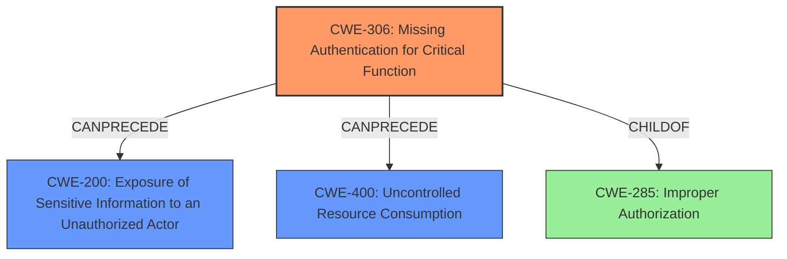

# Analysis Report for CVE-2025-30117

# Vulnerability Analysis Report: CVE-2025-30117

## Description

An issue was discovered on the Forvia Hella HELLA Driving Recorder DR 820. Managing Settings and Obtaining Sensitive Data and Sabotaging the Car Battery can be performed by unauthorized parties. After bypassing the device pairing, an attacker can obtain sensitive user and vehicle information through the settings interface. Remote attackers can modify power management settings, disable recording, delete stored footage, and turn off battery protection, leading to potential denial-of-service conditions and vehicle battery drainage.

## Vulnerability Description Key Phrases

- **Impact:** ['denial-of-service conditions', 'Sabotaging the Car Battery', 'Obtain Sensitive Data', 'Manage Settings']
- **Vector:** After bypassing the device pairing
- **Attacker:** unauthorized parties
- **Product:** Forvia Hella HELLA Driving Recorder DR 820

## Analysis (with Relationship Data)

# Summary
| CWE ID | CWE Name | Confidence | CWE Abstraction Level | CWE Vulnerability Mapping Label | CWE-Vulnerability Mapping Notes |
|---|---|---|---|---|---|
| CWE-306 | Missing Authentication for Critical Function | 0.9 | Base | Allowed | Primary CWE. The product does not perform any authentication for functionality that requires a provable user identity or consumes a significant amount of resources. |
| CWE-200 | Exposure of Sensitive Information to an Unauthorized Actor | 0.7 | Class | Discouraged | Secondary CWE. Sensitive user and vehicle information is exposed after bypassing device pairing. |
| CWE-400 | Uncontrolled Resource Consumption | 0.6 | Base | Allowed | Secondary CWE. An attacker can turn off battery protection, causing the dashcam to drain the vehicle’s battery when parked overnight, leading to a denial of service. |

## Evidence and Confidence

*   **Confidence Score:** 0.8
*   **Evidence Strength:** MEDIUM

## Relationship Analysis
The primary weakness is the **lack of authentication** (CWE-306) for critical functions, which allows an attacker to **bypass device pairing**. This **leads to the exposure of sensitive information** (CWE-200) and the **ability to modify power management settings**, potentially leading to **uncontrolled resource consumption** (CWE-400) by draining the car battery.



## Vulnerability Chain
1.  **Root Cause:** **Missing authentication** (CWE-306) for critical functions.
2.  **Exploitation:** **Bypassing device pairing** due to the missing authentication.
3.  **Impact 1:** **Exposure of sensitive user and vehicle information** (CWE-200).
4.  **Impact 2:** **Modification of power management settings** leading to **uncontrolled resource consumption** (CWE-400), such as draining the car battery.

## Summary of Analysis
The primary weakness is the **lack of authentication** (CWE-306) for critical functions. This **allows unauthorized access** to sensitive data and critical settings, leading to potential denial-of-service conditions and other malicious activities.

The evidence includes: "After **bypassing the device pairing**, an attacker can obtain sensitive user and vehicle information through the settings interface" and "Remote attackers can modify power management settings, disable recording, delete stored footage, and turn off battery protection, leading to potential denial-of-service conditions and vehicle battery drainage."

CWE-306 is selected because it accurately reflects the **root cause** of the vulnerability: the **absence of authentication** for critical functions. CWE-200 is included because the **lack of authentication leads directly to the exposure of sensitive information**. CWE-400 is included because attackers can modify power management settings to cause **uncontrolled resource consumption** (battery drain).

The hierarchical relationship analysis shows that CWE-306 is a child of CWE-285 (**Improper Authorization**), but CWE-306 is more specific and therefore more appropriate.

I considered CWE-285 (**Improper Authorization**) and CWE-862 (**Missing Authorization**), but CWE-306 (**Missing Authentication for Critical Function**) is a better fit because it specifically addresses the **lack of authentication** for functions that require it. CWE-425 (**Direct Request ('Forced Browsing')**) was considered, but the vulnerability is not just about accessing URLs without authorization; it's about a broader **lack of authentication** for critical functions, making CWE-306 a more accurate primary classification.


## CWE Relationship Analysis

Current CWEs represent these abstraction levels: .


### Vulnerability Chain Analysis

**Chain starting from CWE-400:**
- 400 (Uncontrolled Resource Consumption) - ROOT


**Chain starting from CWE-862:**
- 862 (Missing Authorization) - ROOT


### CWE Relationship Diagram

```mermaid
graph TD
    classDef primary fill:#f96,stroke:#333,stroke-width:2px
    classDef secondary fill:#69f,stroke:#333
    classDef tertiary fill:#9e9,stroke:#333
```


*Report generated on 2025-07-14 17:02:50*
