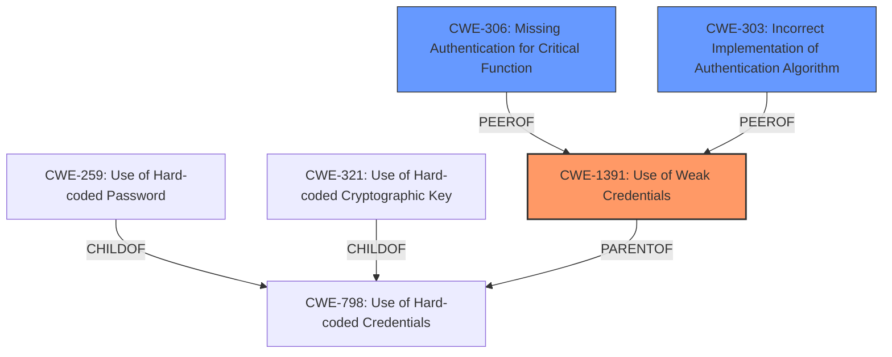

# Enhanced Analysis for CVE-2025-30118

# Summary
| CWE ID  | CWE Name                                                      | Confidence | CWE Abstraction Level | CWE Vulnerability Mapping Label | CWE-Vulnerability Mapping Notes |
| :-------- | :------------------------------------------------------------ | :--------- | :-------------------- | :------------------------------ | :------------------------------ |
| CWE-1391 | Use of Weak Credentials                                       | 0.9        | Class                 | Allowed-with-Review           | Primary CWE                     |
| CWE-306 | Missing Authentication for Critical Function                  | 0.7        | Base                  | Allowed                         | Secondary Candidate             |
| CWE-303 | Incorrect Implementation of Authentication Algorithm        | 0.6        | Base                  | Allowed                         | Secondary Candidate             |

## Evidence and Confidence

*   **Confidence Score:** 0.8
*   **Evidence Strength:** MEDIUM

## Relationship Analysis
The primary relationship influencing the CWE selection is the parent-child relationship, particularly considering the abstraction level. CWE-1391 (Use of Weak Credentials) is chosen as the primary CWE because it directly addresses the **root cause** mentioned in the vulnerability description which states that the device "uses the same default credentials for all devices". While more specific CWEs like CWE-259 (Use of Hard-coded Password) exist as children of CWE-798 (Use of Hard-coded Credentials), and CWE-321 (Use of Hard-coded Cryptographic Key) I don't have enough evidence to narrow it down that far. It could be a password, key, or another type of credential.



## Vulnerability Chain
The vulnerability chain starts with the **use of weak credentials** (CWE-1391) and the **lack of proper multi-device authentication**. This allows attackers to occupy the only available connection, leading to a denial of service (DoS) condition.
  - **Root Cause**: CWE-1391 - Use of Weak Credentials, **does not implement proper multi-device authentication**
  - **Impact**: Denial of service

## Summary of Analysis
The analysis is heavily based on the provided vulnerability description, especially the key phrases identifying the **root cause** as the **use of the same default credentials for all devices** and the **lack of proper multi-device authentication**.

CWE-1391 (Use of Weak Credentials) is the most appropriate primary CWE because it directly addresses the identified **root cause**. The description also mentions that the device "does not implement proper multi-device authentication," suggesting potential issues with authentication mechanisms, leading to the consideration of CWE-306 (Missing Authentication for Critical Function).

CWE-306 is considered as a secondary candidate because it relates to the **lack of authentication** for critical functions, which aligns with the vulnerability description mentioning the **lack of proper multi-device authentication**. Also CWE-303 is considered because it relates to the fact that the authentication might have been **incorrectly implemented**.

The selected CWEs are at the optimal level of specificity as they directly represent the weakness described in the vulnerability report.

Relevant CWE Information:

# Enhanced Context (25 CWEs)

## CWE-1391: Use of Weak Credentials
**Abstraction Level**: Class
**Similarity Score**: 0.78
**Source**: dense

**Description**:
The product uses weak credentials (such as a default key or hard-coded password) that can be calculated, derived, reused, or guessed by an attacker.

**Mapping Guidance**:
- Usage: Allowed-with-Review
- Rationale: This CWE entry is a Class and might have Base-level children that would be more appropriate

**Technical Explanation**: CWE-1391 applies because the Audi Universal Traffic Recorder uses the same default credentials for all devices. This makes it easier for attackers to **gain unauthorized access** by exploiting these well-known credentials. The use of default credentials is a common weakness, especially in IoT devices, as users often fail to change them, leaving the devices vulnerable to attack.
**Security Implications**: Attackers can exploit weak credentials to **gain unauthorized access**, leading to **denial of service** by occupying the only available connection.
**Relationship Analysis**: While it is a class, the vulnerability description doesn't give me enough information to use a child CWE.
**Mapping Guidance Influence**: The mapping guidance indicates that it is "Allowed-with-Review" since it is a Class.

## CWE-306: Missing Authentication for Critical Function
**Abstraction Level**: Base
**Similarity Score**: 1193.21
**Source**: sparse

**Description**:
The product does not perform any authentication for functionality that requires a provable user identity or consumes a significant amount of resources.

**Mapping Guidance**:
- Usage: Allowed
- Rationale: This CWE entry is at the Base level of abstraction, which is a preferred level of abstraction for mapping to the root causes of vulnerabilities.

**Technical Explanation**: CWE-306 applies because the Audi Universal Traffic Recorder **does not implement proper multi-device authentication**. This means that after one device authenticates, another device can take over the connection without proving its identity.
**Security Implications**: This can lead to **denial of service** as attackers can occupy the only available connection, preventing legitimate users from accessing the device.
**Relationship Analysis**: This CWE is a base level CWE which makes it more specific than using a class CWE like CWE-287 (Improper Authentication).
**Mapping Guidance Influence**: The mapping guidance indicates that it is "Allowed" since it is a Base.

## CWE-303: Incorrect Implementation of Authentication Algorithm
**Abstraction Level**: Base
**Similarity Score**: 0.76
**Source**: dense

**Description**:
The requirements for the product dictate the use of an established authentication algorithm, but the implementation of the algorithm is incorrect.

**Mapping Guidance**:
- Usage: Allowed
- Rationale: This CWE entry is at the Base level of abstraction, which is a preferred level of abstraction for mapping to the root causes of vulnerabilities.

**Technical Explanation**: CWE-303 applies because the Audi Universal Traffic Recorder **does not implement proper multi-device authentication** it might be related to an algorithm that was incorrectly implemented.
**Security Implications**: This can lead to **denial of service** as attackers can occupy the only available connection, preventing legitimate users from accessing the device.
**Relationship Analysis**: This CWE is a base level CWE which makes it more specific than using a class CWE like CWE-287 (Improper Authentication).
**Mapping Guidance Influence**: The mapping guidance indicates that it is "Allowed" since it is a Base.

## Not Used

*   CWE-259 (Use of Hard-coded Password) and CWE-321 (Use of Hard-coded Cryptographic Key) were considered, but there was not enough information to determine the type of credential being used.
*   CWE-863 (Incorrect Authorization) was considered but not selected because the issue seems to be related to **authentication** rather than authorization.
*   CWE-1390 (Weak Authentication) was considered but not selected because there was a better fit with the Class CWE-1391 (Use of Weak Credentials).
*   CWE-306 (Missing Authentication for Critical Function) was considered but marked as secondary since the main issue is the **use of weak credentials**, not a complete **lack of authentication**.


## CWE Relationship Analysis

Current CWEs represent these abstraction levels: .


### Vulnerability Chain Analysis

**Chain starting from CWE-1390:**
- 1390 (Weak Authentication) - ROOT


**Chain starting from CWE-321:**
- 321 (Use of Hard-coded Cryptographic Key) - ROOT


### CWE Relationship Diagram

```mermaid
graph TD
    classDef primary fill:#f96,stroke:#333,stroke-width:2px
    classDef secondary fill:#69f,stroke:#333
    classDef tertiary fill:#9e9,stroke:#333
```