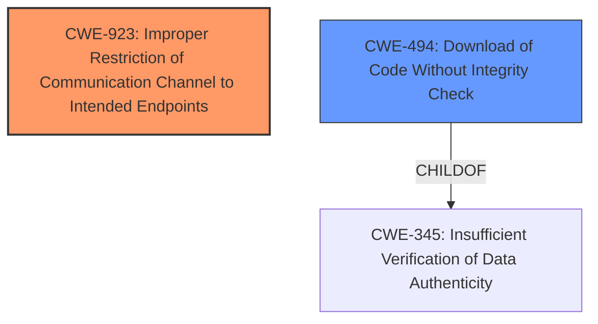

# Analysis for CVE-2025-30132

# Summary
| CWE ID | CWE Name | Confidence | CWE Abstraction Level | CWE Vulnerability Mapping Label | CWE-Vulnerability Mapping Notes |
|---|---|---|---|---|---|
| CWE-923 | Improper Restriction of Communication Channel to Intended Endpoints | 0.9 | Class | Allowed-with-Review | Primary CWE |
| CWE-494 | Download of Code Without Integrity Check | 0.6 | Base | Allowed | Secondary Candidate |

## Evidence and Confidence

*   **Confidence Score:** 0.8
*   **Evidence Strength:** HIGH

## Relationship Analysis
The primary relationship that influenced the decision was the hierarchical structure. While CWE-923 is a Class, the available information does not point to a more specific Base or Variant CWE that would be a better fit. The secondary CWE, CWE-494, is a base class and related to CWE-345, which is a child of CWE-494.

## Vulnerability Chain
The vulnerability chain starts with the **rootcause** of using an **unregistered public domain name as internal domain**. This leads to the potential for an attacker to register the domain and intercept traffic (CWE-923). A possible result of this interception is the download of malicious code without integrity check (CWE-494), ultimately leading to data exfiltration or man-in-the-middle attacks.

## Summary of Analysis
The initial analysis focused on identifying the root cause of the vulnerability. The description clearly states that the vulnerability stems from using an **unregistered public domain name as an internal domain**. This allows an attacker to potentially register the domain and intercept traffic intended for the device.

The selection of CWE-923 is based on the fact that the dashcam fails to properly restrict the communication channel to intended endpoints. The vulnerability description states that the dashcam or related services might resolve the domain over the public internet instead of locally, indicating a failure to properly ensure communication with the correct endpoint. The impact described, data exfiltration or man-in-the-middle attacks, aligns with the potential consequences of this weakness.

CWE-494 was considered as a secondary CWE because the attacker could potentially use the compromised communication channel to deliver malicious code.

The evidence supporting this assessment is:
*   "**unregistered public domain name as internal domain**"
*   "allowing an attacker to register it and potentially intercept sensitive device traffic"
*   "If the dashcam or related services attempt to resolve this domain over the public Internet instead of locally, it could lead to data exfiltration or man-in-the-middle attacks."

The final selected CWEs are at the optimal level of specificity based on the available information.

Relevant CWE Information:

# Enhanced Context (25 CWEs)
The following CWEs were identified as potentially relevant to this vulnerability:

## CWE-1391: Use of Weak Credentials
**Abstraction Level**: Class
**Similarity Score**: 0.71
**Source**: dense

**Description**:
The product uses weak credentials (such as a default key or hard-coded password) that can be calculated, derived, reused, or guessed by an attacker.

**Mapping Guidance**:
- Usage: Allowed-with-Review
- Rationale: This CWE entry is a Class and might have Base-level children that would be more appropriate

## CWE-345: Insufficient Verification of Data Authenticity
**Abstraction Level**: Class
**Similarity Score**: 0.71
**Source**: dense

**Description**:
The product does not sufficiently verify the origin or authenticity of data, in a way that causes it to accept invalid data.

**Mapping Guidance**:
- Usage: Discouraged
- Rationale: This CWE entry is a level-1 Class (i.e., a child of a Pillar). It might have lower-level children that would be more appropriate

## CWE-923: Improper Restriction of Communication Channel to Intended Endpoints
**Abstraction Level**: Class
**Similarity Score**: 0.71
**Source**: dense

**Description**:
The product establishes a communication channel to (or from) an endpoint for privileged or protected operations, but it does not properly ensure that it is communicating with the correct endpoint.

**Mapping Guidance**:
- Usage: Allowed-with-Review
- Rationale: This CWE entry is a Class and might have Base-level children that would be more appropriate

**Technical Explanation**: CWE-923 (Improper Restriction of Communication Channel to Intended Endpoints) describes a weakness where a product doesn't properly ensure that it's communicating with the correct endpoint for privileged operations. This aligns with the vulnerability in IROAD dashcams where using an unregistered public domain name as an internal domain allows attackers to potentially intercept sensitive device traffic. The dashcam fails to restrict the communication channel to its intended, secure internal endpoint.

**Security Implications**: The security implications include man-in-the-middle attacks and data exfiltration, as the attacker can intercept and potentially modify or steal sensitive data transmitted through the compromised communication channel.

**Relationship Analysis**: While CWE-923 is a Class, it directly reflects the **rootcause** of the issue. There isn't sufficient evidence to pinpoint a more specific Base or Variant CWE.

**Mapping Guidance**: The "Allowed-with-Review" usage is appropriate, as it's a Class-level CWE.

## CWE-203: Observable Discrepancy
**Abstraction Level**: Base
**Similarity Score**: 0.71
**Source**: dense

**Description**:
The product behaves differently or sends different responses under different circumstances in a way that is observable to an unauthorized actor, which exposes security-relevant information about the state of the product, such as whether a particular operation was successful or not.

**Mapping Guidance**:
- Usage: Allowed
- Rationale: This CWE entry is at the Base level of abstraction, which is a preferred level of abstraction for mapping to the root causes of vulnerabilities.

## CWE-497: Exposure of Sensitive System Information to an Unauthorized Control Sphere
**Abstraction Level**: Base
**Similarity Score**: 0.71
**Source**: dense

**Description**:
The product does not properly prevent sensitive system-level information from being accessed by unauthorized actors who do not have the same level of access to the underlying system as the product does.

**Mapping Guidance**:
- Usage: Allowed
- Rationale: This CWE entry is at the Base level of abstraction, which is a preferred level of abstraction for mapping to the root causes of vulnerabilities.

## CWE-425: Direct Request ('Forced Browsing')
**Abstraction Level**: Base
**Similarity Score**: 0.71
**Source**: dense

**Description**:
The web application does not adequately enforce appropriate authorization on all restricted URLs, scripts, or files.

**Mapping Guidance**:
- Usage: Allowed
- Rationale: This CWE entry is at the Base level of abstraction, which is a preferred level of abstraction for mapping to the root causes of vulnerabilities.

## CWE-319: Cleartext Transmission of Sensitive Information
**Abstraction Level**: Base
**Similarity Score**: 0.71
**Source**: dense

**Description**:
The product transmits sensitive or security-critical data in cleartext in a communication channel that can be sniffed by unauthorized actors.

**Mapping Guidance**:
- Usage: Allowed
- Rationale: This CWE entry is at the Base level of abstraction, which is a preferred level of abstraction for mapping to the root causes of vulnerabilities.

## CWE-330: Use of Insufficiently Random Values
**Abstraction Level**: Class
**Similarity Score**: 0.70
**Source**: dense

**Description**:
The product uses insufficiently random numbers or values in a security context that depends on unpredictable numbers.

**Mapping Guidance**:
- Usage: Discouraged
- Rationale: This CWE entry is a level-1 Class (i.e., a child of a Pillar). It might have lower-level children that would be more appropriate

## CWE-755: Improper Handling of Exceptional Conditions
**Abstraction Level**: Class
**Similarity Score**: 0.70
**Source**: dense

**Description**:
The product does not handle or incorrectly handles an exceptional condition.

**Mapping Guidance**:
- Usage: Discouraged
- Rationale: This CWE entry is a level-1 Class (i.e., a child of a Pillar). It might have lower-level children that would be more appropriate

## CWE-116: Improper Encoding or Escaping of Output
**Abstraction Level**: Class
**Similarity Score**: 0.69
**Source**: dense

**Description**:
The product prepares a structured message for communication with another component, but encoding or escaping of the data is either missing or done