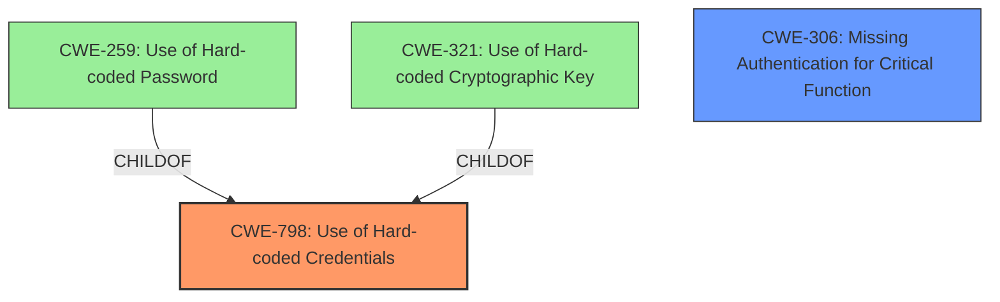

# Analysis for CVE-2025-30137

# Summary
| CWE ID | CWE Name | Confidence | CWE Abstraction Level | CWE Vulnerability Mapping Label | CWE-Vulnerability Mapping Notes |
|---|---|---|---|---|---|
| CWE-798 | Use of Hard-coded Credentials | 1.0 | Base | Primary | Allowed |
| CWE-306 | Missing Authentication for Critical Function | 0.7 | Base | Secondary | Allowed |

## Evidence and Confidence

*   **Confidence Score:** 0.9
*   **Evidence Strength:** HIGH

## Relationship Analysis
The primary relationship that influenced the CWE selection was the parent-child relationship between CWE-798 and its variants like CWE-259 (Use of Hard-coded Password) and CWE-321 (Use of Hard-coded Cryptographic Key). While the vulnerability description specifies hardcoded credentials, it doesn't explicitly state whether these are passwords or cryptographic keys. Therefore, the base CWE-798 is the most appropriate choice. The secondary CWE-306 was considered because the hardcoded credentials effectively bypass authentication, but since the core issue is the presence of the hardcoded credentials themselves, it is secondary.

## Vulnerability Chain
The vulnerability chain starts with the **hardcoded credentials** (CWE-798), leading to **missing authentication** (CWE-306), and ultimately resulting in unauthorized access to the dashcam's API endpoints.
  - Root Cause: CWE-798 Use of Hard-coded Credentials
  - Weakness: CWE-306 Missing Authentication for Critical Function
  - Impact: Unauthorized access to dashcam API endpoints

## Summary of Analysis
The initial analysis focused on identifying the root cause and subsequent impacts of the vulnerability. The presence of **hardcoded credentials** is explicitly stated in the vulnerability description and confirmed by the "Vulnerability Description Key Phrases" section. The "CVE Reference Links Content Summary" further reinforces this finding. The graph relationships helped clarify the hierarchical relationships between CWE-798 and its child CWEs, influencing the choice of the base CWE as the most appropriate.

The decision to select CWE-798 as the primary CWE is strongly supported by the evidence. The vulnerability description clearly states the existence of **hardcoded credentials**, and this aligns perfectly with the definition of CWE-798. The abstraction level (Base) is also appropriate, as it represents the core weakness without being overly specific about the type of credential. The choice of CWE-798 is at the optimal level of specificity because the description does not contain enough information to determine if the credential is a password (CWE-259) or cryptographic key (CWE-321).

Relevant CWE Information:

# Enhanced Context (25 CWEs)
The following CWEs were identified as potentially relevant to this vulnerability:

## CWE-798: Use of Hard-coded Credentials
**Abstraction Level**: Base
**Similarity Score**: 0.78
**Source**: dense

**Description**:
The product contains hard-coded credentials, such as a password or cryptographic key.

**Mapping Guidance**:
- Usage: Allowed
- Rationale: This CWE entry is at the Base level of abstraction, which is a preferred level of abstraction for mapping to the root causes of vulnerabilities.

## CWE-306: Missing Authentication for Critical Function
**Abstraction Level**: base
**Similarity Score**: 2.47
**Source**: graph

**Description**:
CWE-306: Missing Authentication for Critical Function

**Mapping Guidance**:
- Usage: Allowed
- Rationale: This CWE entry is at the Base level of abstraction, which is a preferred level of abstraction for mapping to the root causes of vulnerabilities.