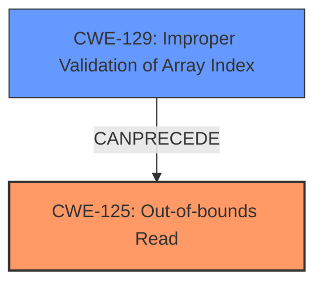

# Analysis Report for CVE-2025-3015

# Vulnerability Analysis Report: CVE-2025-3015

## Description

A vulnerability classified as critical has been found in Open Asset Import Library Assimp 5.4.3. This affects the function AssimpASEImporterBuildUniqueRepresentation of the file code/AssetLib/ASE/ASELoader.cpp of the component ASE File Handler. The manipulation of the argument mIndices leads to **out-of-bounds read**. It is possible to initiate the attack remotely. The exploit has been disclosed to the public and may be used. Upgrading to version 6.0 is able to address this issue. The patch is named 7c705fde418d68cca4e8eff56be01b2617b0d6fe. It is recommended to apply a patch to fix this issue.

## Vulnerability Description Key Phrases

- **Weakness:** out-of-bounds read
- **Product:** Open Asset Import Library Assimp
- **Version:** 5.4.3
- **Component:** ASE File Handler

## Analysis (with Relationship Data)

# Summary

| CWE ID  | CWE Name                                                                 | Confidence | CWE Abstraction Level | CWE Vulnerability Mapping Label | CWE-Vulnerability Mapping Notes |
| :-------- | :----------------------------------------------------------------------- | :--------- | :---------------------- | :------------------------------ | :------------------------------ |
| CWE-125   | Out-of-bounds Read                                                     | 1          | Base                    | Primary                         | Allowed                         |
| CWE-129   | Improper Validation of Array Index                                     | 0.7        | Variant                 | Secondary                       | Allowed                         |

## Evidence and Confidence

*   **Confidence Score:** 0.85
*   **Evidence Strength:** HIGH

## Relationship Analysis

The primary CWE is CWE-125 (Out-of-bounds Read), which directly reflects the vulnerability description. CWE-129 (Improper Validation of Array Index) is a contributing factor, as the lack of validation leads to the out-of-bounds read. The relationship is such that CWE-129 can precede CWE-125, as improper validation can lead to an out-of-bounds read. CWE-125 is a base level weakness, and CWE-129 is a variant.



## Vulnerability Chain

The vulnerability chain starts with the **lack of boundary validation** of the array index (`mIndices`). This **improper validation** (CWE-129) then directly leads to an **out-of-bounds read** (CWE-125) when accessing `mesh.mPositions` with an invalid index. The impact is potential remote code execution.

## Summary of Analysis

The initial analysis strongly points to CWE-125 (Out-of-bounds Read) as the primary weakness, supported by the vulnerability description's key phrase "**out-of-bounds read**" and the CVE Reference Links Content Summary which states "Weaknesses/vulnerabilities present: Out-of-bounds read (CWE-125)." The detailed analysis also suggests that CWE-129 (Improper Validation of Array Index) plays a role, as the **lack of validation** for the array index is the root cause that leads to the out-of-bounds read.

The relationship graph shows the connection between CWE-129 and CWE-125, where the improper validation precedes the out-of-bounds read. This confirms that CWE-129 is a contributing factor.

The selected CWEs are at the optimal level of specificity, with CWE-125 being a base weakness and CWE-129 being a variant. This provides a detailed understanding of the vulnerability.

Relevant CWE Information:
- Vulnerability Description: "The manipulation of the argument mIndices leads to **out-of-bounds read**."
- CVE Reference Links Content Summary: "Specifically, there is no boundary validation for the `(*i).mIndices[n]` value in `code/AssetLib/ASE/ASELoader.cpp:734`, which causes an out-of-bounds read in `mesh.mPositions`."

CWEs Considered but Not Used:

*   CWE-79, CWE-89, CWE-190, CWE-704, CWE-1241, CWE-93, CWE-362, CWE-128: These CWEs were considered because they appeared in the Retriever Results, but they do not accurately represent the specific vulnerability described. They relate to different types of weaknesses (e.g., cross-site scripting, SQL injection, integer overflow) that are not present in this case.


## CWE Relationship Analysis

Current CWEs represent these abstraction levels: .


### Vulnerability Chain Analysis

**Chain starting from CWE-89:**
- 89 (Improper Neutralization of Special Elements used in an SQL Command ('SQL Injection')) - ROOT


**Chain starting from CWE-93:**
- 93 (Improper Neutralization of CRLF Sequences ('CRLF Injection')) - ROOT


### CWE Relationship Diagram

```mermaid
graph TD
    classDef primary fill:#f96,stroke:#333,stroke-width:2px
    classDef secondary fill:#69f,stroke:#333
    classDef tertiary fill:#9e9,stroke:#333
```


*Report generated on 2025-07-14 17:06:18*
