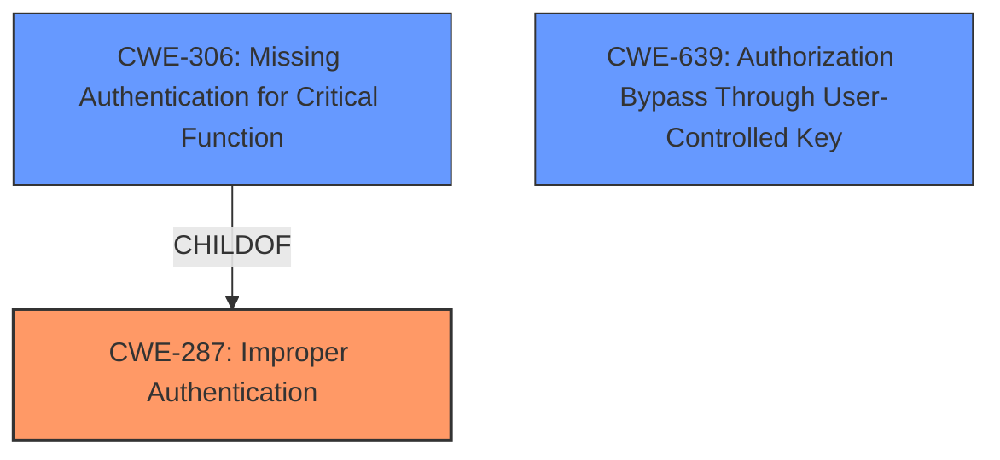

# Analysis Report for CVE-2025-30168

# Vulnerability Analysis Report: CVE-2025-30168

## Description

Parse Server is an open source backend that can be deployed to any infrastructure that can run Node.js. Prior to 7.5.2 and 8.0.2, the 3rd party authentication handling of Parse Server allows the authentication credentials of some specific authentication providers to be used across multiple Parse Server apps. For example, if a user signed up using the same authentication provider in two unrelated Parse Server apps, the credentials stored by one app can be used to authenticate the same user in the other app. Note that this only affects Parse Server apps that specifically use an affected 3rd party authentication provider for user authentication, for example by setting the Parse Server option auth to configure a Parse Server authentication adapter. The fix of this vulnerability requires to upgrade Parse Server to a version that includes the bug fix, as well as upgrade the client app to send a secure payload, which is different from the previous insecure payload. This vulnerability is fixed in 7.5.2 and 8.0.2.

## Vulnerability Description Key Phrases

- **Impact:** authentication credentials of some specific authentication providers can be used across multiple Parse Server apps
- **Product:** Parse Server
- **Version:** Prior to 7.5.2 and 8.0.2
- **Component:** 3rd party authentication handling

## Analysis (with Relationship Data)

# Summary
| CWE ID  | CWE Name                                                       | Confidence | CWE Abstraction Level | CWE Vulnerability Mapping Label | CWE-Vulnerability Mapping Notes |
| :-------- | :------------------------------------------------------------- | :--------- | :-------------------- | :------------------------------ | :------------------------------ |
| CWE-287   | Improper Authentication                                        | 0.9        | Class                 |                               | Discouraged                   |
| CWE-639   | Authorization Bypass Through User-Controlled Key               | 0.6        | Base                  |                               | Allowed                       |
| CWE-306   | Missing Authentication for Critical Function                  | 0.5        | Base                  |                               | Allowed                       |

- The Primary CWE is CWE-287: Improper Authentication
- The secondary candidate CWEs are CWE-639: Authorization Bypass Through User-Controlled Key and CWE-306: Missing Authentication for Critical Function

## Evidence and Confidence

*   **Confidence Score:** 0.7
*   **Evidence Strength:** HIGH

## Relationship Analysis
The primary relationship influencing the selection is the parent-child relationship between CWE-287 and CWE-306. CWE-306 is a child of CWE-287. The analysis leans towards the more general CWE-287 because the vulnerability involves a general failure to properly authenticate users across different Parse Server apps when using specific 3rd party authentication providers. CWE-639 is considered as a potential alternative due to the possibility of user-controlled keys being manipulated to bypass authorization.



## Vulnerability Chain
The vulnerability chain starts with the **improper authentication** handling in Parse Server, leading to the potential use of authentication credentials across multiple apps, and ultimately resulting in unauthorized access to user data.
  - The chain of root cause and weaknesses that followed for the Vulnerability Description is:
  - **Improper Authentication** (CWE-287) -> Use of authentication credentials across multiple apps -> Unauthorized access to user data

## Summary of Analysis
The initial assessment considered CWE-287 as the primary weakness due to the **improper authentication** handling in Parse Server. The evidence from the CVE Reference Links Content Summary explicitly mentions that the vulnerability lies in the authentication handling of Parse Server, allowing credentials to be used across apps. This aligns with the description of CWE-287, which involves a failure to properly prove a user's claimed identity. The selection is further justified by the vulnerability description key phrases, which highlight the impact on authentication credentials.

The retriever results also support this selection, with CWE-287 being listed as a potentially relevant CWE. However, its Usage is "Discouraged" indicating lower-level CWE entries might be applicable.
CWE-639 Authorization Bypass Through User-Controlled Key, was considered because the vulnerability might allow the attacker to modify a key value identifying the data.

The final decision is to use CWE-287 as the primary CWE because it directly addresses the root cause of the vulnerability, which is the **improper authentication** handling that allows credentials to be used across multiple apps.

Relevant CWE Information:

# Enhanced Context (25 CWEs)
The following CWEs were identified as potentially relevant to this vulnerability:

## CWE-212: Improper Removal of Sensitive Information Before Storage or Transfer
**Abstraction Level**: Base
**Similarity Score**: 0.75
**Source**: dense

**Description**:
The product stores, transfers, or shares a resource that contains sensitive information, but it does not properly remove that information before the product makes the resource available to unauthorized actors.

**Mapping Guidance**:
- Usage: Allowed
- Rationale: This CWE entry is at the Base level of abstraction, which is a preferred level of abstraction for mapping to the root causes of vulnerabilities.


## CWE-345: Insufficient Verification of Data Authenticity
**Abstraction Level**: Class
**Similarity Score**: 0.74
**Source**: dense

**Description**:
The product does not sufficiently verify the origin or authenticity of data, in a way that causes it to accept invalid data.

**Mapping Guidance**:
- Usage: Discouraged
- Rationale: This CWE entry is a level-1 Class (i.e., a child of a Pillar). It might have lower-level children that would be more appropriate


## CWE-1390: Weak Authentication
**Abstraction Level**: Class
**Similarity Score**: 0.74
**Source**: dense

**Description**:
The product uses an authentication mechanism to restrict access to specific users or identities, but the mechanism does not sufficiently prove that the claimed identity is correct.

**Mapping Guidance**:
- Usage: Allowed-with-Review
- Rationale: This CWE entry is a Class and might have Base-level children that would be more appropriate


## CWE-303: Incorrect Implementation of Authentication Algorithm
**Abstraction Level**: Base
**Similarity Score**: 0.74
**Source**: dense

**Description**:
The requirements for the product dictate the use of an established authentication algorithm, but the implementation of the algorithm is incorrect.

**Mapping Guidance**:
- Usage: Allowed
- Rationale: This CWE entry is at the Base level of abstraction, which is a preferred level of abstraction for mapping to the root causes of vulnerabilities.


## CWE-41: Improper Resolution of Path Equivalence
**Abstraction Level**: Base
**Similarity Score**: 0.74
**Source**: dense

**Description**:
The product is vulnerable to file system contents disclosure through path equivalence. Path equivalence involves the use of special characters in file and directory names. The associated manipulations are intended to generate multiple names for the same object.

**Mapping Guidance**:
- Usage: Allowed
- Rationale: This CWE entry is at the Base level of abstraction, which is a preferred level of abstraction for mapping to the root causes of vulnerabilities.


## CWE-668: Exposure of Resource to Wrong Sphere
**Abstraction Level**: Class
**Similarity Score**: 0.74
**Source**: dense

**Description**:
The product exposes a resource to the wrong control sphere, providing unintended actors with inappropriate access to the resource.

**Mapping Guidance**:
- Usage: Discouraged
- Rationale: CWE-668 is high-level and is often misused as a catch-all when lower-level CWE IDs might be applicable. It is sometimes used for low-information vulnerability reports [REF-1287]. It is a level-1 Class (i.e., a child of a Pillar). It is not useful for trend analysis.


## CWE-639: Authorization Bypass Through User-Controlled Key
**Abstraction Level**: Base
**Similarity Score**: 0.73
**Source**: dense

**Description**:
The system's authorization functionality does not prevent one user from gaining access to another user's data or record by modifying the key value identifying the data.

**Mapping Guidance**:
- Usage: Allowed
- Rationale: This CWE entry is at the Base level of abstraction, which is a preferred level of abstraction for mapping to the root causes of vulnerabilities.


## CWE-1391: Use of Weak Credentials
**Abstraction Level**: Class
**Similarity Score**: 0.73
**Source**: dense

**Description**:
The product uses weak credentials (such as a default key or hard-coded password) that can be calculated, derived, reused, or guessed by an attacker.

**Mapping Guidance**:
- Usage: Allowed-with-Review
- Rationale: This CWE entry is a Class and might have Base-level children that would be more appropriate


## CWE-330: Use of Insufficiently Random Values
**Abstraction Level**: Class
**Similarity Score**: 0.73
**Source**: dense

**Description**:
The product uses insufficiently random numbers or values in a security context that depends on unpredictable numbers.

**Mapping Guidance**:
- Usage: Discouraged
- Rationale: This CWE entry is a level-1 Class (i.e., a child of a Pillar). It might have lower-level children that would be more appropriate


## CWE-538: Insertion of Sensitive Information into Externally-Accessible File or Directory
**Abstraction Level**: Base
**Similarity Score**: 0.73
**Source**: dense

**Description**:
The product places sensitive information into files or directories that are accessible to actors who are allowed to have access to the files, but not to the sensitive information.

**Mapping Guidance**:
- Usage: Allowed
- Rationale: This CWE entry is at the Base level of abstraction, which is a preferred level of abstraction for mapping to the root causes of vulnerabilities.


## CWE-1390: Weak Authentication
**Abstraction Level**: Class
**Similarity Score**: 2800.88
**


## CWE Relationship Analysis

Current CWEs represent these abstraction levels: .


### Vulnerability Chain Analysis

**Chain starting from CWE-1390:**
- 1390 (Weak Authentication) - ROOT


**Chain starting from CWE-345:**
- 345 (Insufficient Verification of Data Authenticity) - ROOT


### CWE Relationship Diagram

```mermaid
graph TD
    classDef primary fill:#f96,stroke:#333,stroke-width:2px
    classDef secondary fill:#69f,stroke:#333
    classDef tertiary fill:#9e9,stroke:#333
```


*Report generated on 2025-07-14 17:08:36*
