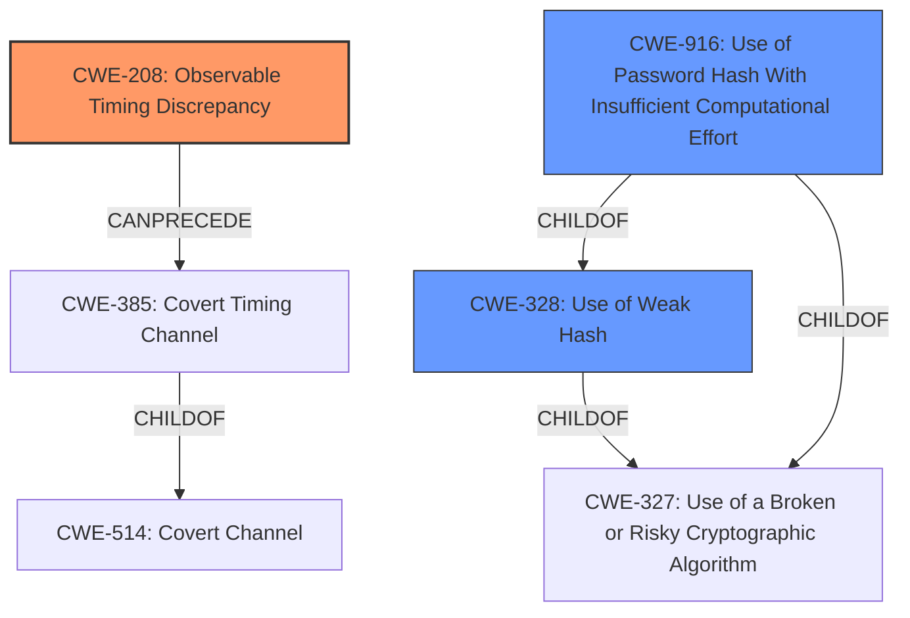

# Analysis Report for CVE-2025-30344

# Vulnerability Analysis Report: CVE-2025-30344

## Description

An issue was discovered in OpenSlides before 4.2.5. During login at the /system/auth/login/ endpoint, the systems response times differ depending on whether a user exists in the system. The timing discrepancy stems from the **omitted hashing of the password** (e.g., more than 100 milliseconds).

## Vulnerability Description Key Phrases

- **Rootcause:** omitted hashing of the password
- **Impact:** timing discrepancy
- **Product:** OpenSlides
- **Version:** before 4.2.5
- **Component:** /system/auth/login/

## Analysis (with Relationship Data)

# Summary
| CWE ID  | CWE Name | Confidence | CWE Abstraction Level | CWE Vulnerability Mapping Label | CWE-Vulnerability Mapping Notes |
| ----------- | ----------- | ----------- | ----------- | ----------- | ----------- |
| CWE-208 | Observable Timing Discrepancy | 1.0 | Base | Primary | Allowed |
| CWE-328 | Use of Weak Hash | 0.7 | Base | Secondary Candidate | Allowed |
| CWE-916 | Use of Password Hash With Insufficient Computational Effort | 0.6 | Base | Secondary Candidate | Allowed |

## Evidence and Confidence

*   **Confidence Score:** 0.9
*   **Evidence Strength:** HIGH

## Relationship Analysis
The primary CWE selected is CWE-208, Observable Timing Discrepancy, which is a base-level CWE. CWE-385, Covert Timing Channel, is a child of CWE-514, but it isn't the right fit because it's more focused on intentional signaling. CWE-328 and CWE-916 were considered because the **omitted hashing of the password** could lead to a weak hash or insufficient computational effort.



## Vulnerability Chain
The vulnerability chain starts with the **omitted hashing of the password**, leading to timing discrepancies during login, which can be observed by an attacker.

Root Cause: **Omitted hashing of the password**
Weakness: CWE-208 Observable Timing Discrepancy
Impact: Information Leakage (user existence)

## Summary of Analysis
The analysis strongly relies on the provided evidence, especially the "CVE Reference Links Content Summary" section, which explicitly states: "The timing discrepancy stems from the **omitted hashing of the password**." This confirms the **root cause** and its direct link to the observable timing discrepancy. The selection of CWE-208 is further supported by its high relevance score in the Retriever Results.

CWE-208 is the most specific and appropriate choice because it directly addresses the observable timing difference resulting from the **omitted hashing of the password**. Other CWEs like CWE-328 and CWE-916 were considered but deemed secondary because they relate more to the potential consequences of **not hashing the password** strongly rather than the timing discrepancy itself.

Relevant CWE Information:

# Enhanced Context (25 CWEs)
The following CWEs were identified as potentially relevant to this vulnerability:

## CWE-208: Observable Timing Discrepancy
**Abstraction Level**: Base
**Similarity Score**: 0.77
**Source**: dense

**Description**:
Two separate operations in a product require different amounts of time to complete, in a way that is observable to an actor and reveals security-relevant information about the state of the product, such as whether a particular operation was successful or not.

**Mapping Guidance**:
- Usage: Allowed
- Rationale: This CWE entry is at the Base level of abstraction, which is a preferred level of abstraction for mapping to the root causes of vulnerabilities.

## CWE-328: Use of Weak Hash
**Abstraction Level**: Base
**Similarity Score**: 0.31
**Source**: sparse

**Description**:
The application uses a hashing algorithm that is not sufficiently strong to protect sensitive data, such as passwords. This can allow an attacker to more easily crack the hashes and obtain the original data.

**Mapping Guidance**:
- Usage: Allowed
- Rationale: This CWE entry is at the Base level of abstraction, which is a preferred level of abstraction for mapping to the root causes of vulnerabilities.

## CWE-204: Observable Response Discrepancy
**Abstraction Level**: Base
**Similarity Score**: 0.76
**Source**: dense

**Description**:
The product provides different responses to incoming requests in a way that reveals internal state information to an unauthorized actor outside of the intended control sphere.

**Mapping Guidance**:
- Usage: Allowed
- Rationale: This CWE entry is at the Base level of abstraction, which is a preferred level of abstraction for mapping to the root causes of vulnerabilities.

## CWE-916: Use of Password Hash With Insufficient Computational Effort
**Abstraction Level**: Base
**Similarity Score**: 0.28
**Source**: sparse

**Description**:
The application uses a hashing algorithm that does not require sufficient computational effort to protect passwords. This allows attackers to more easily crack the password hashes.

**Mapping Guidance**:
- Usage: Allowed
- Rationale: This CWE entry is at the Base level of abstraction, which is a preferred level of abstraction for mapping to the root causes of vulnerabilities.

## CWE-1390: Weak Authentication
**Abstraction Level**: Class
**Similarity Score**: 0.74
**Source**: dense

**Description**:
The product uses an authentication mechanism to restrict access to specific users or identities, but the mechanism does not sufficiently prove that the claimed identity is correct.

**Mapping Guidance**:
- Usage: Allowed-with-Review
- Rationale: This CWE entry is a Class and might have Base-level children that would be more appropriate

## CWE-836: Use of Password Hash Instead of Password for Authentication
**Abstraction Level**: Base
**Similarity Score**: 0.26
**Source**: sparse

**Description**:
The application uses a password hash instead of the actual password for authentication. This can allow an attacker to bypass the authentication process.

**Mapping Guidance**:
- Usage: Allowed
- Rationale: This CWE entry is at the Base level of abstraction, which is a preferred level of abstraction for mapping to the root causes of vulnerabilities.

## CWE-259: Use of Hard-coded Password
**Abstraction Level**: Variant
**Similarity Score**: 0.74
**Source**: dense

**Description**:
The product uses weak credentials (such as a default key or hard-coded password) that can be calculated, derived, reused, or guessed by an attacker.

**Mapping Guidance**:
- Usage: Allowed
- Rationale: This CWE entry is at the Variant level of abstraction, which is a preferred level of abstraction for mapping to the root causes of vulnerabilities.

## CWE-549: Missing Password Field Masking
**Abstraction Level**: Base
**Similarity Score**: 0.24
**Source**: graph

**Description**:
The product does not mask the password field on the login screen. This can allow an attacker to easily see the password as it is being typed.

**Mapping Guidance**:
- Usage: Allowed
- Rationale: This CWE entry is at the Base level of abstraction, which is a preferred level of abstraction for mapping to the root causes of vulnerabilities.

## CWE-385: Covert Timing Channel
**Abstraction Level**: Base
**Similarity Score**: 0.00
**Source**: graph

**Description**:
The application uses a covert timing channel to transmit sensitive information. This can allow an attacker to gain access to the sensitive information.

**Mapping Guidance**:
- Usage: Allowed
- Rationale: This CWE entry is at the Base level of abstraction, which is a preferred level of abstraction for mapping to the root causes of vulnerabilities.


## CWE Relationship Analysis

Current CWEs represent these abstraction levels: .


### Vulnerability Chain Analysis

**Chain starting from CWE-1390:**
- 1390 (Weak Authentication) - ROOT


**Chain starting from CWE-259:**
- 259 (Use of Hard-coded Password) - ROOT


### CWE Relationship Diagram

```mermaid
graph TD
    classDef primary fill:#f96,stroke:#333,stroke-width:2px
    classDef secondary fill:#69f,stroke:#333
    classDef tertiary fill:#9e9,stroke:#333
```


*Report generated on 2025-07-14 17:15:59*
