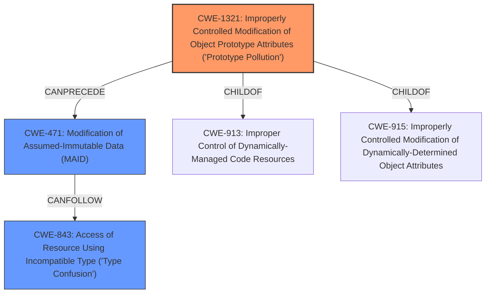

# Analysis Report for CVE-2025-30358

# Vulnerability Analysis Report: CVE-2025-30358

## Description

Mesop is a Python-based UI framework that allows users to build web applications. A class pollution vulnerability in Mesop prior to version 0.14.1 allows attackers to overwrite global variables and class attributes in certain Mesop modules during runtime. This vulnerability could directly lead to a denial of service (DoS) attack against the server. Additionally, it could also result in other severe consequences given the applications implementation, such as identity confusion, where an attacker could impersonate an assistant or system role within conversations. This impersonation could potentially enable jailbreak attacks when interacting with large language models (LLMs). Just like the Javascripts prototype pollution, this vulnerability could leave a way for attackers to manipulate the intended data-flow or control-flow of the application at runtime and lead to severe consequences like remote code execution when gadgets are available. Users should upgrade to version 0.14.1 to obtain a fix for the issue.

## Vulnerability Description Key Phrases

- **Weakness:** class pollution, prototype pollution
- **Product:** Mesop
- **Impact:** denial of service, identity confusion, impersonation, jailbreak attacks, overwrite global variables, remote code execution
- **Attacker:** attackers
- **Version:** prior to version 0.14.1

## Analysis (with Relationship Data)

# Summary
| CWE ID | CWE Name | Confidence | CWE Abstraction Level | CWE Vulnerability Mapping Label | CWE-Vulnerability Mapping Notes |
|---|---|---|---|---|---|
| CWE-1321 | Improperly Controlled Modification of Object Prototype Attributes ('Prototype Pollution') | 1.0 | Variant | Allowed | Primary CWE. This CWE accurately describes the root cause of the vulnerability, which involves the **improperly controlled modification of object prototype attributes**. |
| CWE-471 | Modification of Assumed-Immutable Data (MAID) | 0.5 | Base | Allowed | Secondary. This CWE relates to the broader concept of modifying data assumed to be immutable, which is a consequence of prototype pollution. |
| CWE-843 | Access of Resource Using Incompatible Type ('Type Confusion') | 0.4 | Base | Allowed | Secondary. This CWE is a potential impact in the vulnerability chain, where the attacker manipulates the application to access resources using incompatible types, ultimately leading to remote code execution. |

## Evidence and Confidence

*   **Confidence Score:** 0.8
*   **Evidence Strength:** HIGH

## Relationship Analysis
The primary CWE is CWE-1321, which is a Variant of higher-level Class CWEs related to object modification. CWE-471 (Modification of Assumed-Immutable Data) is a parent of CWE-1321 and represents the broader category of weaknesses related to modification of immutable data. CWE-843 (Access of Resource Using Incompatible Type) can be a consequence of CWE-1321, where the attacker manipulates the application to access resources using incompatible types.



## Vulnerability Chain
The vulnerability chain begins with **CWE-1321**: Improperly Controlled Modification of Object Prototype Attributes ('Prototype Pollution'). This allows attackers to overwrite global variables and class attributes. This can lead to **CWE-471**: Modification of Assumed-Immutable Data (MAID) and potentially **CWE-843**: Access of Resource Using Incompatible Type ('Type Confusion'), ultimately leading to impacts like denial of service (DoS), identity confusion, jailbreak attacks, and remote code execution.

## Summary of Analysis
The analysis is based on the provided evidence, specifically the vulnerability description and CVE reference summary. The primary weakness is identified as **class pollution**, which is directly related to **prototype pollution**.

The selection of CWE-1321 is justified as it is a Variant-level CWE that accurately describes the root cause of the vulnerability. The vulnerability description mentions "**class pollution, prototype pollution**" and the ability to "**overwrite global variables and class attributes**". This directly aligns with the description of CWE-1321: "The product receives input from an upstream component that specifies attributes that are to be initialized or updated in an object, but it does not properly control modifications of attributes of the object prototype."

CWE-471 is considered as a secondary CWE because it represents a broader category of weaknesses related to modification of immutable data. While relevant, it is not as specific as CWE-1321.

CWE-843 is considered as a tertiary CWE since it is a potential result of the attacker being able to manipulate the application, but not necessarily the root cause.


## CWE Relationship Analysis

Current CWEs represent these abstraction levels: .


### Vulnerability Chain Analysis

**Chain starting from CWE-471:**
- 471 (Modification of Assumed-Immutable Data (MAID)) - ROOT


**Chain starting from CWE-1321:**
- 1321 (Improperly Controlled Modification of Object Prototype Attributes ('Prototype Pollution')) - ROOT


### CWE Relationship Diagram

```mermaid
graph TD
    classDef primary fill:#f96,stroke:#333,stroke-width:2px
    classDef secondary fill:#69f,stroke:#333
    classDef tertiary fill:#9e9,stroke:#333
```


*Report generated on 2025-07-14 17:17:46*
