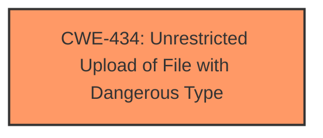

# Enhanced Analysis for CVE-2025-3040

# Summary
| CWE ID | CWE Name | Confidence | CWE Abstraction Level | CWE Vulnerability Mapping Label | CWE-Vulnerability Mapping Notes |
|---|---|---|---|---|---|
| CWE-434 | Unrestricted Upload of File with Dangerous Type | 1 | Base | Primary | Allowed |

## Evidence and Confidence

*   **Confidence Score:** 1
*   **Evidence Strength:** HIGH

## Relationship Analysis
The primary relationship that influenced the decision was the direct match of the vulnerability description to CWE-434. No other parent, child, or peer relationships were deemed relevant as CWE-434 directly addresses the **unrestricted upload** issue. There are no chain relationships. The base level abstraction is optimal as it directly reflects the vulnerability.



## Vulnerability Chain
The vulnerability chain starts with the **unrestricted upload** (**CWE-434**), which allows an attacker to upload malicious files. This can lead to remote code execution on the server if the uploaded file is processed.

## Summary of Analysis
The analysis is based on the provided vulnerability description and the content summary from the CVE reference links. The key phrase "unrestricted upload" from the Vulnerability Description Key Phrases and the explicit mention of "CWE-434: Unrestricted Upload of File with Dangerous Type" in the CVE Reference Links Content Summary provide direct evidence for mapping this vulnerability to **CWE-434 (Unrestricted Upload of File with Dangerous Type)**. The root cause is the **lack of proper validation** of user-supplied files in the `/admin/add_student.php` file upload functionality. The abstraction level of Base is the most appropriate as it directly represents the weakness.

CWEs considered but not used:

*   CWE-89 (Improper Neutralization of Special Elements used in an SQL Command ('SQL Injection')): While SQL injection could be a potential risk in web applications, the primary vulnerability described focuses on file upload, not SQL command construction.
*   CWE-79 (Improper Neutralization of Input During Web Page Generation ('Cross-site Scripting')): Similar to SQL injection, XSS is a different type of vulnerability than the one described.
*   CWE-306 (Missing Authentication for Critical Function): Although authentication issues could be present, the core vulnerability is the **unrestricted file upload**, making CWE-434 the more direct and accurate mapping.
* CWE-472 (External Control of Assumed-Immutable Web Parameter): This is about manipulating parameters that are assumed to be immutable, but the core vulnerability is the **unrestricted file upload**.

The decision to map to CWE-434 is strongly supported by the evidence, aligning with the principle of selecting the most specific and relevant CWE.


## CWE Relationship Analysis

Current CWEs represent these abstraction levels: .


### Vulnerability Chain Analysis

**Chain starting from CWE-89:**
- 89 (Improper Neutralization of Special Elements used in an SQL Command ('SQL Injection')) - ROOT


**Chain starting from CWE-79:**
- 79 (Improper Neutralization of Input During Web Page Generation ('Cross-site Scripting')) - ROOT


### CWE Relationship Diagram

```mermaid
graph TD
    classDef primary fill:#f96,stroke:#333,stroke-width:2px
    classDef secondary fill:#69f,stroke:#333
    classDef tertiary fill:#9e9,stroke:#333
```