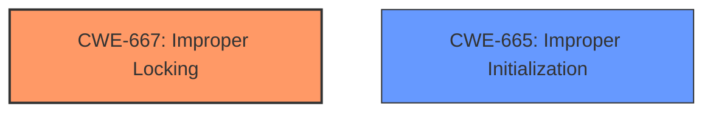

# Enhanced Analysis for CVE-2025-30432

# Summary
| CWE ID | CWE Name | Confidence | CWE Abstraction Level | CWE Vulnerability Mapping Label | CWE-Vulnerability Mapping Notes |
|---|---|---|---|---|---|
| CWE-667 | Improper Locking | 0.7 | Class | Allowed-with-Review | Primary CWE |
| CWE-665 | Improper Initialization | 0.6 | Class | Discouraged | Secondary Candidate |

## Evidence and Confidence

*   **Confidence Score:** 0.7
*   **Evidence Strength:** MEDIUM

## Relationship Analysis
The primary CWE selected, CWE-667, is a Class-level weakness. While a more specific Base or Variant CWE would be preferable, the available information doesn't clearly point to a specific locking issue, so the Class level is appropriate. The vulnerability description mentions a "**logic issue** was addressed with improved state management," which can be interpreted as a potential synchronization problem, i.e. improper locking. CWE-665 was considered because **improper initialization** could lead to incorrect state, but the state *management* fix leans more towards locking.



## Vulnerability Chain
The vulnerability chain starts with a **logic issue** in state management, which leads to a situation where a malicious app can attempt multiple passcode entries, resulting in escalating time delays.
- Root Cause: **Logic Issue** (likely related to concurrency/locking)
- Weakness: Improper State Management (potentially CWE-667)
- Impact: Malicious app bypasses security measures, escalating time delays after 4 failures

## Summary of Analysis
The analysis is based on the provided evidence, which highlights a **logic issue** addressed with improved state management. The content from the CVE reference links consistently mentions this along with the impact of a malicious app being able to attempt passcode entries on a locked device, causing escalating time delays.

The graph relationships and retriever results pointed towards several memory corruption issues (e.g., CWE-787, CWE-415), but these don't directly align with the stated **logic issue** and state management fix. Input validation (CWE-20) was also suggested, but the problem appears to be with how state is managed, rather than with the input itself.

The selection of CWE-667 is at the Class level of abstraction because there isn't enough information to determine the exact type of locking issue.

Relevant CWE Information:

# Enhanced Context (25 CWEs)
The following CWEs were identified as potentially relevant to this vulnerability:

## CWE-667: Improper Locking
**Abstraction Level**: Class
**Similarity Score**: 0.75
**Source**: dense

**Description**:
The product does not properly acquire or release a lock on a resource, leading to unexpected resource state changes and behaviors.

**Mapping Guidance**:
- Usage: Allowed-with-Review
- Rationale: This CWE entry is a Class and might have Base-level children that would be more appropriate

## CWE-665: Improper Initialization
**Abstraction Level**: Class
**Similarity Score**: 0.75
**Source**: dense

**Description**:
The product does not initialize or incorrectly initializes a resource, which might leave the resource in an unexpected state when it is accessed or used.

**Mapping Guidance**:
- Usage: Discouraged
- Rationale: This CWE entry is a level-1 Class (i.e., a child of a Pillar). It might have lower-level children that would be more appropriate

CWE-667: Improper Locking is selected as the primary CWE. The vulnerability description states that "A **logic issue** was addressed with improved state management." This could indicate a problem with how the application is managing locks on shared resources, potentially leading to race conditions or other synchronization issues.
*   **How the vulnerability's details match the CWE's characteristics:** The description aligns with the CWE's focus on improper acquisition or release of locks, leading to unexpected state changes.
*   **The security implications and potential impact:** Allows a malicious app to bypass intended security measures related to passcode attempts, causing escalating time delays after multiple failures.
*   **Any parent-child relationships or chain patterns that influenced your mapping:** The Class level of abstraction is used because the specific type of locking issue isn't detailed in the description.
*   **Whether the weakness is primary or secondary in the vulnerability:** This is considered the primary weakness based on the provided information.
*   **How the official MITRE mapping guidance influenced your decision:** The "Allowed-with-Review" usage is followed because it is a Class level CWE and more specific Base-level children might exist.

CWE-665: Improper Initialization was also considered as a secondary candidate because **improper initialization** can also lead to unexpected state, but the fix was for *state management*, not just initialization.

CWEs like CWE-787 (Out-of-bounds Write), CWE-415 (Double Free), CWE-20 (Improper Input Validation), CWE-119 (Improper Restriction of Operations within the Bounds of a Memory Buffer), and others were considered but ultimately not selected because they don't directly align with the root cause described as a **logic issue** related to state management. These CWEs are more focused on memory corruption or input validation problems.


## CWE Relationship Analysis

Current CWEs represent these abstraction levels: .


### Vulnerability Chain Analysis

**Chain starting from CWE-667:**
- 667 (Improper Locking) - ROOT


**Chain starting from CWE-787:**
- 787 (Out-of-bounds Write) - ROOT


### CWE Relationship Diagram

```mermaid
graph TD
    classDef primary fill:#f96,stroke:#333,stroke-width:2px
    classDef secondary fill:#69f,stroke:#333
    classDef tertiary fill:#9e9,stroke:#333
```